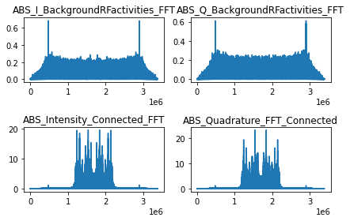

# Leveraging AI for Signal Processing

##### Done by Emil Yong Kai Wen 

# Content Page
<b>Chapter 1 : Introduction </b>

<b>Chapter 2 : Basic understanding of Radio Frequency (RF) </b>
- 2.1 Time Domain for 20 Hertz Sine Wave
- 2.2 Time Domain for 20Hz , 40Hz & 5Hz Sine wave


- 2.3 Understanding FFT Function
 - 2.3.1 FFT Formula
 - 2.3.2 Performing FFT on sample sequence
 
 
- 2.4 Frequency Domain for 20 Hertz Sine wave
- 2.5 Frequency Domain for 20Hz , 40Hz & 5Hz Sine wave

<b>Chapter 3 : DroneRF Dataset </b>
- 3.1 DroneRF Dataset Format
- 3.2 Number of Segments for each Drone and Mode
- 3.3 Analyses of one segment - Ardrone Segment 18 H & L


- 3.4 Time series spectrum of different Drone modes 
 - 3.4.1 Background RF activities Segment 5 ( Time Domain )
 - 3.4.2 Bepopdrone Flying and Video Recording Segment 10 ( Time domain )
  - 3.4.3 Phantom Drone On and Connected Segment 7 (Time Domain)
 - 3.4.4 Phantom Drone On and Connected Segment 7 (Frequency Domain)
 - 3.4.5 The entire spectrum : Higher + Lower Spectrum
 
 
- 3.5 Preprocessing Dataset - FFT entire dataset


- 3.6 Machine Learning (DroneRF) - Binary Classification
 - 3.6.1 Preparing Dataset - DroneRF
 - 3.6.2 Labelling - DroneRF
 - 3.6.3 Training (70%) , Validation(20%) , Testing (10%)
 
 
- 3.7 Machine Learning (DroneRF) -  MultiClass Classification
 - 3.7.1 Preparing Dataset
 - 3.7.2 Labelling
 - 3.7.3 Training (70%) , Validation (20%) , Test (10%) 
 
 
- 3.8 Machine Learning Algorithm (DroneRF) - Support Vector Machine  to classify different modes
  - 3.8.1 Labelling 
  - 3.8.2 Training (70%) , Validation (20%) , Test (10%) 
  
  
<b> Chapter 4 : DeepSig Dataset </b>
- 4.1 Analysing different modulation types with Highest SNR values
 - 4.1.1 BPSK - SNR 18
 - 4.1.2 BPSK Time Series I & Q
 - 4.1.3 BPSK Time Series of one I & Q sample
 - 4.1.4 BPSK FFT - Intensity only
 - 4.1.5 BPSK FFT - Quadrature only
 - 4.1.6 BPSK FFT - Complex IQ
 
 
- 4.2 CPFSK Time Series I & Q
   - 4.2.1  CPFSK Time Series of one I & Q Sample
   - 4.2.2 CPFSK FFT - Intensity only
   - 4.2.3 CPFSK FFT - Quadrature only
   - 4.2.4 CPFSK FFT - Complex IQ 
   
   
   
- 4.3 PAM4 - SNR 18
    - 4.3.1  PAM4 Time Series I & Q
    - 4.3.2 PAM4 Time Seris of  one I & Q Sample
    - 4.3.3 PAM 14 FFT - Intensity only
    - 4.3.4 PAM4 FFT -  Quadrature only
    - 4.3.5 PAM4 FFT - Complex IQ
    
    
- 4.4  QAM16 - SNR 18
    - 4.4.1 QAM16 Time Series I & Q
    - 4.4.2 QAM16 Time Series of one I & Q sample
    - 4.4.3 QAM16 FFT - Intensity only
    - 4.4.4 QAM16 FFT - Quadrature only
    - 4.4.5 QAM16 FFT - Complex IQ
  
  
- 4.5  QPSK - SNR 18
    - 4.5.1 QPSK 18 Time Series I & Q
    - 4.5.2 QPSK 18 Time Series of  one I & Q sample
    - 4.5.3 QPSK FFT - Intensity only
    - 4.5.4 QPSK FFT - Quadrature only
    - 4.5.5 QPSK FFT - Complex IQ 
    
    
- 4.6 GFSK - SNR 18
    - 4.6.1  GFSK 18 Time Series I & Q
    - 4.6.2 GFSK 18 Time Series of one I & Q sample
    - 4.6.3 GFSK FFT - Intensity only
    - 4.6.4 GFSK FFT - Quadrature only
    - 4.6.5 GFSK FFT - Complex IQ


- 4.7 AM-DSB - SNR 18
    - 4.7.1 AM-DSB Time Series I & Q
    - 4.7.2 AM-DSB Time Series of one I & Q sample
    - 4.7.3 AM-DSB FFT - Intensity only
    - 4.7.4 AM-DSB FFT - Quadrature only
    - 4.7.5 AM-DSB FFT - Complex IQ
   
   
- 4.8 WBFM - SNR 18
    - 4.8.1 WBFM Time Series I & Q
    - 4.8.2 WBFM Time series of one I & Q sample
    - 4.8.3 WBFM FFT - Intensity only
    - 4.8.4 WBFM FFT - Quadrature only
    - 4.8.5 WBFM FFT - Complex IQ
    
    
- 4.9 8PSK - SNR 18
    - 4.9.1 8PSK Time Series I & Q
    - 4.9.2 8PSK Time Series of one I & Q sample
    - 4.9.3 8PSK FFT - Intensity only
    - 4.9.4 8PSK FFT - Quadrature only
    - 4.9.5 8PSK FFT - Complex IQ


- 4.10 QAM64 - SNR 18
    - 4.10.1 QAM64 Time Series I & Q 
    - 4.10.2 QAM64 Time Series of one  I & Q sample
    - 4.10.3 QAM64 FFT - Intensity only
    - 4.10.4 QAM64 FFT - Quadrature only
    - 4.10.5 QAM64 FFT - Complex IQ 

<b> Chapter 5 : Machine Learning - Multiclass classification on SNR 18 Modulation using FFT  </b>

- 5.1 Preparing Dataset
- 5.2 Applying FF function on X_Intensity and X_Qudrature
- 5.3 Labelling
- 5.4 Training (70%)  , Validation (20%) , Test (10%)
- 5.5 Using DNN (4 layers) with relu and softmax as activation function - Classifying using only Intensity FFT
- 5.6  Using DNN (4 layers) with relu and softmax as activation function - Classifying using only Quadrature FFT
- 5.7 Using DNN (4 layers) with relu and softmax as activation function - Classifying using  only Complex I & Q FFT 
- 5.8 Classifying using Support Vector Machine (SVM)
    - 5.8.1 SVM with only Intensity FFT
    - 5.8.2 SVM with Complex I & Q FFT
- 5.9  Random Forest Classifier - Complex I & Q FFT
- 5.10 Convolution 1D - Time Series


<b> Chapter 6 : Building own Dataset </b>

- 6.1 Robot under analysis 
- 6.2 Radio Frequency Sensing Module
- 6.3 Experimental  & Database Setup


<b> Chapter 7 : EDA on First Attempt Dataset on 3rd December 2020 </b>
- 7.1 Fast Fourier transform
 
 - 7.1.1 Importing raw IQ data
 - 7.1.2 Renaming Titles of each coloum
 - 7.1.3 First Sticker FFT BackGround and Connected (3 Dec 2020 )
 - 7.1.4 First Sticker FFT Searching && Searching with WIFI established (3 Dec 2020)
 - 7.1.5  Third Sticker FFT BackGround and Connected (3 Dec 2020 )
 - 7.1.6 Third Sticker FFT Searching && Searching with WIFI established (3 Dec 2020)
 - 7.1.7 Fourth Sticker FFT BackGround and Connected (3 Dec 2020 )
 - 7.1.8 Fourth Sticker FFT Searching && Searching with WIFI established (3 Dec 2020)
 - 7.1.9 Fifth Sticker FFT BackGround and Connected (3 Dec 2020 )
 - 7.1.10 Fifth Sticker FFT Searching && Searching with WIFI established (3 Dec 2020)
 
 
- 7.2  Complex Signal I&Q Dataset for First Sticker (3 Dec 2020)

- 7.3 Classying different modes using Machine learning Models
 - 7.3.1 Labeling

- 7.4.1 Conv1D Model
- 7.4.2 Conv1D cross model validation
- 7.4.3 Using First Sticker as Test Set
- 7.4.4 Using Third Sticker as Test Set
- 7.4.5 Using Fourth Sticker as Test Set
- 7.4.6 Using Fifth Sticker as Test Set
 
- 7.5  4 Layer DNN
  - 7.5.1 DNN Cross Model Validation


- 7.6 Time Series

 - 7.6.1 Time Series plot First Sticker Background RF activities & Connected [3 Dec 2020 ]
 - 7.6.2 Time Series plot First Sticker Searching & Searching with WIFI established [3 Dec 2020 ]
 - 7.6.3 Time Series plot Third Sticker Background RF activities & Connected [3 Dec 2020 ]
 - 7.6.4 Time Series plot Third Sticker Searching & Searching with WIFI established [3 Dec 2020 ]
 - 7.6.5 Time Series plot Fourth Sticker Background RF activities & Connected [3 Dec 2020 ]
 - 7.6.6 Time Series plot Fourth Sticker Searching & Searching with WIFI established [3 Dec 2020 ]
 - 7.6.7 Time Series plot Fifth Sticker Background RF activities & Connected [3 Dec 2020 ]
 - 7.6.8  Time Series plot Sticker Searching & Searching with WIFI established [3 Dec 2020 ]
 - 7.6.9 Scaling First Sticker
 - 7.6.10 Scaling Third Sticker
 - 7.6.11 Scaling Fourth Sticker
 - 7.6.12  Scaling Fifth Sticker
 
 
 
- 7.7 First Sticker Conv1D Model Training [ Time Series ]
- 7.8 Third Sticker Conv1D Model Training [ Time Series ]
- 7.9 Fourth Sticker Conv1D Model Training [ Time Series ]
- 7.10 Fifth Sticker Conv1D Model Training [ Time Series ]
- 7.11 Cross Model validation for Covn1D Model Training [ Time Series ]

 
<b> Chapter 8 RFMLS Model on 3 Dec Data </b>
- 8.1 Training First Sticker on RFMLS model
- 8.2 Training Third Sticker on RFMLS model
- 8.3 Training Fourth Sticker on RFMLS model
- 8.4 Training Fifth Sticker on RFMLS model
- 8.5 Cross Model validation for RFMLS Model

<b> Chapter 9 : EDA on Second Attempt Dataset on 16th December 2020 </b>
- 9.1 First Sticker Time Series Plot 
    - 9.1.1 First Sticker Model Training 
- 9.2 Second Sticker Time Series Plot
    - 9.2.1  Second Sticker Model Training 
- 9.3 Third Sticker Time Series Plot
    - 9.3.1 Third Sticker Model Training 

- 9.4 Fourth Sticker Time Series Plot
     - 9.4.1 Fourth Sticker Model Training 
    
- 9.5 Fifth Sticker ( 16 December 2020 )
    - 9.5.1 Fifth Sticker Model Training 
    
    
    
- 9.6 Cross Model validation for RFMLS Model

- 9.7 Cross Model Validation on two datasets

<b>Chapter 10 : Conclusion </b>  
    
    
    
    
    
    

    
    
    
    
    
    
   
   
   
 
  


# Chapter 1 : Introduction

In recent years, Unmanned Aerial Vehicles (UAV) or drones are becoming more and more popular due to their advancement in technology, size and lower in cost. These made drones viable for various useful applications, such as weather observation, inspection of infrastructures and fire detections. However, the effectiveness of drones’ application may also lead to technical, security and public safety issues. Hence, it is essential for government entities to be able to detect and identify unauthorised drones in the air space.
 
The conventional methods of identifying and detecting drones uses radars, camera vision and sound identification. These detection methods maybe useful to a certain extent but they are not solely reliable and are easily restrained. For example, in camera vision object detection, identifying of drones in the air space at night and in a vicinity with birds posed a huge challenge to identify the presence of drones.Since drones are usually remotely controlled using wireless technology such as Bluetooth and WIFI, a new approach will be to use Radio Frequency (RF) signals combined with deep learning approach to sense and identify drones in the airspace. In addition, since different drones’ modes generate different RF signals, this approach will be able to identify the current activities of the drones


# Chapter 2 : Basic understanding of Radio Frequency (RF) 

In radio frequency theory, RF signals can be represented into Time or Frequency domains. Both domains hold the same information of the signal. For time-domain graph, it shows how a signal changes over time, whereas a frequency-domain graph shows how much of the signals lies within each given frequency band over a range of frequencies. To illustrate, a RF signal can be synthetically generated using a sine wave composing of different frequency sine waves using numpy libraries. For the sake of understanding, the sampling frequency (Fs) used is 150Hz , frequency components (Fc), 20Hz with an amplitude of 1, 40 Hz with an amplitude of  0.5 and  5 Hz with an amplitude of 1.5.


```python
import numpy as np
import matplotlib.pyplot as plt
from numpy.fft import fft , fftfreq , ifft
import scipy.fftpack as syfp

Fs = 150 
t= np.arange(0,1,1/Fs)
f1 = 20 # Hz
f2 = 40 # Hz
f3 = 5 # Hz

wave1 = np.sin(2*np.pi*20*t)
wave2 = np.sin(2*np.pi*20*t)+0.5*np.sin(2*np.pi*40*t)
wave2 = np.sin(2*np.pi*20*t)+0.5*np.sin(2*np.pi*40*t)+1.5*np.sin(2*np.pi*5*t)

```


## 2.1 Time Domain for 20 Hertz Sine Wave


```python
plt.subplot(2,1,1)
plt.plot(t,wave1)
plt.title("Sinusoidal 20 Hertz Signal (Time domain)")
plt.xlabel('Time(s)')
plt.ylabel('Amplitude')
plt.tight_layout()

```


    

    


## 2.2 Time Domain for 20Hz , 40Hz & 5Hz Sine wave


```python
plt.subplot(2,1,1)
plt.plot(t,wave2)
plt.title("Sinusoidal 20Hz , 40Hz, 5Hz Signal (Time domain)")
plt.xlabel('Time(s)')
plt.ylabel('Amplitude')
plt.tight_layout()
```


    

    


## 2.3 Understanding FFT Function

Representing the RF signal from time domain to frequency domain uses Fast Fourier Transform (FFT) function in Numpy. It is an algorithm that computes the discrete Fourier Transform (DFT) of the sequence and converts it into frequency domain.


### 2.3.1 FFT Formula 

Given a RF sine wave signal, the RF signal is first sampled at the sampling frequency, Fs, based on Nyquist frequency. In nyquist frequency theory, the sampling frequency must be at least 2 times the highest frequency component of the signal to prevent aliasing. In our example, the highest frequency component is 40Hz. Hence, sampling frequency of 150Hz is more than sufficient.

### 2.3.2 Performing FFT on sample sequence


- Sampling Intervals, t = Td/Nsample 
- Sampling Frequency , Fs = 1/t = Nsamples / Td 

For the above diagram, assume the blue sine wave signal's parameters are:
- Frequency Component, Fin , 125Hz
- Number of samples , N = 16
- Sampling Frequency, Fs = 1000Hz


- Frequency Resolution , f = Fs/N

After performing FFT on the sample seqeunce, the frequency sequences runs from 0 to N-1 order with a frequency resolution of Fs/N. As shown on the above diagram, the spike resides on the second and 14th order after FFT. Given that Fs is 1000Hz, the maximum frequency that holds the Nyquist Sampling rule is at Fmax, Fs/2. Any spike that appears after Fmax will be ignored and deemed as alised.


- Frequency Resolution = 1000/16 = 62.5Hz
- Order where the spike resides = 2
- Frequency = Order x Frequency Resolution
- Frequency = 2 x 62.5Hz = <b>125Hz</b>


## 2.4 Frequency Domain for 20 Hertz Sine wave


```python
n = np.size(t)
wave1_FFT = (2/n)*abs(fft(wave1))
fft_fr = syfp.fftfreq(len(wave1),1/Fs)
```


```python
plt.subplot(2,1,1)
plt.plot(fft_fr,wave1_FFT)
plt.title("Full Frequency spectrum")
plt.xlabel('Frequency')
plt.ylabel('Magnitude')
plt.tight_layout()
```


    

    


```python
fr_positive = (Fs/2)*np.linspace(0,1,n//2)
plt.subplot(2,1,1)
plt.plot(fr_positive,wave1_FFT[0:np.size(fr_positive)])
plt.title("Positive Frequency spectrum")
plt.xlabel('Frequency')
plt.ylabel('Magnitude')
plt.tight_layout()
```


    

    


## 2.5 Frequency Domain for 20Hz , 40Hz & 5Hz Sine wave


```python
n = np.size(t)
wave2_FFT = (2/n)*abs(fft(wave2))
fft_fr_wave2 = syfp.fftfreq(len(wave2),1/Fs)
```


```python
plt.subplot(2,1,1)
plt.plot(fft_fr_wave2,wave2_FFT)
plt.title(" Full Frequency spectrum")
plt.xlabel('Frequency')
plt.ylabel('Magnitude')
plt.tight_layout()
```


    

    


```python
fr_positive = (Fs/2)*np.linspace(0,1,n//2)
plt.subplot(2,1,1)
plt.plot(fr_positive,wave2_FFT[0:np.size(fr_positive)])
plt.title("Positive Frequency spectrum")
plt.xlabel('Frequency')
plt.ylabel('Magnitude')
plt.tight_layout()
```


    

    


With the basic understanding of RF signals and Fast Fourier Transform (FFT), this report will be analysing two different academia datasets – DroneRF and DeepSig. After which, the author will be implementing different machine learning algorithms on each dataset and train a model that classifies different drones and activities for DroneRF dataset and different types of modulation for DeepSig dataset. 

# Chapter 3 : DroneRF Dataset


DroneRF dataset systematically record raw RF signals of different drones under different flight modes such as : on , off and connected, hovering , flying without video recording and flying with video recording. There are three different types of drones used in this dataset - Bepop drone , AR drone and Phantom drone. 


For back ground activties with no drones turned on, the RF signals are labelled with a Binary Unique Identifier (BUI) = 00000 and if drones are activated, the BUI for the RF signal will be labelled with a  prefix 1. Each drones are labelled respectively : Bepop Drone (100xx) , AR Drone (101xx) and Phantom Drone (110xx). The different flights modes are  labelled and are appended to their respective drone's BUI.

- Mode1 [On and connected to the controller] : BUI = XXX00
- Mode2 [Hovering automatically] : BUI = XXX01
- Mode3 [Flying without Video Recording] : BUI = XXX10
- Mode4 [Flying with Video Recording] : BUI = XXX11

The diagram above shows the overall flow of how RF siganls are labelled in DroneRF dataset.

The raw RF signals was recorded for:
- <b>10.25 seconds</b> for background RF activities 
- <b>5.25 seconds</b> for RF drone communication

## 3.1 DroneRF Dataset Format
For simplicity and to prevent memory overflow, the signals recorded in DroneRF dataset are stored as segments in standard comma-separted values (CSV) format.

Each csv file are named with the following format :

[Type of drone & mode ][Upper or lower segment] _ [Segment Number ] .csv

###### Example
100<b>00H_0</b>.csv
    
<b>[Bepop Drone & On and connected to the controller][Upper segment]_[Segment 0].csv</b>
    
The raw samples are recorded using two National Intrument USRP-2943 software defined radio and each RF receiver has a maximum bandwidth of  40MHz. Since WIFI spectrum is 80MHz, the first receiver will capture the lower half of the spectrum while the second receiver will capture the upper half the spectrum. This is why, for each csv file there will be an upper (H) and lower (L) for each drone,mode and segment.


## 3.2 Number of Segments for each Drone and Mode

- Bepop Drone Mode 1 :   21 segments 
- Bepop Drone Mode 2 :   21 segments
- Bepop Drone Mode 3 :   21 segments
- Bepop Drone Mode 4 :   21 segments


- AR Drone Mode 1 :   21 segments
- AR Drone Mode 2 :   21 segments
- AR Drone Mode 3 :   21 segments
- AR Drone Mode 4 :   16 segments


- Phantom Mode 1 :    21 segments


- Background activities (No Drones) :  41 segments

<b>Total Number of segments with Drones :  186

Total Number of segments without Drones : 41 <b>
    


## 3.3 Analyses of one segment - Ardrone Segment 18 H & L 

Each Drone mode segments consist of 20 million RF samples. Where Upper spectrum (H) holds 10 million RF samples and Lower spectrum (L) hold the remaining 10 million RF samples


```python
import numpy as np
ardrone_segment_18_h=np.loadtxt('/home/jax/projects/signals/ardrone/10100H_18.csv', delimiter=",")
ardrone_segment_18_l=np.loadtxt('/home/jax/projects/signals/ardrone/10100L_18.csv', delimiter=",")
print("ARDrone Segment 18 L consists of {0} freq samples with a min/max of {1}/{2}".format(ardrone_segment_18_l.shape[0],min(ardrone_segment_18_l),max(ardrone_segment_18_l)))
print("ARDrone Segment 18 H consists of {0} freq samples with a min/max of {1}/{2}".format(ardrone_segment_18_h.shape[0],min(ardrone_segment_18_h),max(ardrone_segment_18_h)))

```

    ARDrone Segment 18 L consists of 10000000 freq samples with a min/max of -8338.0/8213.0
    ARDrone Segment 18 H consists of 10000000 freq samples with a min/max of -220.0/182.0


## 3.4 Time series spectrum of different Drone modes 

*Objective: Without any prior understanding on the dataset, the author wishes to recreate the time domain plot as shown on the paper. This is to validate that the dataset downloaded is coherent with the paper released. Refer to Fig 10 (a) (b) (c) in the published paper*

Since the RF signals of one activity is recorded for 5.25 seconds,one segment will be approximately 0.25 seconds [ 5.25 seconds/ 21 segment ]

- Time duration of each CSV file : 0.25 seconds
- Number of Samples = 10,000,000
- Therefore, Sampling Frequency (Fs) = 10,000,000 / 0.25 seconds = 40 Million Hertz 

#### 3.4.1 Background RF activities Segment 5 ( Time Domain )


```python
import numpy as np
backgroundrfactivities_segment_5_H1=np.loadtxt('DroneRF/data/DroneRF/backgroundrfactivities/00000H_5.csv', delimiter=",")
backgroundrfactivities_segment_5_L1=np.loadtxt('DroneRF/data/DroneRF/backgroundrfactivities/00000L_5.csv', delimiter=",")

time = 0.25 
Fs = len(backgroundrfactivities_segment_5_H1)/time # 40 million Hz
t = np.arange(0,0.25,1/Fs) # 1/Fs = Time for each step

import matplotlib.pyplot as plt
fig, axs = plt.subplots(2)
axs[0].plot(t,backgroundrfactivities_segment_5_L1)
axs[0].set_title('Lower spectrum of background RF activites segment 5')
axs[1].plot(t,backgroundrfactivities_segment_5_H1)
axs[1].set_title('Higher spectrum of background  RF activites segment 5')

fig.tight_layout()
```


    

    


#### 3.4.2 Bepopdrone Flying and Video Recording Segment 10 ( Time domain )


```python
import numpy as np
Bebop_flying_videorecording_segment_10_H1=np.loadtxt('/home/jax/projects/signals/bebopdrone/10011H_10.csv', delimiter=",")
Bebop_flying_videorecording_segment_10_L1=np.loadtxt('/home/jax/projects/signals/bebopdrone/10011L_10.csv', delimiter=",")


Fs = len(backgroundrfactivities_segment_5_H1)/time # 40 million Hz
t = np.arange(0,0.25,1/Fs) # 1/Fs = Time for each step

import matplotlib.pyplot as plt
fig, axs = plt.subplots(2)
axs[0].plot(t,Bebop_flying_videorecording_segment_10_L1)
axs[0].set_title('Lower spectrum of Bebop drone flying and video recording segment 10')
axs[1].plot(t,Bebop_flying_videorecording_segment_10_H1)
axs[1].set_title('Higher spectrum of Bebop drone flying and video recording segment 10')
fig.tight_layout()
```


    

    


#### 3.4.3 Phantom Drone On and Connected Segment 7 (Time Domain)


```python
import numpy as np
phantom_on_and_connected_segment_7_H1=np.loadtxt('/home/jax/projects/signals/phantomdrone/11000H_7.csv', delimiter=",")
phantom_on_and_connected_segment_7_L1=np.loadtxt('/home/jax/projects/signals/phantomdrone/11000L_7.csv', delimiter=",")

time = 0.25 # 40million sample in 1 seconds
Fs = len(backgroundrfactivities_segment_5_H1)/time # 40 million Hz
t = np.arange(0,0.25,1/Fs) # 1/Fs = Time for each step

import matplotlib.pyplot as plt
fig, axs = plt.subplots(2)
axs[0].plot(t,phantom_on_and_connected_segment_7_L1)
axs[0].set_title('Lower spectrum of Phantom on and connected segment 7')
axs[1].plot(t,phantom_on_and_connected_segment_7_H1)
axs[1].set_title('Higher spectrum of Phantom on and connected segment 7')
fig.tight_layout()
```


    

    


#### 3.4.4 Phantom Drone On and Connected Segment 7 (Frequency Domain)


```python
import numpy as np 
from numpy.fft import fft , fftfreq , ifft
import scipy.fftpack as syfp

n = np.size(t)
freq_axis_positive = (Fs/2)*np.linspace(0,1,n//2) # Only retriving the effective postive spectrum
freq_axis_negative = (Fs/2)*np.linspace(0,-1,n//2) 

mean_of_phantom_H = np.mean(phantom_on_and_connected_segment_7_H1) #Removing any DC Offset 
x_H = fft((phantom_on_and_connected_segment_7_H1-mean_of_phantom_H))
x_H_abs = (2/n)*abs(x_H[0:np.size(freq_axis_positive)])

import matplotlib.pyplot as plt
plt.subplot (2,1,1)
plt.plot(freq_axis_positive,x_H_abs)### Phantom Drone On and Connected Segment 7 (Time Domain),x_H_abs)
plt.title("Higher Magnitude Spectrum [Positive Hz]")
plt.xlabel('Positive Frequency(Hz)')
plt.ylabel('Magnitude')

import matplotlib.pyplot as plt
plt.subplot (2,1,2)
plt.plot(freq_axis_negative,x_H_abs)
plt.title("Higher Magnitude Spectrum [Negative Hz]")
plt.xlabel('Negative Frequency(Hz)')
plt.ylabel('Magnitude')

plt.tight_layout()

```


    

    


```python
freqs_H = syfp.fftfreq(len(phantom_on_and_connected_segment_7_H1),1/Fs)
full_segment_7_Higher =np.fft.fft(phantom_on_and_connected_segment_7_H1)

import matplotlib.pyplot as plt
plt.subplot(2,1,1)
plt.plot(freqs_H,np.abs(full_segment_7_Higher)) # in frequencies 
plt.title('FULL Higher spectrum of Phantom on and connected segment 7')
plt.xlabel('Frequency (Hz)')
plt.ylabel('Magnitude')

plt.tight_layout()

```


    

    


```python
mean_of_phantom_L = np.mean(phantom_on_and_connected_segment_7_L1)
x_L = fft(phantom_on_and_connected_segment_7_L1-mean_of_phantom_L)
x_L_abs = (2/n) * abs(x_L[0:np.size(freq_axis_positive)])

import matplotlib.pyplot as plt
plt.subplot (2,1,1)
plt.plot(freq_axis_positive,x_L_abs)
plt.title("Lower Magnitude Spectrum [Positive Hz]")
plt.xlabel('Positive Frequency(Hz)')
plt.ylabel('Magnitude')

plt.subplot (2,1,2)
plt.plot(freq_axis_negative,x_L_abs)
plt.title("Lower Magnitude Spectrum [Negative Hz]")
plt.xlabel('Negative Frequency(Hz)')
plt.ylabel('Magnitude')
plt.tight_layout()

```


    

    


```python
freqs_L = syfp.fftfreq(len(phantom_on_and_connected_segment_7_L1),1/Fs)
full_segment_7_Lower =np.fft.fft(phantom_on_and_connected_segment_7_L1)

import matplotlib.pyplot as plt
plt.subplot(2,1,1)
plt.plot(freqs_L,np.abs(full_segment_7_Lower)) # in frequencies 
plt.title('FULL Lower spectrum of Phantom on and connected segment 7')
plt.xlabel('Frequency (Hz)')
plt.ylabel('Magnitude')

plt.tight_layout()
```


    

    


*One flaw of using fftfreq : The fftfreq function from Numpy.fft libraries caused a linear line to be plotted only on the Lower magnitude spectrum dataset. The reason for this linear line is still unknown. However, in machine learning perspective , this linear line will not affect the training of the model since fftfreq function is merely used for spectrum representation purposes.*

#### 3.4.5 The entire spectrum : Higher + Lower Spectrum

The higher and lower spectrum of the recorded RF dataset datset are said to be recorded concurrently using two RF receivers. In order to concatenated the transformed signal of both receivers to build an entire spectrum, a normalisation factor, C must be calculated. The normalisation factor C, ensures that the spectral are in continuity between the two half's of the RF spectrum since they are captured using two different devices.

The normalisation factor, C :


The normalisation factor is calculated as the ratio between the last Q samples of the lower spectra and the first Q samples of the upper spectra. 

- Carrier frequency for Lower Spectrum : 2420 MHz

- Carrier frequency for Upper Spectrum : 2460 HHz 

- Bandwidth for spectrum: 40 MHz


```python
import numpy as np

x_H_abs = (2/n)*abs(x_H[0:np.size(freq_axis_positive)])
x_L_abs = (2/n) *abs(x_L[0:np.size(freq_axis_positive)])

Q = 10 # number of returning points for spectral continuity

#equation_from_paper xf = low , yf = high [ Low , High]

mean_Low = np.mean(x_L_abs[-Q-1:-1])
mean_High= np.mean(x_H_abs[0:Q])

Normalising_factor= mean_Low/mean_High

x_H_abs_normalised = (2/n) * abs(x_H[0:np.size(fr)]) * Normalising_factor

Center_frequency_Lower = 2420
Center_frequency_Upper = 2460

fr_full_L_positive  = ((Fs/2)*np.linspace(0,1,n//2))/1e6
fr_full_L_negative  = ((Fs/2)*np.linspace(0,-1,n//2))/1e6
fr_full_L = np.concatenate((fr_full_L_negative + Center_frequency_Lower ,fr_full_L_positive + Center_frequency_Lower),axis = 0)
fr_full_L_fft = np.concatenate((x_L_abs,x_L_abs),axis = 0) # contains the full spectrum FFT since X_L_abs only contains half 


fr_full_H_positive  = ((Fs/2)*np.linspace(0,1,n//2))/1e6
fr_full_H_negative  = ((Fs/2)*np.linspace(0,-1,n//2))/1e6

fr_full_H = np.concatenate((fr_full_H_negative+Center_frequency_Upper,fr_full_H_positive+Center_frequency_Upper),axis = 0)
fr_full_H_fft = np.concatenate((x_H_abs_normalised,x_H_abs_normalised),axis = 0) 

Full_spectrum = np.concatenate((fr_full_L_fft,fr_full_H_fft),axis=0)
fr_full = np.concatenate((fr_full_L,fr_full_H),axis =0)


import matplotlib.pyplot as plt
plt.subplot (2,1,1)
plt.plot(fr_full,Full_spectrum)
plt.title("Full Magnitude Spectrum of Phantom on and Connected")
plt.xlabel('Frequency(MHz)')
plt.ylabel('Magnitude')

plt.tight_layout()
```


    

    


## 3.5 Preprocessing Dataset - FFT entire dataset

For better learning of the RF signal, the segmented RF signal (10 million samples) is further segmented in 100 smaller segments. Thus, each smaller segments will only contain 100,000 raw RF signal samples. The written code then uses Numpy FFT algorithm with 1028 frequency bins on each smaller segment and concatenate the results when all raw RF signals segments have been transformed. The concetenated results holds the magnitude of the RF signal. Hence, squaring it will give us the power spectrum of the RF signal. This result is saved into a directory ('data/DroneRF/Drone_RF_FFT') and is ready for machine learning training


```python
import numpy as np 
from numpy.fft import fft , fftfreq , ifft
import scipy.fftpack as syfp
#parameters

BUI =[0]*8
BUI[0] = '00000' #BUI of RF background activities
BUI[1:4] = ['10000','10001','10010','10011'] #BUI of the Bebop drone RF activities
BUI[5:8] = ['10100','10101','10110','10111'] #BUI of the AR drone RF activities
BUI[9]='11000'#BUI of the Phantom drone RF activities

Drones = {0:'backgroundrfactivities', 1:'bebopdrone', 2:'bebopdrone', 3:'bebopdrone', 4:'bebopdrone' 
          , 5:'ardrone' , 6:'ardrone' ,7:'ardrone' ,8:'ardrone' , 9: 'phantomdrone'}

M = 2048 #Total number of frequency bins
L = 1e5 #Total number samples in a segment
Q = 10 #Number of returning points for spectral continuity

```


```python
for i in range (len(BUI)):
    flag = 1
    if BUI[i] == '00000':
        N = 41
        selected_drones = Drones[0]
    elif BUI[i] == '10111':
        N = 18
    else:
        N = 21
    data = []
    cnt = 1

    counter = 0 # for checking


    for j in range (N):
        counter = counter + 1
        if BUI[i] == '00000' :
            print('data/DroneRF/'+ str(Drones[i]) +'/' + str(BUI[i]) +'H_'+ str(j)+'.csv')
            x_H=np.loadtxt('data/DroneRF/'+ str(Drones[i]) +'/' + str(BUI[i]) +'H_'+ str(j)+'.csv', delimiter=",")
            y_L=np.loadtxt('data/DroneRF/'+ Drones[i] +'/' + str(BUI[i]) +'L_'+ str(j)+'.csv', delimiter=",")
            factor = int(len(x_H)/L)
        
        else:
            print("the number" +str(j)+str(i))
            print('/home/jax/projects/signals/'+ str(Drones[i]) +'/' + str(BUI[i]) +'H_'+ str(j)+'.csv')
            x_H=np.loadtxt('/home/jax/projects/signals/'+ str(Drones[i]) +'/' + str(BUI[i]) +'H_'+ str(j)+'.csv', delimiter=",")
            y_L=np.loadtxt('/home/jax/projects/signals/'+ str(Drones[i]) +'/' + str(BUI[i]) +'L_'+ str(j)+'.csv', delimiter=",")
            factor = int(len(x_H)/L)
            
        for k  in range(1,factor+1):
            start = int(1 + (k-1)*L)
            finish = int(k*L)
    
            xf = abs(np.fft.fftshift(fft(x_H[start:finish]-np.mean(x_H[start:finish]),M)))
            end_xf=xf.shape[0]
            xf=xf[int(end_xf/2):end_xf]

            yf = abs(np.fft.fftshift(fft(y_L[start:finish]-np.mean(y_L[start:finish]),M)))
            end_yf=yf.shape[0]
            yf=yf[int(end_yf/2):end_yf]
            normalisation_factor = np.divide((np.mean(xf[-Q-1:-1])),np.mean(yf[0:Q]))
            yf = yf*normalisation_factor
    
            xf = np.transpose(xf)
            yf = np.transpose(yf)
            xf_yf = np.r_[xf,yf]
    
            if flag == 1:
                data = xf_yf
                flag = 0
            else:
                data = np.c_[data,xf_yf]

                
        print(int(100*j/N))
        print(data.shape)
        
    Data=np.square(data)
    save_L_H =np.savetxt('data/DroneRF/' + 'testing_FFT'+'/'+str(BUI[i])+'_FFT_power.csv',Data, delimiter=",")
    print("Saving")
        
 
```

## 3.6 Machine Learning (DroneRF) - Binary Classification

The machine learning model frame work used is  <b>Keras</b>


```python
from tensorflow import keras
from tensorflow.keras import layers
from keras.models import Sequential
from keras.layers import Dense

import numpy as np
import matplotlib.pyplot as plt


from sklearn.preprocessing import StandardScaler, OneHotEncoder
from sklearn.compose import ColumnTransformer, make_column_transformer
from sklearn import preprocessing

import random

directory = 'DroneRF/data/DroneRF/RF_Data_FFT/'
```

### 3.6.1 Preparing Dataset - DroneRF
Using the preprocessed FFT data from above, the aim of this model is to be able to differentiate and classifiy drone vs nodrone (BackgroundRF activities). The drones used are BepopDrone and PhantomDrone 


```python
bepop = np.loadtxt(directory+'10000_FFT_power.csv', delimiter=",")
phantomDrone1 = np.loadtxt(directory+'11000_FFT_power.csv',delimiter=",")
backgroundRFnoise = np.loadtxt(directory+'00000_FFT_power.csv',delimiter = ",")
print(backgroundRFnoise.shape)
random.shuffle(backgroundRFnoise)
noDrones = backgroundRFnoise[:,:]

```

    (2048, 4100)


- Number of input features : 2048
- Number of  data for noDrones (backgrounRFnoise) : 4100
- Number of  data for Drones : 2100 (Bepop) + 2100 (Phantom)= 4200

The conventional way to structure a dataset is <b>[no of data X Input features]</b>. However, for the preprocessed FFT of DroneRF, it is opposite <b>[Input features X No of data]</b> . Hence, an additional step is required to transpose the results when reading directly from the drone's CSV file. Since noDrones contains only 4100 datas, for consistency and unbaised sake, the number of datas used for Drones should be the same as well.


```python
bepop_transpose = np.transpose(bepop)
phantomdrone_transpose = np.transpose(phantomDrone1)
Drone_transpose = np.vstack((bepop_transpose,phantomdrone_transpose)) #stack the two drones data together
Drone_transpose = Drone_transpose[0:4100,:] #for consistency sake, the number of availble data for drones should be the same as noDrones
noDrones_transpose = np.transpose(noDrones)
```

In most of the machine learning algorithms, it works better when the features are relatively similar scale and close to normal distribution. For this report, the author uses StandardScaler method to preprocess the data for machine learning. Standardscaler standardiszes a feature by substracting the mean and then scaling to unit variance. 


```python
normalised_Drones = preprocessing.StandardScaler().fit_transform(Drone_transpose)
normalised_noDrones = preprocessing.StandardScaler().fit_transform(noDrones_transpose)

```

#### 3.6.2 Labelling - DroneRF

- Drones : 1
- noDrones : 0

The labels are appended for each row of data


```python
Label_bepopDrone1 = np.array([1])
Drones_dataset_concatenate = np.tile(Label_bepopDrone1[np.newaxis,:],(normalised_Drones.shape[0],1)) #Transforming the lavelled array[1] into the same shape as Drones Dataset
Drones_dataset=np.concatenate((normalised_Drones,Drones_dataset_concatenate),axis=1)

Label_noDrones = np.array([0])
noDrones_dataset_concatenate = np.tile(Label_noDrones[np.newaxis,:],(normalised_noDrones.shape[0],1))
noDrones_dataset =np.concatenate((normalised_noDrones,noDrones_dataset_concatenate),axis =1 )
```


```python
print('An example of a single data with 2048 input features followed by a label at index 2049. \n')
print(str(Drones_dataset[0]))

```

    An example of a single data with 2048 input features followed by a label at index 2049. 
    
    [-0.19144631 -0.23254951 -0.22885139 ... -0.1942947  -0.18225159
      1.        ]


```python
stacked_dataset = np.vstack((Drones_dataset, noDrones_dataset))
```

### 3.6.3 Training (70%) , Validation(20%) , Testing (10%)


```python
np.random.shuffle(stacked_dataset)
# Randomised the dataset before splitting 70-20-10 without the help of libraries
```


```python
TrainingSet_index = int(0.7*stacked_dataset.shape[0]) #2940
Validation_index = int(0.2*stacked_dataset.shape[0])#840
Test_index = int(stacked_dataset.shape[0] - (TrainingSet_index + Validation_index)) #420
stacked_dataset.shape
```


    (8200, 2049)


Total Size of entire dataset (Drones+NoDrones) : 8200 
- Size of Training dataset : 2940
- Size of Validation dataset : 840
- Size of Testing dataset : 420


```python
Training_set = stacked_dataset[0:TrainingSet_index]
Validation_set = stacked_dataset[TrainingSet_index:Validation_index+TrainingSet_index]
Test_set = stacked_dataset[Validation_index+TrainingSet_index:8200]
```

Seperate the label from the data in the stacked dataset. The corresponding label for each row of data is always at index 2049.


```python
X_Trained = Training_set[:,0:2048]
Y_Trained = Training_set[:,2048:2049]

X_Validation = Validation_set[:,0:2048]
Y_Validation = Validation_set[:,2048:2049]

X_Test = Test_set[:,0:2048]
Y_TrueClassification = Test_set[:,2048:2049]
```

Deep Learning using 3 layers with relu and sigmoid as the activation function. For learning , the loss function used is binary crossentropy


```python
model = Sequential()
model.add(Dense(2048, input_dim=2048, activation='relu'))
model.add(Dense(1024, activation='relu'))
model.add(Dense(1, activation='sigmoid'))
```


```python
model.compile(loss='binary_crossentropy', optimizer='adam', metrics=['accuracy'])
```


```python
model.fit(X_Trained, Y_Trained, epochs=150, batch_size=10)
```


```python
_, accuracy = model.evaluate(X_Validation, Y_Validation)
print('Accuracy: %.2f' % (accuracy*100))
```

    52/52 [==============================] - 0s 1ms/step - loss: 0.0121 - accuracy: 0.9994
    Accuracy: 99.94


```python
model.predict(X_Test)
```


```python
Y_TrueClassification
```

## 3.7 Machine Learning (DroneRF) -  MultiClass Classification

### 3.7.1 Preparing Dataset

There are only 8 different modes of classification : 
- Bepobdrone Mode 1/3/4 
- ARdrone Mode 1/2/3 
- PhantomDrone Mode 1 
- BackgroundRFnoise


```python
bepob_Mode_1 = np.loadtxt(directory+'10000_FFT_power.csv', delimiter=",")
bepob_Mode_3 = np.loadtxt(directory+'10010_FFT_power.csv', delimiter=",")
bepob_Mode_4 = np.loadtxt(directory+'10011_FFT_power.csv', delimiter=",")

ardrone_Mode_1 = np.loadtxt(directory+'10100_FFT_power.csv', delimiter=",")
ardrone_Mode_2 = np.loadtxt(directory+'10101_FFT_power.csv', delimiter=",")
ardrone_Mode_3 = np.loadtxt(directory+'10110_FFT_power.csv', delimiter=",")


phantomDrone1 = np.loadtxt(directory+'11000_FFT_power.csv',delimiter=",")

backgroundRFnoise = np.loadtxt(directory+'00000_FFT_power.csv',delimiter = ",")

#Different number of class : 8
```

As aforementioned, the preprocess FFT function of DroneRF is structured in the opposite, an additonal step is required to transposed before standardising the input features using StandardScaler () function from sk.learn.


```python
bepop_Mode_1_transposed = np.transpose(bepob_Mode_1) # (2100,2048)
normalised_bepopDrone_Mode_1 = preprocessing.StandardScaler().fit_transform(bepop_Mode_1_transposed)

bepop_Mode_3_transposed = np.transpose(bepob_Mode_3) # (2100,2048)
normalised_bepopDrone_Mode_3 = preprocessing.StandardScaler().fit_transform(bepop_Mode_3_transposed)

bepop_Mode_4_transposed = np.transpose(bepob_Mode_4) # (2100,2048)
normalised_bepopDrone_Mode_4 = preprocessing.StandardScaler().fit_transform(bepop_Mode_4_transposed)

ardrone_Mode_1_transposed = np.transpose(ardrone_Mode_1) # (2100,2048)
normalised_ardrone_Mode_1 = preprocessing.StandardScaler().fit_transform(ardrone_Mode_1_transposed)

ardrone_Mode_2_transposed = np.transpose(ardrone_Mode_2) # (2100,2048)
normalised_ardrone_Mode_2 = preprocessing.StandardScaler().fit_transform(ardrone_Mode_2_transposed)

ardrone_Mode_3_transposed = np.transpose(ardrone_Mode_3) # (2100,2048)
normalised_ardrone_Mode_3 = preprocessing.StandardScaler().fit_transform(ardrone_Mode_3_transposed)


phantom_Mode_1_transposed = np.transpose(phantomDrone1) # (2100,2048)
normalised_phantom_Mode_1 = preprocessing.StandardScaler().fit_transform(phantom_Mode_1_transposed)


backgroundRFnoise_transposed = np.transpose(backgroundRFnoise) #(4100,2048)
normalised_backgroundRFnoise = preprocessing.StandardScaler().fit_transform(backgroundRFnoise_transposed)
```

### 3.7.2 Labelling

Since there are 8 different modes to classify, each mode is one hot encoded and  represented as an unique 8 bit vector .


```python
import tensorflow as tf
indices = [0, 1, 2,3,4,5,6,7]
depth = 8
x = tf.one_hot(indices, depth)
print(x)
```

    tf.Tensor(
    [[1. 0. 0. 0. 0. 0. 0. 0.]
     [0. 1. 0. 0. 0. 0. 0. 0.]
     [0. 0. 1. 0. 0. 0. 0. 0.]
     [0. 0. 0. 1. 0. 0. 0. 0.]
     [0. 0. 0. 0. 1. 0. 0. 0.]
     [0. 0. 0. 0. 0. 1. 0. 0.]
     [0. 0. 0. 0. 0. 0. 1. 0.]
     [0. 0. 0. 0. 0. 0. 0. 1.]], shape=(8, 8), dtype=float32)


Each 8 bit vector is appended to the every mode's dataset before concatenating, shuffling and splitting into Train, Validate and Test dataset 


```python

Label_bepopDrone_mode_1 = x.numpy()[0]
bepopDrone_Mode_1_concatenate = np.tile(Label_bepopDrone_mode_1[np.newaxis,:],(normalised_bepopDrone_Mode_1.shape[0],1))
bepopDrone_Mode_1_dataset=np.concatenate((normalised_bepopDrone_Mode_1,bepopDrone_Mode_1_concatenate),axis=1)

Label_bepopDrone_mode_3 = x.numpy()[1]
bepopDrone_Mode_3_concatenate = np.tile(Label_bepopDrone_mode_3[np.newaxis,:],(normalised_bepopDrone_Mode_3.shape[0],1))
bepopDrone_Mode_3_dataset=np.concatenate((normalised_bepopDrone_Mode_3,bepopDrone_Mode_3_concatenate),axis=1)

Label_bepopDrone_mode_4 = x.numpy()[2]
bepopDrone_Mode_4_concatenate = np.tile(Label_bepopDrone_mode_4[np.newaxis,:],(normalised_bepopDrone_Mode_4.shape[0],1))
bepopDrone_Mode_4_dataset=np.concatenate((normalised_bepopDrone_Mode_4,bepopDrone_Mode_4_concatenate),axis=1)

Label_arDrone_mode_1 = x.numpy()[3]
arDrone_Mode_1_concatenate = np.tile(Label_arDrone_mode_1[np.newaxis,:],(normalised_ardrone_Mode_1.shape[0],1))
arDrone_Mode_1_dataset=np.concatenate((normalised_ardrone_Mode_1,arDrone_Mode_1_concatenate),axis=1)

Label_arDrone_mode_2 = x.numpy()[4]
arDrone_Mode_2_concatenate = np.tile(Label_arDrone_mode_2[np.newaxis,:],(normalised_ardrone_Mode_2.shape[0],1))
arDrone_Mode_2_dataset=np.concatenate((normalised_ardrone_Mode_2,arDrone_Mode_2_concatenate),axis=1)


Label_arDrone_mode_3 = x.numpy()[5]
arDrone_Mode_3_concatenate = np.tile(Label_arDrone_mode_3[np.newaxis,:],(normalised_ardrone_Mode_3.shape[0],1))
arDrone_Mode_3_dataset=np.concatenate((normalised_ardrone_Mode_3,arDrone_Mode_3_concatenate),axis=1)


Label_phantomDrone_mode_1 = x.numpy()[6]
phantomDrone_Mode_1_concatenate = np.tile(Label_phantomDrone_mode_1[np.newaxis,:],(normalised_phantom_Mode_1.shape[0],1))
phantomDrone_Mode_1_dataset=np.concatenate((normalised_phantom_Mode_1,phantomDrone_Mode_1_concatenate),axis=1)


Label_backgroundRFactivities = x.numpy()[7]
backgroundRFactivities_concatenate = np.tile(Label_backgroundRFactivities[np.newaxis,:],(normalised_backgroundRFnoise.shape[0],1))
backgroundRFactivities_dataset=np.concatenate((normalised_backgroundRFnoise,backgroundRFactivities_concatenate),axis=1)


```

### 3.7.3 Training (70%) , Validation (20%) , Test (10%) 

For each mode, the code will first randomly shuffle the dataset and split into 10% Test , 20% Validation and the remaining 70% as the Training dataset


```python
np.random.shuffle(bepopDrone_Mode_1_dataset) #shuffle to retrieve Test Data
bepopDrone_Mode_1_index_Test = int(0.1*bepopDrone_Mode_1_dataset.shape[0])
bepopDrone_Mode_1_index_Validate = int(0.2*bepopDrone_Mode_1_dataset.shape[0])+bepopDrone_Mode_1_index_Test

Test_bepopDrone_mode_1 = bepopDrone_Mode_1_dataset[0:bepopDrone_Mode_1_index_Test,0:2048]
y_Test_bepopDrone_mode_1 = bepopDrone_Mode_1_dataset[0:bepopDrone_Mode_1_index_Test,2048:]

bepopDRone_mode_1_R = bepopDrone_Mode_1_dataset[bepopDrone_Mode_1_index_Test:,:]

Validate_bepopDrone_mode_1 = bepopDrone_Mode_1_dataset[bepopDrone_Mode_1_index_Test:bepopDrone_Mode_1_index_Validate,:]
Training_bepopDrone_mode_1 = bepopDrone_Mode_1_dataset[bepopDrone_Mode_1_index_Validate:,:]

##===========================================================================================

np.random.shuffle(bepopDrone_Mode_3_dataset)
bepopDrone_Mode_3_index_Test = int(0.1*bepopDrone_Mode_3_dataset.shape[0])
bepopDrone_Mode_3_index_Validate = int(0.2*bepopDrone_Mode_3_dataset.shape[0])+bepopDrone_Mode_3_index_Test

Test_bepopDrone_mode_3 = bepopDrone_Mode_3_dataset[0:bepopDrone_Mode_3_index_Test,0:2048]
y_Test_bepopDrone_mode_3 = bepopDrone_Mode_3_dataset[0:bepopDrone_Mode_3_index_Test,2048:]

bepopDrone_mode_3_R = bepopDrone_Mode_3_dataset[bepopDrone_Mode_3_index_Test:,:]

Validate_bepopDrone_mode_3 = bepopDrone_Mode_3_dataset[bepopDrone_Mode_3_index_Test:bepopDrone_Mode_3_index_Validate,:]
Training_bepopDrone_mode_3 = bepopDrone_Mode_3_dataset[bepopDrone_Mode_3_index_Validate:,:]


##=============================================================================================


np.random.shuffle(bepopDrone_Mode_4_dataset)
bepopDrone_Mode_4_index_Test = int(0.1*bepopDrone_Mode_4_dataset.shape[0])
bepopDrone_Mode_4_index_Validate = int(0.2*bepopDrone_Mode_4_dataset.shape[0])+bepopDrone_Mode_4_index_Test

Test_bepopDrone_mode_4 = bepopDrone_Mode_4_dataset[0:bepopDrone_Mode_4_index_Test,0:2048]
y_Test_bepopDrone_mode_4 = bepopDrone_Mode_4_dataset[0:bepopDrone_Mode_4_index_Test,2048:]

bepopDrone_mode_4_R = bepopDrone_Mode_4_dataset[bepopDrone_Mode_4_index_Test:,:]

Validate_bepopDrone_mode_4 = bepopDrone_Mode_4_dataset[bepopDrone_Mode_4_index_Test:bepopDrone_Mode_4_index_Validate,:]
Training_bepopDrone_mode_4 = bepopDrone_Mode_4_dataset[bepopDrone_Mode_4_index_Validate:,:]

##===============================================================================================

np.random.shuffle(arDrone_Mode_1_dataset)
arDrone_Mode_1_index_Test = int(0.1*arDrone_Mode_1_dataset.shape[0])
arDrone_Mode_1_index_Validate = int(0.2*arDrone_Mode_1_dataset.shape[0])+arDrone_Mode_1_index_Test

Test_arDrone_mode_1 = arDrone_Mode_1_dataset[0:arDrone_Mode_1_index_Test,0:2048]
y_Test_arDrone_mode_1 = arDrone_Mode_1_dataset[0:arDrone_Mode_1_index_Test,2048:]

arDrone_mode_1_R = arDrone_Mode_1_dataset[arDrone_Mode_1_index_Test:,:]

Validate_arDrone_mode_1 = arDrone_Mode_1_dataset[arDrone_Mode_1_index_Test:arDrone_Mode_1_index_Validate,:]
Training_arDrone_mode_1 = arDrone_Mode_1_dataset[arDrone_Mode_1_index_Validate:,:]


##==============================================================================================================================
np.random.shuffle(arDrone_Mode_2_dataset)
arDrone_Mode_2_index_Test = int(0.1*arDrone_Mode_2_dataset.shape[0])
arDrone_Mode_2_index_Validate = int(0.2*arDrone_Mode_2_dataset.shape[0])+arDrone_Mode_2_index_Test

Test_arDrone_mode_2 = arDrone_Mode_2_dataset[0:arDrone_Mode_2_index_Test,0:2048]
y_Test_arDrone_mode_2 = arDrone_Mode_2_dataset[0:arDrone_Mode_2_index_Test,2048:]

arDrone_mode_2_R = arDrone_Mode_2_dataset[arDrone_Mode_2_index_Test:,:]

Validate_arDrone_mode_2 = arDrone_Mode_2_dataset[arDrone_Mode_2_index_Test:arDrone_Mode_2_index_Validate,:]
Training_arDrone_mode_2 = arDrone_Mode_2_dataset[arDrone_Mode_2_index_Validate:,:]


##================================================================================================================

np.random.shuffle(arDrone_Mode_3_dataset)
arDrone_Mode_3_index_Test = int(0.1*arDrone_Mode_3_dataset.shape[0])
arDrone_Mode_3_index_Validate = int(0.2*arDrone_Mode_3_dataset.shape[0])+arDrone_Mode_3_index_Test

Test_arDrone_mode_3 = arDrone_Mode_3_dataset[0:arDrone_Mode_3_index_Test,0:2048]
y_Test_arDrone_mode_3 = arDrone_Mode_3_dataset[0:arDrone_Mode_3_index_Test,2048:]

Validate_arDrone_mode_3 = arDrone_Mode_3_dataset[arDrone_Mode_3_index_Test:arDrone_Mode_3_index_Validate,:]
Training_arDrone_mode_3 = arDrone_Mode_3_dataset[arDrone_Mode_3_index_Validate:,:]

##+==================================================================================================

np.random.shuffle(phantomDrone_Mode_1_dataset)
phantomDrone_Mode_1_index_Test = int(0.1*phantomDrone_Mode_1_dataset.shape[0])
phantomDrone_Mode_1_index_Validate = int(0.2*phantomDrone_Mode_1_dataset.shape[0])+phantomDrone_Mode_1_index_Test

Test_phantomDrone_mode_1 = phantomDrone_Mode_1_dataset[0:phantomDrone_Mode_1_index_Test,0:2048]
y_Test_phantomDrone_mode_1 = phantomDrone_Mode_1_dataset[0:phantomDrone_Mode_1_index_Test,2048:]

Validate_phantomDrone_mode_1 = phantomDrone_Mode_1_dataset[phantomDrone_Mode_1_index_Test:phantomDrone_Mode_1_index_Validate,:]
Training_phantomDrone_mode_1 = phantomDrone_Mode_1_dataset[phantomDrone_Mode_1_index_Validate:,:]


##======================================================================================================

np.random.shuffle(backgroundRFactivities_dataset)
backgroundRFactivities_index_Test = int(0.1*backgroundRFactivities_dataset.shape[0])
backgroundRFactivities_index_Validate = int(0.2*backgroundRFactivities_dataset.shape[0])+backgroundRFactivities_index_Test

Test_backgroundRFactivities = backgroundRFactivities_dataset[0:backgroundRFactivities_index_Test,0:2048]
y_Test_backgroundRFactivities = backgroundRFactivities_dataset[0:backgroundRFactivities_index_Test,2048:]

Validate_backgroundRFactivities = backgroundRFactivities_dataset[backgroundRFactivities_index_Test:backgroundRFactivities_index_Validate,:]

#2870
Training_backgroundRFactivities = backgroundRFactivities_dataset[backgroundRFactivities_index_Validate:,:]

```

When each mode has been split into Test,Validate and Training, the next step is to stack all respective training and validation modes together using np.vstack for training the machine learning model. 
- The size of Validation dataset : 3760
- The size of Test dataset : 13160


```python
stacked_Validation = np.vstack((Validate_backgroundRFactivities,Validate_phantomDrone_mode_1,Validate_arDrone_mode_3,
                               Validate_arDrone_mode_2,Validate_arDrone_mode_1,Validate_bepopDrone_mode_4,Validate_bepopDrone_mode_3,
                               Validate_bepopDrone_mode_1))
```


```python
np.random.shuffle(stacked_Validation)
```


```python
validation_Stacked_Dataset = stacked_Validation[:,0:2048]
Y_validation_Stacked_Dataset = stacked_Validation[:,2048:]

Y_validation_Stacked_Dataset.shape
```


    (3760, 8)


```python
stacked_Training = np.vstack((Training_backgroundRFactivities,Training_phantomDrone_mode_1,Training_arDrone_mode_3,
                             Training_arDrone_mode_2,Training_arDrone_mode_1,Training_bepopDrone_mode_4,Training_bepopDrone_mode_3,
                              Training_bepopDrone_mode_1))
```


```python
np.random.shuffle(stacked_Training)
```


```python
Training_Stacked_Dataset = stacked_Training[:,0:2048]
Y_training_Stacked_Dataset = stacked_Training[:,2048:]
Training_Stacked_Dataset.shape
```


    (13160, 2048)


```python
model = Sequential()
model.add(Dense(2048, input_dim=2048, activation='relu'))
model.add(Dense(1024, activation='relu'))
model.add(Dense(8, activation='softmax'))
```


```python
 model.compile(optimizer='rmsprop',loss='categorical_crossentropy',metrics=['accuracy'])
```


```python
model.fit(Training_Stacked_Dataset, Y_training_Stacked_Dataset, epochs=150, batch_size=10)
```


```python
_, accuracy = model.evaluate(validation_Stacked_Dataset, Y_validation_Stacked_Dataset)
print('Accuracy: %.2f' % (accuracy*100))
```

    118/118 [==============================] - 0s 1ms/step - loss: 7.9211 - accuracy: 0.9750
    Accuracy: 97.50


```python
y_Test_all = np.vstack((y_Test_bepopDrone_mode_1,y_Test_bepopDrone_mode_3,y_Test_bepopDrone_mode_4,
                       y_Test_arDrone_mode_1,y_Test_arDrone_mode_2,y_Test_arDrone_mode_3,y_Test_phantomDrone_mode_1,
                       y_Test_backgroundRFactivities))

x_Test_all = np.vstack((Test_bepopDrone_mode_1,Test_bepopDrone_mode_3,Test_bepopDrone_mode_4,Test_arDrone_mode_1
                       ,Test_arDrone_mode_2,Test_arDrone_mode_3,Test_phantomDrone_mode_1,Test_backgroundRFactivities))
```


```python
y_pred = model.predict(x_Test_all)
y_pred
```


    array([[1.0000000e+00, 0.0000000e+00, 0.0000000e+00, ..., 0.0000000e+00,
            1.9528710e-29, 0.0000000e+00],
           [1.0000000e+00, 0.0000000e+00, 0.0000000e+00, ..., 0.0000000e+00,
            0.0000000e+00, 0.0000000e+00],
           [1.0000000e+00, 0.0000000e+00, 0.0000000e+00, ..., 0.0000000e+00,
            2.0697680e-29, 0.0000000e+00],
           ...,
           [0.0000000e+00, 0.0000000e+00, 1.9100313e-26, ..., 0.0000000e+00,
            0.0000000e+00, 1.0000000e+00],
           [0.0000000e+00, 0.0000000e+00, 0.0000000e+00, ..., 0.0000000e+00,
            0.0000000e+00, 1.0000000e+00],
           [0.0000000e+00, 0.0000000e+00, 2.4933090e-35, ..., 0.0000000e+00,
            0.0000000e+00, 9.9833530e-01]], dtype=float32)


```python
y_Test_all
```


    array([[1., 0., 0., ..., 0., 0., 0.],
           [1., 0., 0., ..., 0., 0., 0.],
           [1., 0., 0., ..., 0., 0., 0.],
           ...,
           [0., 0., 0., ..., 0., 0., 1.],
           [0., 0., 0., ..., 0., 0., 1.],
           [0., 0., 0., ..., 0., 0., 1.]])


```python
from sklearn.metrics import confusion_matrix
y_confusion_Test = np.argmax(y_Test_all,axis=1)
y_confusion_pred = np.argmax(y_pred, axis=1)
confusion_matrix_DroneRF  = confusion_matrix(y_confusion_Test, y_confusion_pred, labels=None, sample_weight=None, normalize=None)
```

- Drones : 210
- BackgroundRFactivities : 410
-Row/Coloumn Order : [Bepop Mode 1]  [Bepop Mode 3]  [Bepop Mode 4] [Ardrone Mode 1] [Ardrone Mode 2] [Ardrone Mode 3] [Phantom Mode 1] [Background acitivties]    


```python
confusion_matrix_DroneRF
```


    array([[203,   0,   2,   2,   0,   2,   0,   1],
           [  1, 200,   1,   2,   0,   0,   6,   0],
           [  0,   1, 205,   0,   1,   1,   0,   2],
           [  0,   0,   0, 210,   0,   0,   0,   0],
           [  0,   0,   1,   1, 203,   5,   0,   0],
           [  0,   0,   0,   1,   3, 205,   1,   0],
           [  0,   0,   0,   0,   0,   1, 209,   0],
           [  1,   0,   2,   1,   5,   4,   0, 397]])


Example : <b> Class 1 [Bepop Mode 1 ] </b> 
- True Positive : 203
- False Positive : 2 
- False Negative : 7
- True Negative[The sum of all the values in the matrix except those in column 1 and row 1]


```python
from sklearn.metrics import f1_score
f1_score(y_confusion_Test, y_confusion_pred, labels=None, pos_label=1, average='micro', sample_weight=None, zero_division='warn')
```


    0.9744680851063829


## 3.8 Machine Learning Algorithm (DroneRF) - Support Vector Machine  to classify different modes


The dataset preparation for Support Vector Machine (SVM) is similar to using DNN for multiclass classification (above code) . Hence the code can be reuse.

### 3.8.1 Labelling 

Unlike using DNN for multiclass classification, for SVM the labels are not one hot encoded.

The labels for each modes are : 

- BepopDrone Mode 1 : Label (0)
- BepopDrone Mode 2 : Label (1)
- BepopDrone Mode 3 : Label (2)
- ArDrone Mode 1 : Label (3)
- ArDrone Mode 2 : Label (4)
- ArDrone Mode 3 : Label (5)
- PhantomDrone Mode 1 : Label (6)
- BackgroundRFactivities : Label (7)


```python
Label_bepopDrone_mode_1 = np.array([0])
bepopDrone_Mode_1_concatenate = np.tile(Label_bepopDrone_mode_1[np.newaxis,:],(normalised_bepopDrone_Mode_1.shape[0],1))
bepopDrone_Mode_1_dataset=np.concatenate((normalised_bepopDrone_Mode_1,bepopDrone_Mode_1_concatenate),axis=1)

Label_bepopDrone_mode_3 = np.array([1])
bepopDrone_Mode_3_concatenate = np.tile(Label_bepopDrone_mode_3[np.newaxis,:],(normalised_bepopDrone_Mode_3.shape[0],1))
bepopDrone_Mode_3_dataset=np.concatenate((normalised_bepopDrone_Mode_3,bepopDrone_Mode_3_concatenate),axis=1)

Label_bepopDrone_mode_4 = np.array([2])
bepopDrone_Mode_4_concatenate = np.tile(Label_bepopDrone_mode_4[np.newaxis,:],(normalised_bepopDrone_Mode_4.shape[0],1))
bepopDrone_Mode_4_dataset=np.concatenate((normalised_bepopDrone_Mode_4,bepopDrone_Mode_4_concatenate),axis=1)

Label_arDrone_mode_1 = np.array([3])
arDrone_Mode_1_concatenate = np.tile(Label_arDrone_mode_1[np.newaxis,:],(normalised_ardrone_Mode_1.shape[0],1))
arDrone_Mode_1_dataset=np.concatenate((normalised_ardrone_Mode_1,arDrone_Mode_1_concatenate),axis=1)

Label_arDrone_mode_2 = np.array([4])
arDrone_Mode_2_concatenate = np.tile(Label_arDrone_mode_2[np.newaxis,:],(normalised_ardrone_Mode_2.shape[0],1))
arDrone_Mode_2_dataset=np.concatenate((normalised_ardrone_Mode_2,arDrone_Mode_2_concatenate),axis=1)


Label_arDrone_mode_3 = np.array([5])
arDrone_Mode_3_concatenate = np.tile(Label_arDrone_mode_3[np.newaxis,:],(normalised_ardrone_Mode_3.shape[0],1))
arDrone_Mode_3_dataset=np.concatenate((normalised_ardrone_Mode_3,arDrone_Mode_3_concatenate),axis=1)


Label_phantomDrone_mode_1 = np.array([6])
phantomDrone_Mode_1_concatenate = np.tile(Label_phantomDrone_mode_1[np.newaxis,:],(normalised_phantom_Mode_1.shape[0],1))
phantomDrone_Mode_1_dataset=np.concatenate((normalised_phantom_Mode_1,phantomDrone_Mode_1_concatenate),axis=1)


Label_backgroundRFactivities = np.array([7])
backgroundRFactivities_concatenate = np.tile(Label_backgroundRFactivities[np.newaxis,:],(normalised_backgroundRFnoise.shape[0],1))
backgroundRFactivities_dataset=np.concatenate((normalised_backgroundRFnoise,backgroundRFactivities_concatenate),axis=1)


```

### 3.8.2 Training (70%) , Validation (20%) , Test (10%) 

Similar to using DNN for multiclass classification, the dataset for each modes are randomly shuffled and split in to 10% Test , 20% Validation and the remaining 70% as the training dataset.


```python
np.random.shuffle(bepopDrone_Mode_1_dataset) #shuffle to retrieve Test Data
bepopDrone_Mode_1_index_Test = int(0.1*bepopDrone_Mode_1_dataset.shape[0])
bepopDrone_Mode_1_index_Validate = int(0.2*bepopDrone_Mode_1_dataset.shape[0])+bepopDrone_Mode_1_index_Test

Test_bepopDrone_mode_1 = bepopDrone_Mode_1_dataset[0:bepopDrone_Mode_1_index_Test,0:2048]
y_Test_bepopDrone_mode_1 = bepopDrone_Mode_1_dataset[0:bepopDrone_Mode_1_index_Test,2048:]

bepopDRone_mode_1_R = bepopDrone_Mode_1_dataset[bepopDrone_Mode_1_index_Test:,:]

Validate_bepopDrone_mode_1 = bepopDrone_Mode_1_dataset[bepopDrone_Mode_1_index_Test:bepopDrone_Mode_1_index_Validate,:]
Training_bepopDrone_mode_1 = bepopDrone_Mode_1_dataset[bepopDrone_Mode_1_index_Validate:,:]

##===========================================================================================

np.random.shuffle(bepopDrone_Mode_3_dataset)
bepopDrone_Mode_3_index_Test = int(0.1*bepopDrone_Mode_3_dataset.shape[0])
bepopDrone_Mode_3_index_Validate = int(0.2*bepopDrone_Mode_3_dataset.shape[0])+bepopDrone_Mode_3_index_Test

Test_bepopDrone_mode_3 = bepopDrone_Mode_3_dataset[0:bepopDrone_Mode_3_index_Test,0:2048]
y_Test_bepopDrone_mode_3 = bepopDrone_Mode_3_dataset[0:bepopDrone_Mode_3_index_Test,2048:]

bepopDrone_mode_3_R = bepopDrone_Mode_3_dataset[bepopDrone_Mode_3_index_Test:,:]

Validate_bepopDrone_mode_3 = bepopDrone_Mode_3_dataset[bepopDrone_Mode_3_index_Test:bepopDrone_Mode_3_index_Validate,:]
Training_bepopDrone_mode_3 = bepopDrone_Mode_3_dataset[bepopDrone_Mode_3_index_Validate:,:]


##=============================================================================================


np.random.shuffle(bepopDrone_Mode_4_dataset)
bepopDrone_Mode_4_index_Test = int(0.1*bepopDrone_Mode_4_dataset.shape[0])
bepopDrone_Mode_4_index_Validate = int(0.2*bepopDrone_Mode_4_dataset.shape[0])+bepopDrone_Mode_4_index_Test

Test_bepopDrone_mode_4 = bepopDrone_Mode_4_dataset[0:bepopDrone_Mode_4_index_Test,0:2048]
y_Test_bepopDrone_mode_4 = bepopDrone_Mode_4_dataset[0:bepopDrone_Mode_4_index_Test,2048:]

bepopDrone_mode_4_R = bepopDrone_Mode_4_dataset[bepopDrone_Mode_4_index_Test:,:]

Validate_bepopDrone_mode_4 = bepopDrone_Mode_4_dataset[bepopDrone_Mode_4_index_Test:bepopDrone_Mode_4_index_Validate,:]
Training_bepopDrone_mode_4 = bepopDrone_Mode_4_dataset[bepopDrone_Mode_4_index_Validate:,:]

##===============================================================================================

np.random.shuffle(arDrone_Mode_1_dataset)
arDrone_Mode_1_index_Test = int(0.1*arDrone_Mode_1_dataset.shape[0])
arDrone_Mode_1_index_Validate = int(0.2*arDrone_Mode_1_dataset.shape[0])+arDrone_Mode_1_index_Test

Test_arDrone_mode_1 = arDrone_Mode_1_dataset[0:arDrone_Mode_1_index_Test,0:2048]
y_Test_arDrone_mode_1 = arDrone_Mode_1_dataset[0:arDrone_Mode_1_index_Test,2048:]

arDrone_mode_1_R = arDrone_Mode_1_dataset[arDrone_Mode_1_index_Test:,:]

Validate_arDrone_mode_1 = arDrone_Mode_1_dataset[arDrone_Mode_1_index_Test:arDrone_Mode_1_index_Validate,:]
Training_arDrone_mode_1 = arDrone_Mode_1_dataset[arDrone_Mode_1_index_Validate:,:]


##==============================================================================================================================
np.random.shuffle(arDrone_Mode_2_dataset)
arDrone_Mode_2_index_Test = int(0.1*arDrone_Mode_2_dataset.shape[0])
arDrone_Mode_2_index_Validate = int(0.2*arDrone_Mode_2_dataset.shape[0])+arDrone_Mode_2_index_Test

Test_arDrone_mode_2 = arDrone_Mode_2_dataset[0:arDrone_Mode_2_index_Test,0:2048]
y_Test_arDrone_mode_2 = arDrone_Mode_2_dataset[0:arDrone_Mode_2_index_Test,2048:]

arDrone_mode_2_R = arDrone_Mode_2_dataset[arDrone_Mode_2_index_Test:,:]

Validate_arDrone_mode_2 = arDrone_Mode_2_dataset[arDrone_Mode_2_index_Test:arDrone_Mode_2_index_Validate,:]
Training_arDrone_mode_2 = arDrone_Mode_2_dataset[arDrone_Mode_2_index_Validate:,:]


##================================================================================================================

np.random.shuffle(arDrone_Mode_3_dataset)
arDrone_Mode_3_index_Test = int(0.1*arDrone_Mode_3_dataset.shape[0])
arDrone_Mode_3_index_Validate = int(0.2*arDrone_Mode_3_dataset.shape[0])+arDrone_Mode_3_index_Test

Test_arDrone_mode_3 = arDrone_Mode_3_dataset[0:arDrone_Mode_3_index_Test,0:2048]
y_Test_arDrone_mode_3 = arDrone_Mode_3_dataset[0:arDrone_Mode_3_index_Test,2048:]

Validate_arDrone_mode_3 = arDrone_Mode_3_dataset[arDrone_Mode_3_index_Test:arDrone_Mode_3_index_Validate,:]
Training_arDrone_mode_3 = arDrone_Mode_3_dataset[arDrone_Mode_3_index_Validate:,:]

##+==================================================================================================

np.random.shuffle(phantomDrone_Mode_1_dataset)
phantomDrone_Mode_1_index_Test = int(0.1*phantomDrone_Mode_1_dataset.shape[0])
phantomDrone_Mode_1_index_Validate = int(0.2*phantomDrone_Mode_1_dataset.shape[0])+phantomDrone_Mode_1_index_Test

Test_phantomDrone_mode_1 = phantomDrone_Mode_1_dataset[0:phantomDrone_Mode_1_index_Test,0:2048]
y_Test_phantomDrone_mode_1 = phantomDrone_Mode_1_dataset[0:phantomDrone_Mode_1_index_Test,2048:]

Validate_phantomDrone_mode_1 = phantomDrone_Mode_1_dataset[phantomDrone_Mode_1_index_Test:phantomDrone_Mode_1_index_Validate,:]
Training_phantomDrone_mode_1 = phantomDrone_Mode_1_dataset[phantomDrone_Mode_1_index_Validate:,:]


##======================================================================================================

np.random.shuffle(backgroundRFactivities_dataset)
backgroundRFactivities_index_Test = int(0.1*backgroundRFactivities_dataset.shape[0])
backgroundRFactivities_index_Validate = int(0.2*backgroundRFactivities_dataset.shape[0])+backgroundRFactivities_index_Test

Test_backgroundRFactivities = backgroundRFactivities_dataset[0:backgroundRFactivities_index_Test,0:2048]
y_Test_backgroundRFactivities = backgroundRFactivities_dataset[0:backgroundRFactivities_index_Test,2048:]

Validate_backgroundRFactivities = backgroundRFactivities_dataset[backgroundRFactivities_index_Test:backgroundRFactivities_index_Validate,:]

#2870
Training_backgroundRFactivities = backgroundRFactivities_dataset[backgroundRFactivities_index_Validate:,:]

```

The validation and training set of each modes are stacked using np.vstack to be trained and validated using SVM algorithm.


```python
stacked_Validation = np.vstack((Validate_backgroundRFactivities,Validate_phantomDrone_mode_1,Validate_arDrone_mode_3,
                               Validate_arDrone_mode_2,Validate_arDrone_mode_1,Validate_bepopDrone_mode_4,Validate_bepopDrone_mode_3,
                               Validate_bepopDrone_mode_1))

np.random.shuffle(stacked_Validation)
validation_Stacked_Dataset = stacked_Validation[:,0:2048]
Y_validation_Stacked_Dataset = stacked_Validation[:,2048:]

```


    '\nstacked_Validation = np.vstack((Validate_backgroundRFactivities,Validate_phantomDrone_mode_1,Validate_arDrone_mode_3,\n                               Validate_arDrone_mode_2,Validate_arDrone_mode_1,Validate_bepopDrone_mode_4,Validate_bepopDrone_mode_3,\n                               Validate_bepopDrone_mode_1))\n\nnp.random.shuffle(stacked_Validation)\nvalidation_Stacked_Dataset = stacked_Validation[:,0:2048]\nY_validation_Stacked_Dataset = stacked_Validation[:,2048:]\n'


```python
stacked_Training = np.vstack((Training_backgroundRFactivities,Training_phantomDrone_mode_1,Training_arDrone_mode_3,
                             Training_arDrone_mode_2,Training_arDrone_mode_1,Training_bepopDrone_mode_4,Training_bepopDrone_mode_3,
                              Training_bepopDrone_mode_1))
np.random.shuffle(stacked_Training)
Training_Stacked_Dataset = stacked_Training[:,0:2048]
Y_training_Stacked_Dataset = stacked_Training[:,2048:]
```

For SVM, the target feature (Y) of the training dataset must be in one dimension. This is easily converted using np.ravel.


```python
oneDimension_Y_training_Stacked_Dataset=np.ravel(Y_training_Stacked_Dataset, order='C')
```

With that,every target feature,Y for the test dataset in each mode has to convert as well


```python
#Changing dimension size for the SVM prediction[ True Y values of respective modes ]
oneDimension_y_Test_bepopDrone_mode_1=np.ravel(y_Test_bepopDrone_mode_1, order='C')
oneDimension_y_Test_bepopDrone_mode_3=np.ravel(y_Test_bepopDrone_mode_3, order='C')
oneDimension_y_Test_bepopDrone_mode_4=np.ravel(y_Test_bepopDrone_mode_4, order='C')
oneDimension_y_Test_arDrone_mode_1=np.ravel(y_Test_arDrone_mode_1, order='C')
oneDimension_y_Test_arDrone_mode_2=np.ravel(y_Test_arDrone_mode_2, order='C')
oneDimension_y_Test_arDrone_mode_3=np.ravel(y_Test_arDrone_mode_3, order='C')
oneDimension_y_Test_phantomDrone_mode_1=np.ravel(y_Test_phantomDrone_mode_1, order='C')
oneDimension_y_Test_backgroundRFactivities=np.ravel(y_Test_backgroundRFactivities, order='C')


oneDImension_x_Test_all =np.vstack((Test_bepopDrone_mode_1,Test_bepopDrone_mode_3,Test_bepopDrone_mode_4,Test_arDrone_mode_1
                       ,Test_arDrone_mode_2,Test_arDrone_mode_3,Test_phantomDrone_mode_1,Test_backgroundRFactivities))

```

For SVM, we will be using two different kernels to test our dataset :

- Radial Basis Function (RBF)
- Linear


```python
from sklearn import svm
# Creating a SVM Classifier 
svm_classifier_rbf = svm.SVC(kernel='rbf')
svm_classifier_rbf.fit(Training_Stacked_Dataset,oneDimension_Y_training_Stacked_Dataset)
```


    SVC()


```python
y_pred_rbf=svm_classifier_rbf.predict(Test_bepopDrone_mode_1)#using Radial Base Function Kernal
y_pred_rbf
```


    array([0., 0., 3., 0., 0., 0., 0., 0., 0., 0., 0., 0., 3., 0., 0., 0., 0.,
           0., 0., 0., 0., 0., 0., 0., 0., 0., 0., 0., 3., 0., 0., 0., 0., 0.,
           0., 3., 0., 0., 0., 0., 3., 0., 0., 0., 0., 0., 0., 0., 0., 0., 0.,
           0., 0., 0., 0., 0., 0., 0., 0., 0., 0., 0., 0., 0., 0., 0., 0., 0.,
           0., 0., 3., 0., 0., 0., 0., 0., 0., 3., 0., 0., 3., 0., 0., 0., 0.,
           0., 0., 0., 0., 0., 0., 0., 3., 0., 0., 0., 0., 0., 0., 0., 3., 0.,
           0., 0., 0., 0., 0., 0., 0., 0., 0., 0., 0., 7., 7., 0., 0., 0., 0.,
           0., 0., 0., 0., 0., 0., 0., 0., 0., 0., 0., 0., 0., 0., 0., 0., 0.,
           7., 0., 0., 0., 3., 0., 3., 3., 7., 0., 0., 0., 0., 0., 7., 0., 0.,
           0., 0., 0., 7., 0., 0., 0., 7., 0., 7., 0., 3., 0., 0., 0., 0., 3.,
           0., 3., 0., 0., 0., 0., 0., 0., 0., 7., 0., 0., 0., 0., 0., 0., 0.,
           0., 0., 0., 0., 0., 0., 0., 0., 0., 0., 0., 0., 0., 0., 0., 0., 0.,
           0., 0., 0., 0., 7., 0.])


```python
from sklearn import metrics
print("Accuracy for SVM (RBF):",metrics.accuracy_score(oneDimension_y_Test_bepopDrone_mode_1, y_pred_rbf))
```

    Accuracy for SVM (RBF): 0.8761904761904762


```python
from sklearn import svm
# Creating a SVM Classifier 
svm_classifier_linear = svm.SVC(kernel='linear')
svm_classifier_linear.fit(Training_Stacked_Dataset,oneDimension_Y_training_Stacked_Dataset)
```


    SVC(kernel='linear')


```python
y_pred_linear=svm_classifier_linear.predict(Test_bepopDrone_mode_1)#using Linear Kernal
y_pred_linear
```


    array([0., 0., 2., 0., 0., 0., 0., 0., 0., 5., 0., 0., 7., 0., 0., 0., 5.,
           0., 0., 0., 0., 0., 0., 0., 0., 0., 0., 0., 0., 0., 0., 0., 0., 0.,
           0., 1., 0., 0., 0., 0., 2., 0., 6., 0., 0., 0., 0., 0., 0., 0., 0.,
           0., 0., 0., 0., 0., 0., 4., 6., 0., 0., 0., 0., 0., 0., 0., 0., 0.,
           0., 0., 2., 0., 0., 0., 0., 0., 0., 7., 0., 0., 2., 0., 0., 6., 0.,
           0., 0., 0., 0., 0., 0., 0., 4., 0., 0., 0., 0., 0., 0., 0., 5., 0.,
           0., 0., 0., 0., 0., 0., 3., 0., 0., 0., 0., 5., 5., 0., 0., 0., 0.,
           0., 0., 0., 1., 0., 1., 0., 0., 0., 0., 0., 0., 0., 0., 0., 0., 0.,
           7., 0., 0., 0., 2., 0., 2., 0., 3., 0., 0., 0., 0., 0., 1., 0., 1.,
           0., 0., 0., 4., 0., 0., 0., 5., 0., 7., 0., 2., 0., 0., 0., 0., 1.,
           0., 2., 0., 0., 0., 0., 0., 0., 0., 2., 0., 0., 0., 0., 0., 0., 0.,
           0., 0., 0., 1., 4., 0., 0., 0., 0., 0., 0., 7., 0., 0., 0., 0., 0.,
           5., 0., 0., 0., 1., 0.])


```python
from sklearn import metrics
print("Accuracy for SVM (Linear):",metrics.accuracy_score(oneDimension_y_Test_bepopDrone_mode_1, y_pred_linear))
```

    Accuracy for SVM (Linear): 0.819047619047619


# Chapter 4 : DeepSig Dataset

The next academic dataset to analyse is <b>DeepSig dataset</b>. Unlike DroneRF dataset, deepsig dataset is build using a software defined radio called, GNU Radio. For DeepSig's GNU Radio, it includes suites of modulators, encoders, and demodulators as well as rich set of channel simulation modules to synthetically create the given dataset. 

For channel simulation, the  GNU radio dynamic channel model hieratachial block includes a number of desired effects such as random processes for center frequency offset, sample rate offset and also white gaussien noise and fading. These factors are considered to mimick real world interfernce in the dataset.

This dataset has already been normalised to prevent and destroy any residual features from the simulation that are not deemed as present in the real world. All stored signals are scaled to a unit energy with <b> 128 sampled data vector</b>. These data is packaged into .dat file as an N-dimension vector using cPickle. 

DeepSig Inc will be constantly updating and releasing new verisons of the dataset. However for this report, the dataset used is <b>RML2016.10b.dat</b>. This datasets contains randomly time segements from the output stream of each simulation and stored as an output vector.

There are <b>10 different</b> modulations in this dataset :

- '8PSK' Modulation
- 'AM-DSB' Modulation
- 'AM-SSB' Modulation
- 'BPSK' Modulation
- 'CPFSK' Modulation
- 'GFSK' Modulation
- 'PAM4' Modulation
- 'QAM16' Modulation
- 'QAM64' Modulation
- 'WBFM' Modulation
- 'QPSK' Modulation

Each of these modulations are represented as <b>I/Q sample data</b> with a shape of <b>( 2 x 128 )</b>


```python
%matplotlib inline
import os,random
import numpy as np
import matplotlib.pyplot as plt
import seaborn as sns
import pickle as cPickle, random, sys, keras
import scipy
from sklearn import preprocessing
import tensorflow as tf

Xd = cPickle.load(open("deepsig/RML2016.10b.dat",'rb'), encoding='latin1')
```

Using cPickle, the dataset is read into the variable Xd. This dataset contains 200 different keys which represents all the different types of modulation with different Signal to Noise Ratio (SNR). In each modulation, there are 20 different levels of Signal to Noise Ratio (SNR). The SNR level ranges from -20 to 18. 

For instance, QPSK Modulation:

- (QPSK , -20 )
- (QPSK , -18 )
- (QPSK , -16 )
- (QPSK , -12 )
- (QPSK , -10 )
- (QPSK , -8 )
- (QPSK , -6 )
- (QPSK , -4 )
- (QPSK , -2 )
- (QPSK ,  0 )
- (QPSK ,  2 )
- (QPSK ,  4 )
- (QPSK ,  6 )
- (QPSK ,  8 )
- (QPSK ,  10 )
- (QPSK ,  12 )
- (QPSK ,  14 )
- (QPSK ,  16 )
- (QPSK ,  18 )

Each key contains 6000 128 - Vector of I/Q samples. Therefore, the dimension of 1 key is (6000,2,128)


```python
print('The number of keys in this dataset : {0} keys'.format(len(Xd.keys())))
print("The shape of one modulation (key) is :{0}\n".format(Xd[('QPSK', 2)].shape))
print("This means, Intensity (I) : 6000 IQ Samples of QPSK Modulation with each IQ Samples having 128 samples")
print("Similary, Quadranture (Q) : 6000 IQ Samples of QPSK Modulation with each IQ Samples having 128 samples")
```

    The number of keys in this dataset : 200 keys
    The shape of one modulation (key) is :(6000, 2, 128)
    
    This means, Intensity (I) : 6000 IQ Samples of QPSK Modulation with each IQ Samples having 128 samples
    Similary, Quadranture (Q) : 6000 IQ Samples of QPSK Modulation with each IQ Samples having 128 samples


```python
snrs,mods = map(lambda j: sorted(list(set(map(lambda x: x[j], Xd.keys())))), [1,0])

print('The types of modulation available in this dataset')
print(mods)

print('/n The number of different Singal-to-Noises of one particular moudlation in this dataset : {0}'.format(len(snrs)))
print(snrs)
```

    The types of modulation available in this dataset
    ['8PSK', 'AM-DSB', 'BPSK', 'CPFSK', 'GFSK', 'PAM4', 'QAM16', 'QAM64', 'QPSK', 'WBFM']
    /n The number of different Singal-to-Noises of one particular moudlation in this dataset : 20
    [-20, -18, -16, -14, -12, -10, -8, -6, -4, -2, 0, 2, 4, 6, 8, 10, 12, 14, 16, 18]


## 4.1 Analysing different modulation types with Highest SNR values

For each of the modualtion analyse, we will plot

- Time Series of I & Q individually
- Time Series of one I & Q 
- FFT on <b>Intensity</b> only [ Magnitude & Power Spectrum ]
- FFT on <b>Quadrature</b> only [ Magnitude & Power Sepctrum ]
- FFT on <b>Complex IQ </b> [ (Intensity) + j(Quadrature) ]

 
### 4.1.1 BPSK - SNR 18


```python
BPSK_18 = Xd[('BPSK',18)]
BPSK_18.shape
```


    (6000, 2, 128)


```python
Intensity_BPSK_18 = BPSK_18[:,0,:] 
Qudrature_BPSK_18 = BPSK_18[:,1,:]
```

### 4.1.2 BPSK Time Series I & Q


```python
import matplotlib.pyplot as plt
fig, axs = plt.subplots(2)
axs[0].plot(Intensity_BPSK_18)
axs[0].set_title('Intensity')

axs[1].plot(Qudrature_BPSK_18)
axs[1].set_title('Qudrature')
fig.tight_layout()
```


    

    


### 4.1.3 BPSK Time Series of one I & Q sample


```python
import matplotlib.pyplot as plt
fig, axs = plt.subplots(2)
axs[0].plot(Intensity_BPSK_18[100])
axs[0].set_title('Intensity')

axs[1].plot(Qudrature_BPSK_18[100])
axs[1].set_title('Qudrature')
fig.tight_layout()
```


    

    


### 4.1.4 BPSK FFT - Intensity only


```python
import numpy as np
from numpy.fft import *
import matplotlib.pyplot as plt

xf_BPSK = abs(np.fft.fftshift(fft(Intensity_BPSK_18[:]-np.mean(Intensity_BPSK_18[:]))))

power_I_BPSK = xf_BPSK **2 

import matplotlib.pyplot as plt
fig, axs = plt.subplots(2)

for intensityPlot in xf_BPSK:
    axs[0].plot(intensityPlot)
axs[0].set_title('INTENSITY_BPSK')

for powerPlot in power_I_BPSK:
    axs[1].plot(powerPlot)
axs[1].set_title('Power_INTENSITY_BPSK')

fig.tight_layout()
```


    

    


### 4.1.5 BPSK FFT - Quadrature only


```python
import numpy as np
from numpy.fft import *
import matplotlib.pyplot as plt

xf_Q_BPSK = abs(np.fft.fftshift(fft(Qudrature_BPSK_18[:]-np.mean(Qudrature_BPSK_18[:]))))

power_Q_BPSK = xf_Q_BPSK **2 

import matplotlib.pyplot as plt
fig, axs = plt.subplots(2)

for intensityPlot in xf_Q_BPSK:
    axs[0].plot(intensityPlot)
axs[0].set_title('Qudrature_BPSK')

for powerPlot in power_Q_BPSK:
    axs[1].plot(powerPlot)
axs[1].set_title('Power_Qudrature_BPSK')

fig.tight_layout()
```


    

    


### 4.1.6 BPSK FFT - Complex IQ


```python
complex_num = Intensity_BPSK_18 + 1j*Qudrature_BPSK_18
abs_complex = abs(complex_num)

xf_complex_abs = abs(np.fft.fftshift(fft(abs_complex[:]-np.mean(abs_complex[:]))))

power_complex_abs = xf_complex_abs **2 

import matplotlib.pyplot as plt
fig, axs = plt.subplots(2)

for intensityPlot in xf_complex_abs:
    axs[0].plot(intensityPlot)
axs[0].set_title('ComplexAbs_BPSK')

for powerPlot in power_complex_abs:
    axs[1].plot(powerPlot)
axs[1].set_title('Complex_ABS_power_BPSK')

fig.tight_layout()


```


    

    


```python
CPFSK_18 = Xd[('CPFSK',18)]
CPFSK_18.shape
```


    (6000, 2, 128)


```python
Intensity_CPFSK_18 = CPFSK_18[:,0,:] 
Qudrature_CPFSK_18 = CPFSK_18[:,1,:]
```

### 4.2 CPFSK Time Series I & Q


```python
import matplotlib.pyplot as plt
fig, axs = plt.subplots(2)
axs[0].plot(Intensity_CPFSK_18[0:100])
axs[0].set_title('Intensity')

axs[1].plot(Qudrature_CPFSK_18[0:100])
axs[1].set_title('Qudrature')
fig.tight_layout()
```


    

    


### CPFSK Time Series of one I & Q Sample


```python
import matplotlib.pyplot as plt
fig, axs = plt.subplots(2)
axs[0].plot(Intensity_CPFSK_18[99])
axs[0].set_title('Intensity of one IQ sample')

axs[1].plot(Qudrature_CPFSK_18[99])
axs[1].set_title('Qudrature of one IQ sample')
fig.tight_layout()
```


    

    


### 4.2.2 CPFSK FFT - Intensity only


```python
import numpy as np
from numpy.fft import *
import matplotlib.pyplot as plt

xf_CPFSK = abs(np.fft.fftshift(fft(Intensity_CPFSK_18[:]-np.mean(Intensity_CPFSK_18[:]))))
power_I_CPFSK = xf_CPFSK**2 

import matplotlib.pyplot as plt
fig, axs = plt.subplots(2)

for intensityPlot in xf_CPFSK:
    axs[0].plot(intensityPlot)
axs[0].set_title('INTENSITY_CPFSK')

for powerPlot in power_I_CPFSK:
    axs[1].plot(powerPlot)
axs[1].set_title('Power_INTENSITY_CPFSK')

fig.tight_layout()
```


    

    


### 4.2.3 CPFSK FFT - Quadrature only


```python
import numpy as np
from numpy.fft import *
import matplotlib.pyplot as plt

xf_Q_CPFSK = abs(np.fft.fftshift(fft(Qudrature_CPFSK_18[:]-np.mean(Qudrature_CPFSK_18[:]))))
#end_xf_Q_BPSK=xf_Q_BPSK.shape[1]
#xf_Q_BPSK_positive=xf_Q_BPSK[int(end_xf_Q_BPSK/2):end_xf_Q_BPSK] #Taking the positive spectrum only
power_Q_CPFSK = xf_Q_CPFSK **2 

import matplotlib.pyplot as plt
fig, axs = plt.subplots(2)

for intensityPlot in xf_Q_CPFSK:
    axs[0].plot(intensityPlot)
axs[0].set_title('Qudrature_CPFSK')

for powerPlot in power_Q_CPFSK:
    axs[1].plot(powerPlot)
axs[1].set_title('Power_Qudrature_CPFSK')

fig.tight_layout()
```


    

    


### 4.2.4 CPFSK FFT - Complex IQ 


```python
import numpy as np
from numpy.fft import *
import matplotlib.pyplot as plt
complex_num_CPFSK = Intensity_CPFSK_18 + 1j*Qudrature_CPFSK_18

xf_complex_CPFSK = abs(np.fft.fftshift(fft(complex_num_CPFSK[:]-np.mean(complex_num_CPFSK[:]))))

power_complex_CPFSK = xf_complex_CPFSK **2 

import matplotlib.pyplot as plt
fig, axs = plt.subplots(2)

for intensityPlot in xf_complex_CPFSK:
    axs[0].plot(intensityPlot)
axs[0].set_title('Complex_CPFSK')

for powerPlot in power_complex_CPFSK:
    axs[1].plot(powerPlot)
axs[1].set_title('Complex_Power_CPFSK')

fig.tight_layout()
```


    

    


## 4.3 PAM4 - SNR 18


```python
PAM4_18 = Xd[('PAM4',18)]
PAM4_18.shape
```


    (6000, 2, 128)


### 4.3.1  PAM4 Time Series I & Q


```python
Intensity_PAM4_18 = PAM4_18[:,0,:] #Taking only First 100 Intensity  
Qudrature_PAM4_18 = PAM4_18[:,1,:]
```


```python
import matplotlib.pyplot as plt
fig, axs = plt.subplots(2)
axs[0].plot(Intensity_PAM4_18[0:100])
axs[0].set_title('Intensity')

axs[1].plot(Qudrature_PAM4_18[0:100])
axs[1].set_title('Qudrature')
fig.tight_layout()
```


    

    


### 4.3.2 PAM4 Time Seris of  one I & Q Sample


```python
import matplotlib.pyplot as plt
fig, axs = plt.subplots(2)
axs[0].plot(Intensity_PAM4_18[100])
axs[0].set_title('Intensity')

axs[1].plot(Qudrature_PAM4_18[100])
axs[1].set_title('Qudrature')
fig.tight_layout()
```


    

    


### 4.3.3 PAM 14 FFT - Intensity only


```python
import numpy as np
from numpy.fft import *
import matplotlib.pyplot as plt

xf_PAM4 = abs(np.fft.fftshift(fft(Intensity_PAM4_18[:]-np.mean(Intensity_PAM4_18[:]))))
power_I_PAM4 = xf_PAM4**2 

import matplotlib.pyplot as plt
fig, axs = plt.subplots(2)

for intensityPlot in xf_PAM4:
    axs[0].plot(intensityPlot)
axs[0].set_title('INTENSITY_PAM4')

for powerPlot in power_I_PAM4:
    axs[1].plot(powerPlot)
axs[1].set_title('Power_INTENSITY_PAM4')

fig.tight_layout()
```


    

    


### 4.3.4 PAM4 FFT -  Quadrature only


```python
import numpy as np
from numpy.fft import *
import matplotlib.pyplot as plt

xf_Q_PAM4 = abs(np.fft.fftshift(fft(Qudrature_PAM4_18[:]-np.mean(Qudrature_PAM4_18[:]))))
#end_xf_Q_BPSK=xf_Q_BPSK.shape[1]
#xf_Q_BPSK_positive=xf_Q_BPSK[int(end_xf_Q_BPSK/2):end_xf_Q_BPSK] #Taking the positive spectrum only
power_Q_PAM4 = xf_Q_PAM4 **2 

import matplotlib.pyplot as plt
fig, axs = plt.subplots(2)

for intensityPlot in xf_Q_PAM4:
    axs[0].plot(intensityPlot)
axs[0].set_title('Qudrature_PAM4')

for powerPlot in power_Q_PAM4:
    axs[1].plot(powerPlot)
axs[1].set_title('Power_Qudrature_PAM4')

fig.tight_layout()
```


    

    


### 4.3.5 PAM4 FFT - Complex IQ


```python
import numpy as np
from numpy.fft import *
import matplotlib.pyplot as plt
complex_num_PAM4 = Intensity_PAM4_18 + 1j*Qudrature_PAM4_18

xf_complex_PAM4 = abs(np.fft.fftshift(fft(complex_num_PAM4[:]-np.mean(complex_num_PAM4[:]))))

power_complex_PAM4 = xf_complex_PAM4 **2 

import matplotlib.pyplot as plt
fig, axs = plt.subplots(2)

for intensityPlot in xf_complex_PAM4:
    axs[0].plot(intensityPlot)
axs[0].set_title('Complex_PAM4')

for powerPlot in power_complex_PAM4:
    axs[1].plot(powerPlot)
axs[1].set_title('Complex_Power_PAM4')

fig.tight_layout()
```


    

    


### 4.4  QAM16 - SNR 18


```python
QAM16_18 = Xd[('QAM16',18)]
QAM16_18.shape
Intensity_QAM16_18 = QAM16_18[:,0,:] #Taking only First 100 Intensity  
Qudrature_QAM16_18 = QAM16_18[:,1,:]
```

###  4.4.1 QAM16 Time Series I & Q


```python
import matplotlib.pyplot as plt
fig, axs = plt.subplots(2)
axs[0].plot(Intensity_QAM16_18[0:100])
axs[0].set_title('Intensity')

axs[1].plot(Intensity_QAM16_18[0:100])
axs[1].set_title('Qudrature')
fig.tight_layout()
```


    

    


###  4.4.2 QAM16 Time Series of one I & Q sample


```python
import matplotlib.pyplot as plt
fig, axs = plt.subplots(2)
axs[0].plot(Intensity_QAM16_18[100])
axs[0].set_title('Intensity')

axs[1].plot(Intensity_QAM16_18[100])
axs[1].set_title('Qudrature')
fig.tight_layout()
```


    

    


### 4.4.3 QAM16 FFT - Intensity only


```python
import numpy as np
from numpy.fft import *
import matplotlib.pyplot as plt

xf_QAM16 = abs(np.fft.fftshift(fft(Intensity_QAM16_18[:]-np.mean(Intensity_QAM16_18[:]))))
power_I_QAM16 = xf_QAM16**2 

import matplotlib.pyplot as plt
fig, axs = plt.subplots(2)

for intensityPlot in xf_QAM16:
    axs[0].plot(intensityPlot)
axs[0].set_title('INTENSITY_QAM16')

for powerPlot in power_I_QAM16:
    axs[1].plot(powerPlot)
axs[1].set_title('Power_INTENSITY_QAM16')

fig.tight_layout()
```


    

    


### 4.4.4 QAM16 FFT - Quadrature only


```python
import numpy as np
from numpy.fft import *
import matplotlib.pyplot as plt

xf_Q_QAM16 = abs(np.fft.fftshift(fft(Qudrature_QAM16_18[:]-np.mean(Qudrature_QAM16_18[:]))))
#end_xf_Q_BPSK=xf_Q_BPSK.shape[1]
#xf_Q_BPSK_positive=xf_Q_BPSK[int(end_xf_Q_BPSK/2):end_xf_Q_BPSK] #Taking the positive spectrum only
power_Q_QAM16 = xf_Q_QAM16 **2 

import matplotlib.pyplot as plt
fig, axs = plt.subplots(2)

for intensityPlot in xf_Q_QAM16:
    axs[0].plot(intensityPlot)
axs[0].set_title('Qudrature_QAM16')

for powerPlot in power_Q_QAM16:
    axs[1].plot(powerPlot)
axs[1].set_title('Power_Qudrature_QAM16')

fig.tight_layout()

```


    

    


### 4.4.5 QAM16 FFT - Complex IQ


```python
import numpy as np
from numpy.fft import *
import matplotlib.pyplot as plt
complex_num_QAM16 = Intensity_QAM16_18 + 1j*Qudrature_QAM16_18

xf_complex_QAM16 = abs(np.fft.fftshift(fft(complex_num_QAM16[:]-np.mean(complex_num_QAM16[:]))))

power_complex_QAM16 = xf_complex_QAM16 **2 

import matplotlib.pyplot as plt
fig, axs = plt.subplots(2)

for intensityPlot in xf_complex_QAM16:
    axs[0].plot(intensityPlot)
axs[0].set_title('Complex_QAM16')

for powerPlot in power_complex_QAM16:
    axs[1].plot(powerPlot)
axs[1].set_title('Complex_Power_QAM16')

fig.tight_layout()

```


    

    


## 4.5 QPSK - SNR 18


```python
QPSK_18 = Xd[('QPSK',18)]
QPSK_18.shape
```


    (6000, 2, 128)


```python
Intensity_QPSK_18 = QPSK_18[:,0,:] #Taking only First 100 Intensity  
Qudrature_QPSK_18= QPSK_18[:,1,:]
```

### 4.5.1 QPSK 18 Time Series I & Q


```python
import matplotlib.pyplot as plt
fig, axs = plt.subplots(2)
axs[0].plot(Intensity_QPSK_18[0:100])
axs[0].set_title('Intensity')

axs[1].plot(Intensity_QPSK_18[0:100])
axs[1].set_title('Qudrature')
fig.tight_layout()
```


    

    


### 4.5.2 QPSK 18 Time Series of  one I & Q sample


```python
import matplotlib.pyplot as plt
fig, axs = plt.subplots(2)
axs[0].plot(Intensity_QPSK_18[100])
axs[0].set_title('Intensity')

axs[1].plot(Intensity_QPSK_18[100])
axs[1].set_title('Qudrature')
fig.tight_layout()
```


    

    


### 4.5.3 QPSK FFT - Intensity only


```python
import numpy as np
from numpy.fft import *
import matplotlib.pyplot as plt

xf_QPSK= abs(np.fft.fftshift(fft(Intensity_QPSK_18[:]-np.mean(Intensity_QPSK_18[:]))))
power_I_QPSK = xf_QPSK**2 

import matplotlib.pyplot as plt
fig, axs = plt.subplots(2)

for intensityPlot in xf_QPSK:
    axs[0].plot(intensityPlot)
axs[0].set_title('INTENSITY_QPSK')

for powerPlot in power_I_QPSK:
    axs[1].plot(powerPlot)
axs[1].set_title('Power_INTENSITY_QPSK')

fig.tight_layout()

```


    

    


### 4.5.4 QPSK FFT - Quadrature only


```python
import numpy as np
from numpy.fft import *
import matplotlib.pyplot as plt

xf_Q_QPSK = abs(np.fft.fftshift(fft(Qudrature_QPSK_18[:]-np.mean(Qudrature_QPSK_18[:]))))
#end_xf_Q_BPSK=xf_Q_BPSK.shape[1]
#xf_Q_BPSK_positive=xf_Q_BPSK[int(end_xf_Q_BPSK/2):end_xf_Q_BPSK] #Taking the positive spectrum only
power_Q_QPSK = xf_Q_QPSK **2 

import matplotlib.pyplot as plt
fig, axs = plt.subplots(2)

for intensityPlot in xf_Q_QPSK:
    axs[0].plot(intensityPlot)
axs[0].set_title('Qudrature_QPSK')

for powerPlot in power_Q_QPSK:
    axs[1].plot(powerPlot)
axs[1].set_title('Power_Qudrature_QPSK')

fig.tight_layout()

```


    

    


### 4.5.5 QPSK FFT - Complex IQ 


```python
import numpy as np
from numpy.fft import *
import matplotlib.pyplot as plt
complex_num_QPSK = Intensity_QPSK_18 + 1j*Qudrature_QPSK_18

xf_complex_QPSK = abs(np.fft.fftshift(fft(complex_num_QPSK[:]-np.mean(complex_num_QPSK[:]))))

power_complex_QPSK = xf_complex_QPSK **2 

import matplotlib.pyplot as plt
fig, axs = plt.subplots(2)

for intensityPlot in xf_complex_QPSK:
    axs[0].plot(intensityPlot)
axs[0].set_title('Complex_QPSK')

for powerPlot in power_complex_QPSK:
    axs[1].plot(powerPlot)
axs[1].set_title('Complex_Power_QPSK')

fig.tight_layout()

```


    

    


# 4.6 GFSK - SNR 18


```python
import numpy as np
from numpy.fft import *
import matplotlib.pyplot as plt

GFSK_18 = Xd[('GFSK',18)]
GFSK_18.shape

```


    (6000, 2, 128)


### 4.6.1  GFSK 18 Time Series I & Q


```python
Intensity_GFSK_18 = GFSK_18[:,0,:] #Taking only First 100 Intensity  
Qudrature_GFSK_18= GFSK_18[:,1,:]# Taking only First 100 Quadrature

import matplotlib.pyplot as plt
fig, axs = plt.subplots(2)
axs[0].plot(Intensity_GFSK_18[0:100])
axs[0].set_title('Intensity')

axs[1].plot(Qudrature_GFSK_18[0:100])
axs[1].set_title('Qudrature')
fig.tight_layout()
```


    

    


### 4.6.2 GFSK 18 Time Series of one I & Q sample


```python
import matplotlib.pyplot as plt
fig, axs = plt.subplots(2)
axs[0].plot(Intensity_GFSK_18[100])
axs[0].set_title('Intensity')

axs[1].plot(Qudrature_GFSK_18[100])
axs[1].set_title('Qudrature')
fig.tight_layout()
```


    

    


### 4.6.3 GFSK FFT - Intensity only


```python
import numpy as np
from numpy.fft import *
import matplotlib.pyplot as plt

xf_GFSK = abs(np.fft.fftshift(fft(Intensity_GFSK_18[:]-np.mean(Intensity_GFSK_18[:]))))
power_I_GFSK = xf_GFSK**2 

import matplotlib.pyplot as plt
fig, axs = plt.subplots(2)

for intensityPlot in xf_GFSK:
    axs[0].plot(intensityPlot)
axs[0].set_title('INTENSITY_GFSK')

for powerPlot in power_I_GFSK:
    axs[1].plot(powerPlot)
axs[1].set_title('Power_INTENSITY_GFSK')

fig.tight_layout()


```


    

    


### 4.6.4 GFSK FFT - Quadrature only


```python
import numpy as np
from numpy.fft import *
import matplotlib.pyplot as plt

xf_Q_GFSK = abs(np.fft.fftshift(fft(Qudrature_GFSK_18[:]-np.mean(Qudrature_GFSK_18[:]))))
#end_xf_Q_BPSK=xf_Q_BPSK.shape[1]
#xf_Q_BPSK_positive=xf_Q_BPSK[int(end_xf_Q_BPSK/2):end_xf_Q_BPSK] #Taking the positive spectrum only
power_Q_GFSK = xf_Q_GFSK **2 

import matplotlib.pyplot as plt
fig, axs = plt.subplots(2)

for intensityPlot in xf_Q_GFSK:
    axs[0].plot(intensityPlot)
axs[0].set_title('Qudrature_GFSK')

for powerPlot in power_Q_GFSK:
    axs[1].plot(powerPlot)
axs[1].set_title('Power_Qudrature_GFSK')

fig.tight_layout()


```


    

    


### 4.6.5 GFSK FFT - Complex IQ


```python
import numpy as np
from numpy.fft import *
import matplotlib.pyplot as plt
complex_num_GFSK = Intensity_GFSK_18 + 1j*Qudrature_GFSK_18

xf_complex_GFSK = abs(np.fft.fftshift(fft(complex_num_GFSK[:]-np.mean(complex_num_GFSK[:]))))

power_complex_GFSK = xf_complex_GFSK **2 

import matplotlib.pyplot as plt
fig, axs = plt.subplots(2)

for intensityPlot in xf_complex_GFSK:
    axs[0].plot(intensityPlot)
axs[0].set_title('Complex_GFSK')

for powerPlot in power_complex_GFSK:
    axs[1].plot(powerPlot)
axs[1].set_title('Complex_Power_GFSK')

fig.tight_layout()

```


    

    


## 4.7 AM-DSB - SNR 18


```python
AMDSB_18 = Xd[('AM-DSB',18)]
AMDSB_18.shape
Intensity_AMDSB_18 = AMDSB_18[:,0,:] #Taking only First 100 Intensity  
Qudrature_AMDSB_18= AMDSB_18[:,1,:]# Taking only First 100 Quadrature
```

### 4.7.1 AM-DSB Time Series I & Q


```python
import matplotlib.pyplot as plt
fig, axs = plt.subplots(2)
axs[0].plot(Intensity_AMDSB_18[0:100])
axs[0].set_title('Intensity')

axs[1].plot(Qudrature_AMDSB_18[0:100])
axs[1].set_title('Qudrature')
fig.tight_layout()
```


    

    


### 4.7.2 AM-DSB Time Series of one I & Q sample


```python
import matplotlib.pyplot as plt
fig, axs = plt.subplots(2)
axs[0].plot(Intensity_AMDSB_18[100])
axs[0].set_title('Intensity')

axs[1].plot(Qudrature_AMDSB_18[100])
axs[1].set_title('Qudrature')
fig.tight_layout()
```


    

    


### 4.7.3 AM-DSB FFT - Intensity only


```python
import numpy as np
from numpy.fft import *
import matplotlib.pyplot as plt

xf_AMDSB= abs(np.fft.fftshift(fft(Intensity_AMDSB_18[:]-np.mean(Intensity_AMDSB_18[:]))))
power_I_AMDSB = xf_AMDSB**2 

import matplotlib.pyplot as plt
fig, axs = plt.subplots(2)

for intensityPlot in xf_AMDSB:
    axs[0].plot(intensityPlot)
axs[0].set_title('INTENSITY_AMDSB')

for powerPlot in power_I_AMDSB:
    axs[1].plot(powerPlot)
axs[1].set_title('Power_INTENSITY_AMDSB')

fig.tight_layout()

```


    

    


### 4.7.4 AM-DSB FFT - Quadrature only


```python
import numpy as np
from numpy.fft import *
import matplotlib.pyplot as plt

xf_Q_AMDSB= abs(np.fft.fftshift(fft(Qudrature_AMDSB_18[:]-np.mean(Qudrature_AMDSB_18[:]))))
#end_xf_Q_BPSK=xf_Q_BPSK.shape[1]
#xf_Q_BPSK_positive=xf_Q_BPSK[int(end_xf_Q_BPSK/2):end_xf_Q_BPSK] #Taking the positive spectrum only
power_Q_AMDSB = xf_Q_AMDSB **2 

import matplotlib.pyplot as plt
fig, axs = plt.subplots(2)

for intensityPlot in xf_Q_AMDSB:
    axs[0].plot(intensityPlot)
axs[0].set_title('Qudrature_AMDSB')

for powerPlot in power_Q_AMDSB:
    axs[1].plot(powerPlot)
axs[1].set_title('Power_Qudrature_AMDSB')

fig.tight_layout()
```


    

    


### 4.7.5 AM-DSB FFT - Complex IQ


```python
import numpy as np
from numpy.fft import *
import matplotlib.pyplot as plt
complex_num_AMDSB = Intensity_AMDSB_18 + 1j*Qudrature_AMDSB_18

xf_complex_AMDSB = abs(np.fft.fftshift(fft(complex_num_AMDSB[:]-np.mean(complex_num_AMDSB[:]))))

power_complex_AMDSB = xf_complex_AMDSB **2 

import matplotlib.pyplot as plt
fig, axs = plt.subplots(2)

for intensityPlot in xf_complex_AMDSB:
    axs[0].plot(intensityPlot)
axs[0].set_title('Complex_AMDSB')

for powerPlot in power_complex_AMDSB:
    axs[1].plot(powerPlot)
axs[1].set_title('Complex_Power_AMDSB')

fig.tight_layout()
```


    

    


# 4.8 WBFM - SNR 18


```python
WBFM_18 = Xd[('WBFM',18)]
WBFM_18.shape

Intensity_WBFM_18 = WBFM_18[:,0,:] #Taking only First 100 Intensity  
Qudrature_WBFM_18 = WBFM_18[:,1,:]# Taking only First 100 Quadrature
```

### 4.8.1 WBFM Time Series I & Q


```python
import matplotlib.pyplot as plt
fig, axs = plt.subplots(2)
axs[0].plot(Intensity_WBFM_18[0:100])
axs[0].set_title('Intensity')

axs[1].plot(Qudrature_WBFM_18[0:100])
axs[1].set_title('Qudrature')
fig.tight_layout()
```


    

    


### 4.8.2 WBFM Time series of one I & Q sample


```python
import matplotlib.pyplot as plt
fig, axs = plt.subplots(2)
axs[0].plot(Intensity_WBFM_18[100])
axs[0].set_title('Intensity')

axs[1].plot(Qudrature_WBFM_18[100])
axs[1].set_title('Qudrature')
fig.tight_layout()
```


    

    


### 4.8.3 WBFM FFT - Intensity only


```python
import numpy as np
from numpy.fft import *
import matplotlib.pyplot as plt

xf_WBFM = abs(np.fft.fftshift(fft(Intensity_WBFM_18[:]-np.mean(Intensity_WBFM_18[:]))))
power_I_WBFM = xf_WBFM**2 

import matplotlib.pyplot as plt
fig, axs = plt.subplots(2)

for intensityPlot in xf_WBFM:
    axs[0].plot(intensityPlot)
axs[0].set_title('INTENSITY_WBFM')

for powerPlot in power_I_WBFM:
    axs[1].plot(powerPlot)
axs[1].set_title('Power_INTENSITY_WBFM')

fig.tight_layout()

```


    

    


### 4.8.4 WBFM FFT - Quadrature only


```python
import numpy as np
from numpy.fft import *
import matplotlib.pyplot as plt

xf_Q_WBFM = abs(np.fft.fftshift(fft(Qudrature_WBFM_18[:]-np.mean(Qudrature_WBFM_18[:]))))
#end_xf_Q_BPSK=xf_Q_BPSK.shape[1]
#xf_Q_BPSK_positive=xf_Q_BPSK[int(end_xf_Q_BPSK/2):end_xf_Q_BPSK] #Taking the positive spectrum only
power_Q_WBFM= xf_Q_WBFM **2 

import matplotlib.pyplot as plt
fig, axs = plt.subplots(2)

for intensityPlot in xf_Q_WBFM:
    axs[0].plot(intensityPlot)
axs[0].set_title('Qudrature_WBFM')

for powerPlot in power_Q_WBFM:
    axs[1].plot(powerPlot)
axs[1].set_title('Power_Qudrature_WBFM')

fig.tight_layout()

```


    

    


### 4.8.5 WBFM FFT - Complex IQ


```python
import numpy as np
from numpy.fft import *
import matplotlib.pyplot as plt
complex_num_WBFM = Intensity_WBFM_18 + 1j*Qudrature_WBFM_18

xf_complex_WBFM = abs(np.fft.fftshift(fft(complex_num_WBFM[:]-np.mean(complex_num_WBFM[:]))))

power_complex_WBFM = xf_complex_WBFM **2 

import matplotlib.pyplot as plt
fig, axs = plt.subplots(2)

for intensityPlot in xf_complex_WBFM:
    axs[0].plot(intensityPlot)
axs[0].set_title('Complex_WBFM')

for powerPlot in power_complex_WBFM:
    axs[1].plot(powerPlot)
axs[1].set_title('Complex_Power_WBFM')

fig.tight_layout()

```


    

    


# 4.9 8PSK - SNR 18


```python
PSK8_18 = Xd[('8PSK',18)]
PSK8_18.shape

Intensity_PSK8_18= PSK8_18[:,0,:]  
Qudrature_PSK8_18 = PSK8_18[:,1,:]
```

### 4.9.1 8PSK Time Series I & Q


```python
import matplotlib.pyplot as plt
fig, axs = plt.subplots(2)
axs[0].plot(Intensity_PSK8_18[0:100])
axs[0].set_title('Intensity')

axs[1].plot(Qudrature_PSK8_18[0:100])
axs[1].set_title('Qudrature')
fig.tight_layout()
```


    

    


### 4.9.2 8PSK Time Series of one I & Q sample


```python
import matplotlib.pyplot as plt
fig, axs = plt.subplots(2)
axs[0].plot(Intensity_PSK8_18[100])
axs[0].set_title('Intensity')

axs[1].plot(Qudrature_PSK8_18[100])
axs[1].set_title('Qudrature')
fig.tight_layout()
```


    

    


### 4.9.3 8PSK FFT - Intensity only


```python
import numpy as np
from numpy.fft import *
import matplotlib.pyplot as plt

xf_PSK8 = abs(np.fft.fftshift(fft(Intensity_PSK8_18[:]-np.mean(Intensity_PSK8_18[:]))))
power_I_PSK8 = xf_PSK8**2 

import matplotlib.pyplot as plt
fig, axs = plt.subplots(2)

for intensityPlot in xf_PSK8:
    axs[0].plot(intensityPlot)
axs[0].set_title('INTENSITY_8PSK')

for powerPlot in power_I_PSK8:
    axs[1].plot(powerPlot)
axs[1].set_title('Power_INTENSITY_8PSK')

fig.tight_layout()

```


    

    


### 4.9.4 8PSK FFT - Quadrature only


```python
import numpy as np
from numpy.fft import *
import matplotlib.pyplot as plt

xf_Q_PSK8 = abs(np.fft.fftshift(fft(Qudrature_PSK8_18[:]-np.mean(Qudrature_PSK8_18[:]))))
#end_xf_Q_BPSK=xf_Q_BPSK.shape[1]
#xf_Q_BPSK_positive=xf_Q_BPSK[int(end_xf_Q_BPSK/2):end_xf_Q_BPSK] #Taking the positive spectrum only
power_Q_PSK8 = xf_Q_PSK8 **2 

import matplotlib.pyplot as plt
fig, axs = plt.subplots(2)

for intensityPlot in xf_Q_PSK8:
    axs[0].plot(intensityPlot)
axs[0].set_title('Qudrature_8PSK')

for powerPlot in power_Q_PSK8:
    axs[1].plot(powerPlot)
axs[1].set_title('Power_Qudrature_8PSK')

fig.tight_layout()

```

### 4.9.5 8PSK FFT - Complex IQ


```python
import numpy as np
from numpy.fft import *
import matplotlib.pyplot as plt
complex_num_PSK8 = Intensity_PSK8_18 + 1j*Qudrature_PSK8_18

xf_complex_PSK8 = abs(np.fft.fftshift(fft(complex_num_PSK8[:]-np.mean(complex_num_PSK8[:]))))

power_complex_PSK8= xf_complex_PSK8 **2 

import matplotlib.pyplot as plt
fig, axs = plt.subplots(2)

for intensityPlot in xf_complex_PSK8:
    axs[0].plot(intensityPlot)
axs[0].set_title('Complex_8PSK')

for powerPlot in power_complex_PSK8:
    axs[1].plot(powerPlot)
axs[1].set_title('Complex_Power_8PSK')

fig.tight_layout()

```


    

    


# 4.10 QAM64 - SNR 18


```python
QAM64_18 = Xd[('QAM64',18)]
QAM64_18.shape

Intensity_QAM64_18= QAM64_18[:,0,:]  
Qudrature_QAM64_18 = QAM64_18[:,1,:]
```

### 4.10.1 QAM64 Time Series I & Q 


```python
import matplotlib.pyplot as plt
fig, axs = plt.subplots(2)
axs[0].plot(Intensity_QAM64_18[0:100])
axs[0].set_title('Intensity')

axs[1].plot(Qudrature_QAM64_18[0:100])
axs[1].set_title('Qudrature')
fig.tight_layout()
```


    

    


### 4.10.2 QAM64 Time Series of one  I & Q sample


```python
import matplotlib.pyplot as plt
fig, axs = plt.subplots(2)
axs[0].plot(Intensity_QAM64_18[100])
axs[0].set_title('Intensity')

axs[1].plot(Qudrature_QAM64_18[100])
axs[1].set_title('Qudrature')
fig.tight_layout()
```


    

    


### 4.10.3 QAM64 FFT - Intensity only


```python
import numpy as np
from numpy.fft import *
import matplotlib.pyplot as plt

xf_QAM64 = abs(np.fft.fftshift(fft(Intensity_QAM64_18[:]-np.mean(Intensity_QAM64_18[:]))))
power_I_QAM64 = xf_QAM64**2 

import matplotlib.pyplot as plt
fig, axs = plt.subplots(2)

for intensityPlot in xf_QAM64:
    axs[0].plot(intensityPlot)
axs[0].set_title('INTENSITY_QAM64')

for powerPlot in power_I_QAM64:
    axs[1].plot(powerPlot)
axs[1].set_title('Power_INTENSITY_QAM64')

fig.tight_layout()
```


    

    


### 4.10.4 QAM64 FFT - Quadrature only


```python
import numpy as np
from numpy.fft import *
import matplotlib.pyplot as plt

xf_Q_QAM64 = abs(np.fft.fftshift(fft(Qudrature_QAM64_18[:]-np.mean(Qudrature_QAM64_18[:]))))
#end_xf_Q_BPSK=xf_Q_BPSK.shape[1]
#xf_Q_BPSK_positive=xf_Q_BPSK[int(end_xf_Q_BPSK/2):end_xf_Q_BPSK] #Taking the positive spectrum only
power_Q_QAM64= xf_Q_QAM64 **2 

import matplotlib.pyplot as plt
fig, axs = plt.subplots(2)

for intensityPlot in xf_Q_QAM64:
    axs[0].plot(intensityPlot)
axs[0].set_title('Qudrature_QAM64')

for powerPlot in power_Q_QAM64:
    axs[1].plot(powerPlot)
axs[1].set_title('Power_Qudrature_QAM64')

fig.tight_layout()
```


    

    


### 4.10.5 QAM64 FFT - Complex IQ 


```python
import numpy as np
from numpy.fft import *
import matplotlib.pyplot as plt
complex_num_QAM64 = Intensity_QAM64_18 + 1j*Qudrature_QAM64_18

xf_complex_QAM64 = abs(np.fft.fftshift(fft(complex_num_QAM64[:]-np.mean(complex_num_QAM64[:]))))

power_complex_QAM64= xf_complex_QAM64 **2 

import matplotlib.pyplot as plt
fig, axs = plt.subplots(2)

for intensityPlot in xf_complex_QAM64:
    axs[0].plot(intensityPlot)
axs[0].set_title('Complex_QAM64')

for powerPlot in power_complex_QAM64:
    axs[1].plot(powerPlot)
axs[1].set_title('Complex_Power_QAM64')
fig.tight_layout()

```


    ---------------------------------------------------------------------------

    NameError                                 Traceback (most recent call last)

    <ipython-input-5-a355a962df72> in <module>
          2 from numpy.fft import *
          3 import matplotlib.pyplot as plt
    ----> 4 complex_num_QAM64 = Intensity_QAM64_18 + 1j*Qudrature_QAM64_18
          5 
          6 xf_complex_QAM64 = abs(np.fft.fftshift(fft(complex_num_QAM64[:]-np.mean(complex_num_QAM64[:]))))


    NameError: name 'Intensity_QAM64_18' is not defined


## Chapter 5: Machine Learning - Multiclass classification on SNR 18 Modulation using FFT 


```python
INTENSITY_AXIS=0
QUADRATURE_AXIS=1
import numpy as np
from numpy.fft import *
import matplotlib.pyplot as plt

snrs,mods = map(lambda j: sorted(list(set(map(lambda x: x[j], Xd.keys())))), [1,0])

```

### 5.1  Preparing Dataset

The Intensity and Qudrature of every IQ samples for each modulation type of SNR 18 is stacked into X_Intensity or X_Quadrature list accordingly. At the same time, the type of modulation is appended to Label_string. It labels the stacked data in X_Intensity and X_Quadrature by indexing.


```python
X_Intensity = []  
X_Quadrature = []
Label_strings = []
for mod in mods:
    X_Intensity.append(Xd[(mod,18)][:,INTENSITY_AXIS,:])
    X_Quadrature.append(Xd[(mod,18)][:,QUADRATURE_AXIS,:])
    for label in range(len(Xd[(mod,18)][:,INTENSITY_AXIS,:])):
        Label_strings.append(mod)
X_Intensity = np.vstack(X_Intensity) # Quick way to create stacked dataset
X_Quadrature = np.vstack(X_Quadrature)

Label_strings=np.vstack(Label_strings)
complex_num = X_Intensity + 1j*X_Quadrature

```


```python
print(Label_strings)
print(Label_strings.shape)
```

    [['8PSK']
     ['8PSK']
     ['8PSK']
     ...
     ['WBFM']
     ['WBFM']
     ['WBFM']]
    (60000, 1)


### 5.2 Applying FF function on X_Intensity and X_Qudrature


```python
X_Intensity_FFT = abs(np.fft.fftshift(fft(X_Intensity[:]-np.mean(X_Intensity[:]))))
X_Qudrature_FFT = abs(np.fft.fftshift(fft(X_Quadrature[:]-np.mean(X_Quadrature[:]))))
```

### 5.3 Labelling

The labels inside Label_String is in string format. Hence, to train a model, these strings have to be represented in integers or bits. Label_String is pre-processed using LabelEncoder to convert into integer and subsequently one hot encoded.


```python
le= preprocessing.LabelEncoder()
le.fit(Label_strings)
Label_Y_numbers = le.transform(Label_strings)
depth = 10
Label = tf.one_hot(Label_Y_numbers,depth)
```

    /mnt/DATA/projects/signals/venv/lib/python3.7/site-packages/sklearn/utils/validation.py:72: DataConversionWarning: A column-vector y was passed when a 1d array was expected. Please change the shape of y to (n_samples, ), for example using ravel().
      return f(**kwargs)


```python

print(Label)
```

    tf.Tensor(
    [[1. 0. 0. ... 0. 0. 0.]
     [1. 0. 0. ... 0. 0. 0.]
     [1. 0. 0. ... 0. 0. 0.]
     ...
     [0. 0. 0. ... 0. 0. 1.]
     [0. 0. 0. ... 0. 0. 1.]
     [0. 0. 0. ... 0. 0. 1.]], shape=(60000, 10), dtype=float32)


The labels are concanated with the dataset for shuffling and model training


```python
X_Intensity_Label = np.c_[X_Intensity_FFT, Label]
X_Quadrature_Label = np.c_[X_Qudrature_FFT,Label]

```

A precaution step is to duplicate the labelled dataset before shuffling. This is to prevent any changes to the original dataset.


```python
import copy
X_Intensity_Label_shuffled = copy.copy(X_Intensity_Label) # Create another copy to shuffle
X_Quadratue_Label_shuffled = copy.copy(X_Quadrature_Label)
```


```python
np.random.shuffle(X_Intensity_Label_shuffled)
np.random.shuffle(X_Quadratue_Label_shuffled)
```

## 5.4 Training (70%)  , Validation (20%) , Test (10%)

- Training Size : 42,000
- Validation Size : 12000


```python
length_of_X_train = int(0.7*X_Intensity_Label_shuffled.shape[0]) #42000
length_of_X_validation = (int(0.2*X_Intensity_Label_shuffled.shape[0]))+length_of_X_train #12000

```

    42000


```python
Train_Intensity = X_Intensity_Label_shuffled[0:length_of_X_train,0:128]
Y_Intensity = X_Intensity_Label_shuffled[0:length_of_X_train,128:]

Validation_Intensity = X_Intensity_Label_shuffled[length_of_X_train:length_of_X_validation,0:128]
Y_Validation = X_Intensity_Label_shuffled[length_of_X_train:length_of_X_validation,128:]
```

### 5.5 Using DNN (4 layers) with relu and softmax as activation function - Classifying using <u>only Intensity FFT</u>  


```python

from tensorflow import keras
from tensorflow.keras import layers
from keras.models import Sequential
from keras.layers import Dense
import tensorflow as tf

callback = tf.keras.callbacks.EarlyStopping(monitor='loss', patience=6)
model2 = Sequential()
model2.add(Dense(128, input_dim=128, activation='relu'))
model2.add(Dense(64, activation='relu'))
model2.add(Dense(32, activation='relu'))
model2.add(Dense(10, activation='softmax'))

model2.compile(optimizer='rmsprop',loss='categorical_crossentropy',metrics=['accuracy'])
```


```python
history = model2.fit(Train_Intensity, Y_Intensity, epochs=250, batch_size=100,callbacks=[callback])
```


```python
_, accuracy = model2.evaluate(Validation_Intensity, Y_Validation)
print('Accuracy: %.2f' % (accuracy*100))
```

    375/375 [==============================] - 0s 824us/step - loss: 1.0510 - accuracy: 0.5655
    Accuracy: 56.55


```python
plt.figure()
plt.title('Training performance')
plt.plot(history.epoch, history.history['loss'], label='train loss+error')
plt.legend()

```


    <matplotlib.legend.Legend at 0x7f774f2fc128>


    

    


```python
Train_Quadrature = X_Quadratue_Label_shuffled[0:length_of_X_train,0:128]
Y_Quadrature = X_Quadratue_Label_shuffled[0:length_of_X_train,128:]

Validation_Quadraturey = X_Quadratue_Label_shuffled[length_of_X_train:length_of_X_validation,0:128]
Y_Validation_Quadrature = X_Quadratue_Label_shuffled[length_of_X_train:length_of_X_validation,128:]
```

### 5.6  Using DNN (4 layers) with relu and softmax as activation function - Classifying using <u>only Quadrature FFT</u>


```python
#callback = tf.keras.callbacks.EarlyStopping(monitor='loss', patience=6)

model_Quadrature = Sequential()
model_Quadrature.add(Dense(128, input_dim=128, activation='relu'))
model_Quadrature.add(Dense(64, activation='relu'))
model_Quadrature.add(Dense(32, activation='relu'))
model_Quadrature.add(Dense(10, activation='softmax'))

model_Quadrature.compile(optimizer='rmsprop',loss='categorical_crossentropy',metrics=['accuracy'])
```


```python
history_Quadrature = model_Quadrature.fit(Train_Quadrature, Y_Quadrature, epochs=4000,validation_data=(Validation_Quadraturey, Y_Validation_Quadrature), batch_size=100,
                     callbacks = [keras.callbacks.EarlyStopping(monitor='val_loss', patience=10, verbose=0, mode='auto')])
```


```python
_, accuracy = model_Quadrature.evaluate(Validation_Quadraturey, Y_Validation_Quadrature)
print('Accuracy: %.2f' % (accuracy*100))

```

    375/375 [==============================] - 0s 1ms/step - loss: 0.9489 - accuracy: 0.5573
    Accuracy: 55.73


```python
plt.figure()
plt.title('Training performance')
plt.plot(history_Quadrature.history['loss'], label='train_loss')
plt.plot(history_Quadrature.history['val_loss'], label='Validation')
plt.legend()
plt.show()

```


    

    


### 5.7 Using DNN (4 layers) with relu and softmax as activation function - Classifying using <u> only Complex I & Q FFT </u>


```python
X_complex_FFT = abs(np.fft.fftshift(fft(complex_num[:]-np.mean(complex_num[:]))))
X_complex_Label = np.c_[X_complex_FFT,Label]
import copy
X_complex_Label_shuffled = copy.copy(X_complex_Label) # Create another copy to shuffle

```


```python
np.random.shuffle(X_complex_Label_shuffled)
```


```python
Train_complex = X_complex_Label_shuffled[0:length_of_X_train,0:128]
Y_complex = X_complex_Label_shuffled[0:length_of_X_train,128:]

print(Train_complex.shape)
Validation_complex = X_complex_Label_shuffled[length_of_X_train:length_of_X_validation,0:128]
Y_validation_complex = X_complex_Label_shuffled[length_of_X_train:length_of_X_validation,128:]
```

    (42000, 128)


```python
#callback = tf.keras.callbacks.EarlyStopping(monitor='loss', patience=10)

model3 = Sequential()
model3.add(Dense(128, input_dim=128, activation='relu'))
model3.add(Dense(64, activation='relu'))
model3.add(Dense(32, activation='relu'))
model3.add(Dense(10, activation='softmax'))

model3.compile(optimizer='rmsprop',loss='categorical_crossentropy',metrics=['accuracy'])
```


```python
history3 = model3.fit(Train_complex, Y_complex, epochs=6000, batch_size=100,validation_data=(Validation_complex, Y_validation_complex),
    callbacks = [keras.callbacks.EarlyStopping(monitor='val_loss', patience=10, verbose=0, mode='auto')])
```


```python
_, accuracy = model3.evaluate(Validation_complex, Y_validation_complex)
print('Accuracy: %.2f' % (accuracy*100))
```

    375/375 [==============================] - 0s 1ms/step - loss: 0.6388 - accuracy: 0.6783
    Accuracy: 67.83


```python
plt.figure()
plt.title('Training performance')
#plt.plot(history3.epoch, history3.history['loss'], label='train loss+error')
#plt.plot(history3.epoch, history3.history['val_loss'], label= 'val_loss')
plt.plot(history3.history['loss'], label='train_loss')
plt.plot(history3.history['val_loss'], label='Validation')
plt.legend()
plt.show()

```


    

    


## 5.8 Classifying using Support Vector Machine (SVM)


```python
X_Intensity_FFT = abs(np.fft.fftshift(fft(X_Intensity[:]-np.mean(X_Intensity[:]))))
X_Quadrature_FFT = abs(np.fft.fftshift(fft(X_Quadrature[:]-np.mean(X_Quadrature[:]))))
X_complex_FFT = abs(np.fft.fftshift(fft(complex_num[:]-np.mean(complex_num[:]))))

X_Power_Intensity_FFT = X_Intensity_FFT**2
X_Power_Quadrature_FFT = X_Quadrature_FFT**2
X_Power_complex_FFT = X_complex_FFT**2

le_svm= preprocessing.LabelEncoder()
le_svm.fit(Label_strings)
Label_Y_numbers_SVM = le.transform(Label_strings)
```


```python
X_Intensity_Label_SVM = np.c_[X_Intensity_FFT, Label_Y_numbers_SVM]
X_Quadrature_Label_SVM = np.c_[X_Quadrature_FFT,Label_Y_numbers_SVM]
X_complex_Label_SVM = np.c_[X_complex_FFT,Label_Y_numbers_SVM]

X_Intensity_Label_SVM.shape
```


    (60000, 129)


```python
import copy
X_Intensity_Label_shuffled_SVM = copy.copy(X_Intensity_Label_SVM) # Create another copy to shuffle
X_Quadratue_Label_shuffled_SVM = copy.copy(X_Quadrature_Label_SVM)
X_complex_Label_shuffled_SVM = copy.copy(X_complex_Label_SVM)

np.random.shuffle(X_Intensity_Label_shuffled_SVM)
np.random.shuffle(X_Quadratue_Label_shuffled_SVM)
np.random.shuffle(X_complex_Label_shuffled_SVM)

length_of_X_train_SVM = int(0.7*X_Intensity_Label_shuffled_SVM.shape[0]) #42000
length_of_X_validation_SVM = (int(0.2*X_Intensity_Label_shuffled_SVM.shape[0]))+length_of_X_train #12000
length_of_X_train_SVM
```


    42000


### 5.8.1 SVM with only Intensity FFT


```python
Train_Intensity_SVM = X_Intensity_Label_shuffled_SVM[0:length_of_X_train_SVM,0:128]
Y_Intensity_SVM = X_Intensity_Label_shuffled_SVM[0:length_of_X_train_SVM,128:]

Validation_Intensity_SVM = X_Intensity_Label_shuffled_SVM[length_of_X_train_SVM:length_of_X_validation_SVM,0:128]
Y_Validation_SVM = X_Intensity_Label_shuffled_SVM[length_of_X_train_SVM:length_of_X_validation_SVM,128:]

```


```python
Y_Intensity_1D_SVM = np.ravel(Y_Intensity_SVM,order = 'C')
Y_Intensity_1D_SVM
```


    array([1., 1., 8., ..., 6., 6., 8.])


```python
from sklearn import svm
# Creating a SVM Classifier 
svm_classifier_rbf = svm.SVC(kernel='rbf')
svm_classifier_rbf.fit(Train_Intensity_SVM,Y_Intensity_1D_SVM)
```


    SVC()


```python
y_pred_rbf=svm_classifier_rbf.predict(Validation_Intensity_SVM)#using Radial Base Function Kernal
y_pred_rbf
```


    array([3., 3., 5., ..., 1., 0., 3.])


```python
from sklearn import metrics
print("Accuracy:",metrics.accuracy_score(Y_Validation_SVM, y_pred_rbf))
```

    Accuracy: 0.5334166666666667


### 5.8.2 SVM with Complex I & Q FFT


```python
Train_complex_SVM = X_complex_Label_shuffled_SVM[0:length_of_X_train_SVM,0:128]
Y_complex_SVM = X_complex_Label_shuffled_SVM[0:length_of_X_train_SVM,128:]

print(Train_complex_SVM.shape)
Validation_complex_SVM = X_complex_Label_shuffled_SVM[length_of_X_train_SVM:length_of_X_validation_SVM,0:128]
Y_validation_complex_SVM = X_complex_Label_shuffled_SVM[length_of_X_train_SVM:length_of_X_validation_SVM,128:]
```

    (42000, 128)


```python
Y_complex_1D_SVM = np.ravel(Y_complex_SVM,order='C')
```


```python
from sklearn import svm
# Creating a SVM Classifier 
svm_classifier_rbf_Complex_SVM = svm.SVC(kernel='rbf')
svm_classifier_rbf_Complex_SVM.fit(Train_complex_SVM,Y_complex_1D_SVM)
```


    SVC()


```python
from sklearn import metrics
y_pred_rbf_complex_SVM=svm_classifier_rbf_Complex_SVM.predict(Validation_complex_SVM)
```


```python
Y_validation_complex_1D_SVM = np.ravel(Y_validation_complex_SVM,order= 'C')
y_pred_rbf_complex_SVM
```


    array([2., 1., 2., ..., 0., 6., 7.])


```python
print("Accuracy:",metrics.accuracy_score(Y_validation_complex_1D_SVM, y_pred_rbf_complex_SVM))
```

    Accuracy: 0.6800833333333334


## 5.9  Random Forest Classifier - Complex I & Q FFT


```python
from sklearn.ensemble import RandomForestClassifier
classifier = RandomForestClassifier(n_estimators = 500, criterion = 'entropy', random_state = 150)
classifier.fit(Train_complex_SVM, Y_complex_1D_SVM)
```


    RandomForestClassifier(criterion='entropy', n_estimators=500, random_state=150)


```python
y_pred_random = classifier.predict(Validation_complex_SVM)
```


```python
print("Accuracy:",metrics.accuracy_score(Y_validation_complex_1D_SVM, y_pred_random))
```

    Accuracy: 0.6933333333333334


```python
np.random.seed(2016)
X_Intensity_Dataset = np.c_[X_Intensity, Label]
```


```python
import copy
X_Intensity_Dataset_Label_shuffled = copy.copy(X_Intensity_Dataset)
np.random.shuffle(X_Intensity_Dataset_Label_shuffled)

length_of_X_train = int(0.7*X_Intensity_Dataset_Label_shuffled.shape[0]) #42000
length_of_X_validation = (int(0.2*X_Intensity_Dataset_Label_shuffled.shape[0]))+length_of_X_train #12000
print(length_of_X_validation)
```

    54000


## 5.10 Convolution 1D - Time Series


```python
Train_Intensity_Dataset_Time1D = X_Intensity_Dataset_Label_shuffled[0:length_of_X_train,0:128]
Y_Train_Intensity_Dataset_Time1D  = X_Intensity_Dataset_Label_shuffled[0:length_of_X_train,128:]

Validation_Intensity_Dataset_Time1D  = X_Intensity_Dataset_Label_shuffled[length_of_X_train:length_of_X_validation,0:128]
Y_Validation_Intensity_Dataset_Time1D  = X_Intensity_Dataset_Label_shuffled[length_of_X_train:length_of_X_validation,128:]

Validation_Intensity_Dataset_Time1D .shape
```


    (12000, 128)


```python
BATCH_SIZE = 100
```


```python
from tensorflow.keras.layers import Reshape,Dense,Dropout,Activation,Flatten
from tensorflow.keras.layers import GlobalMaxPooling1D,Conv1D,MaxPooling1D
model_m = Sequential()
model_m.add(Conv1D(100, 10, activation='relu', input_shape=(128,1)))
model_m.add(Conv1D(100, 10, activation='relu'))
model_m.add(MaxPooling1D(3))
model_m.add(Conv1D(160, 10, activation='relu'))
model_m.add(Conv1D(160, 10, activation='relu'))
model_m.add(GlobalMaxPooling1D())
model_m.add(Dropout(0.5))
model_m.add(Dense(10, activation='softmax'))
print(model_m.summary())
```

    Model: "sequential_5"
    _________________________________________________________________
    Layer (type)                 Output Shape              Param #   
    =================================================================
    conv1d_4 (Conv1D)            (None, 119, 100)          1100      
    _________________________________________________________________
    conv1d_5 (Conv1D)            (None, 110, 100)          100100    
    _________________________________________________________________
    max_pooling1d_1 (MaxPooling1 (None, 36, 100)           0         
    _________________________________________________________________
    conv1d_6 (Conv1D)            (None, 27, 160)           160160    
    _________________________________________________________________
    conv1d_7 (Conv1D)            (None, 18, 160)           256160    
    _________________________________________________________________
    global_max_pooling1d_1 (Glob (None, 160)               0         
    _________________________________________________________________
    dropout_1 (Dropout)          (None, 160)               0         
    _________________________________________________________________
    dense_17 (Dense)             (None, 10)                1610      
    =================================================================
    Total params: 519,130
    Trainable params: 519,130
    Non-trainable params: 0
    _________________________________________________________________
    None


```python
model_m.compile(loss='categorical_crossentropy',
                optimizer='adam', metrics=['accuracy'])
```


```python

Train_Intensity_Dataset_Time1D=Train_Intensity_Dataset_Time1D.reshape(42000,128,1)
Validation_Intensity_Dataset_Time1D=Validation_Intensity_Dataset_Time1D.reshape(12000,128,1)
print(Validation_Intensity_Dataset_Time1D.shape)
```

    (12000, 128, 1)


```python
import tensorflow.keras
from tensorflow.keras import layers
from tensorflow.keras.models import Sequential
from tensorflow.keras.layers import Dense
# import tensorflow as tf

EPOCHS = 300
historyTime1D = model_m.fit(Train_Intensity_Dataset_Time1D,
                      Y_Train_Intensity_Dataset_Time1D,
                      batch_size=BATCH_SIZE,
                      epochs=EPOCHS,
                     validation_data=(Validation_Intensity_Dataset_Time1D, Y_Validation_Intensity_Dataset_Time1D),
                    callbacks = [tensorflow.keras.callbacks.EarlyStopping(monitor='val_loss', patience=5, verbose=0, mode='auto')])
```


```python
_, accuracy = model_m.evaluate(Validation_Intensity_Dataset_Time1D, Y_Validation_Intensity_Dataset_Time1D)
print('Accuracy: %.2f' % (accuracy*100))
```

    375/375 [==============================] - 1s 2ms/step - loss: 0.6405 - accuracy: 0.7042
    Accuracy: 70.42


```python
plt.figure()
plt.title('Training performance')
plt.plot(historyTime1D.history['loss'], label='train_loss')
plt.plot(historyTime1D.history['val_loss'], label='Validation')
plt.legend()
plt.show()

```


    

    


```python
import copy
X_Dataset_complex = np.c_[X_Intensity,X_Quadrature, Label]

X_Dataset_complex_Label_shuffled = copy.copy(X_Dataset_complex)
np.random.shuffle(X_Dataset_complex_Label_shuffled)

length_of_X_train_complex = int(0.7*X_Dataset_complex_Label_shuffled.shape[0]) #42000
length_of_X_validation_complex = (int(0.2*X_Dataset_complex_Label_shuffled.shape[0]))+length_of_X_train #12000


Train_Dataset_complex = X_Dataset_complex_Label_shuffled[0:length_of_X_train_complex,0:256]
Y_Train_Dataset_complex = X_Dataset_complex_Label_shuffled[0:length_of_X_train_complex,256:]

Validation_Dataset_complex = X_Dataset_complex_Label_shuffled[length_of_X_train_complex:length_of_X_validation_complex,0:256]
Y_Validation_Dataset_complex = X_Dataset_complex_Label_shuffled[length_of_X_train_complex:length_of_X_validation_complex,256:]


```


```python
from tensorflow.keras.layers import Reshape,Dense,Dropout,Activation,Flatten
from tensorflow.keras.layers import GlobalMaxPooling1D,Conv1D,MaxPooling1D

model_Dataset = Sequential()
model_Dataset.add(Conv1D(100, 10, activation='relu', input_shape=(256,1)))
model_Dataset.add(Conv1D(100, 10, activation='relu'))
model_Dataset.add(MaxPooling1D(3))
model_Dataset.add(Conv1D(160, 10, activation='relu'))
model_Dataset.add(Conv1D(160, 10, activation='relu'))
model_Dataset.add(GlobalMaxPooling1D())
model_Dataset.add(Dropout(0.5))
model_Dataset.add(Dense(10, activation='softmax'))
print(model_Dataset.summary())

model_Dataset.compile(loss='categorical_crossentropy',
                optimizer='adam', metrics=['accuracy'])
```

    Model: "sequential_9"
    _________________________________________________________________
    Layer (type)                 Output Shape              Param #   
    =================================================================
    conv1d_20 (Conv1D)           (None, 247, 100)          1100      
    _________________________________________________________________
    conv1d_21 (Conv1D)           (None, 238, 100)          100100    
    _________________________________________________________________
    max_pooling1d_5 (MaxPooling1 (None, 79, 100)           0         
    _________________________________________________________________
    conv1d_22 (Conv1D)           (None, 70, 160)           160160    
    _________________________________________________________________
    conv1d_23 (Conv1D)           (None, 61, 160)           256160    
    _________________________________________________________________
    global_max_pooling1d_5 (Glob (None, 160)               0         
    _________________________________________________________________
    dropout_5 (Dropout)          (None, 160)               0         
    _________________________________________________________________
    dense_21 (Dense)             (None, 10)                1610      
    =================================================================
    Total params: 519,130
    Trainable params: 519,130
    Non-trainable params: 0
    _________________________________________________________________
    None


```python
Train_Dataset_complex=Train_Dataset_complex.reshape(42000,256,1)
Validation_Dataset_complex=Validation_Dataset_complex.reshape(12000,256,1)

```


```python
EPOCHS = 300
history_Dataset = model_Dataset.fit(Train_Dataset_complex,
                      Y_Train_Dataset_complex,
                      batch_size=BATCH_SIZE,
                      epochs=EPOCHS,
                      validation_data=(Validation_Dataset_complex, Y_Validation_Dataset_complex),
                    callbacks =[tensorflow.keras.callbacks.EarlyStopping(monitor='val_loss', patience=5, verbose=0, mode='auto')])
```


```python
_, accuracy = model_Dataset.evaluate(Validation_Dataset_complex, Y_Validation_Dataset_complex)
print('Accuracy: %.2f' % (accuracy*100))
```

    375/375 [==============================] - 1s 3ms/step - loss: 0.4527 - accuracy: 0.7828
    Accuracy: 78.28


```python
plt.figure()
plt.title('Training performance')
plt.plot(history_Dataset.history['loss'], label='train_loss')
plt.plot(history_Dataset.history['val_loss'], label='Validation')
plt.legend()
plt.show()
```


    

    


```python

```

# Chapter 6 : Building Own Dataset

### 6.1 Robot under analysis 

This dataset is build based on RF signals from Robomaster S1 DJI robot. It is control via the RoboMaster DJI App which is  operating at 2.4GHz or 5.8GHz. The RoboMaster DJI App allows the user to select a specific transmission channel to prevent channel hopping. For this dataset, the channel was fixed at channel 161, which is from 5805MHz to 5825MHz .


### 6.2 Radio Frequency Sensing Module


  
A RF sensing recevier is used to intercept the robot's RF communication between the robot and the RF controller (phone for this case). For this dataset, the recevier used is <b>RSA507A analyser from Tektronic</b> which is capable of detecting RF signal with a frequency range from 9kHz to 18GHz. For more information about this specification, you may view it at the following URL : https://sg.tek.com/datasheet/spectrum-analyzer 

This anlayser operates together with SignalVu-PC, a powerful computer program that allows real-time processing, recording and displaying of RF signal in time domain,spectrogram etc. You may refer to <b>"Procedures to record RF signals with Tektronic"</b> for the step by step guide of how this dataset is collected using SignalVu-PC


The modes collected in this dataset are :

- <b>Background RF activities</b> (Noise)
- <b>Searching for connection</b> (RoboMaster is turned on without connecting to phone's Wifi)
- <b>Searching with WIFI established</b>  (RoboMaster is connected to phone's wifi <b>BUT</b> RoboMaster DJI app is not turned on )
- <b>Connected</b>  (connected and operating RoboMaster App with robomaster )


### 6.3 Experimental  & Database Setup
 
The two datasets are collected in an office environment on two working days - 3 and 16 Decemeber 2020. With 3rd December being a work from home day, the office will be "noiser" on the 16 December 2020. The 2D sketchup of this experiment set up is shown below. 


This dataset records all modes at different distance to observe the RF signals at different SNRs level. The distances are labelled as Stickers.

- <b>0 Meter</b> [First Sticker ]
- <b>5 Meter</b> [Second Sticker ]
- <b>11 Meter</b> [Third Sticker ]
- <b>17 Meter</b> [Fourth Sticker]
- <b>22 Meter</b> [Fifth Sticker ]


# Chapter 7 : EDA on First Attempt Dataset on 3rd December 2020

We will be analysing two different features of the collected dataset and perfrom machine learning algorithm to classify each mode :
- Fast fourier transform
- Time series 

## 7.1 Fast Fourier transform


```python
%matplotlib inline
import matplotlib.pyplot as plt
import numpy as np
import pandas as pd

import scipy
from sklearn import preprocessing
import tensorflow as tf
from numpy.fft import *

import os
from os import listdir
import tensorflow.keras
from tensorflow.keras import layers
from tensorflow.keras.models import Sequential
from tensorflow.keras.layers import Dense
from verta.integrations.keras import VertaCallback

```

### 7.1.1 Importing raw IQ data


```python
path_First_sticker= 'RF signals with AI/First Dataset collected on 3 December 2020/Data_to_be_process/First_Sticker'
path_Third_sticker= 'RF signals with AI/First Dataset collected on 3 December 2020/Data_to_be_process/Third_Sticker'
path_Fourth_sticker= 'RF signals with AI/First Dataset collected on 3 December 2020/Data_to_be_process/Fourth_Sticker'
path_Fifth_sticker= 'RF signals with AI/First Dataset collected on 3 December 2020/Data_to_be_process/Fifth_Sticker'
```


```python
First_Sticker_BackgroundRFactivities = pd.read_csv(path_First_sticker+'/BackgroundRFactivities.csv')
First_Sticker_Connected = pd.read_csv(path_First_sticker+'/Connected.csv')
First_Sticker_Searching = pd.read_csv(path_First_sticker+'/Searching.csv')
First_Sticker_Searching_without_connected = pd.read_csv(path_First_sticker+'/Searching_without_connecting_to_app.csv')

Third_Sticker_BackgroundRFactivities = pd.read_csv(path_Third_sticker+'/BackgroundRFactivities.csv')
Third_Sticker_Connected = pd.read_csv(path_Third_sticker+'/Connected.csv')
Third_Sticker_Searching = pd.read_csv(path_Third_sticker+'/Searching.csv')
Third_Sticker_Searching_without_connected = pd.read_csv(path_Third_sticker+'/Searching_without_connecting_to_app.csv')

Fourth_Sticker_BackgroundRFactivities = pd.read_csv(path_Fourth_sticker+'/BackgroundRFactivities.csv')
Fourth_Sticker_Connected = pd.read_csv(path_Fourth_sticker+'/Connected.csv')
Fourth_Sticker_Searching = pd.read_csv(path_Fourth_sticker+'/Searching.csv')
Fourth_Sticker_Searching_without_connected = pd.read_csv(path_Fourth_sticker+'/Searching_without_connecting_to_app.csv')

Fifth_Sticker_BackgroundRFactivities = pd.read_csv(path_Fifth_sticker+'/BackgroundRFactivities.csv')
Fifth_Sticker_Connected = pd.read_csv(path_Fifth_sticker+'/Connected.csv')
Fifth_Sticker_Searching = pd.read_csv(path_Fifth_sticker+'/Searching.csv')
Fifth_Sticker_Searching_without_connected = pd.read_csv(path_Fifth_sticker+'/Searching_without_connecting_to_app.csv')
```

### 7.1.2 Renaming Titles of each coloum


```python
# Renaming the Title of each coloum 

First_Sticker_BackgroundRFactivities=First_Sticker_BackgroundRFactivities.rename(columns = {'Version':'I_Data','0.3':'Q_Data'})
First_Sticker_Connected=First_Sticker_Connected.rename(columns = {'Version':'I_Data','0.3':'Q_Data'})
First_Sticker_Searching=First_Sticker_Searching.rename(columns = {'Version':'I_Data','0.3':'Q_Data'})
First_Sticker_Searching_without_connected=First_Sticker_Searching_without_connected.rename(columns = {'Version':'I_Data','0.3':'Q_Data'})

Third_Sticker_BackgroundRFactivities=Third_Sticker_BackgroundRFactivities.rename(columns = {'Version':'I_Data','0.3':'Q_Data'})
Third_Sticker_Connected=Third_Sticker_Connected.rename(columns = {'Version':'I_Data','0.3':'Q_Data'})
Third_Sticker_Searching=Third_Sticker_Searching.rename(columns = {'Version':'I_Data','0.3':'Q_Data'})
Third_Sticker_Searching_without_connected=Third_Sticker_Searching_without_connected.rename(columns = {'Version':'I_Data','0.3':'Q_Data'})

Fourth_Sticker_BackgroundRFactivities=Fourth_Sticker_BackgroundRFactivities.rename(columns = {'Version':'I_Data','0.3':'Q_Data'})
Fourth_Sticker_Connected=Fourth_Sticker_Connected.rename(columns = {'Version':'I_Data','0.3':'Q_Data'})
Fourth_Searching=Fourth_Sticker_Searching.rename(columns = {'Version':'I_Data','0.3':'Q_Data'})
Fourth_Searching_without_connected=Fourth_Sticker_Searching_without_connected.rename(columns = {'Version':'I_Data','0.3':'Q_Data'})

Fifth_Sticker_BackgroundRFactivities=Fifth_Sticker_BackgroundRFactivities.rename(columns = {'Version':'I_Data','0.3':'Q_Data'})
Fifth_Sticker_Connected=Fifth_Sticker_Connected.rename(columns = {'Version':'I_Data','0.3':'Q_Data'})
Fifth_Sticker_Searching=Fifth_Sticker_Searching.rename(columns = {'Version':'I_Data','0.3':'Q_Data'})
Fifth_Sticker_Searching_without_connected=Fifth_Sticker_Searching_without_connected.rename(columns = {'Version':'I_Data','0.3':'Q_Data'})

```


```python
# converting Pandas to Numpy for easier plotting
First_Sticker_BackgroundRFactivities_numpy = First_Sticker_BackgroundRFactivities.to_numpy()
First_Sticker_Connected_numpy = First_Sticker_Connected.to_numpy()
First_Sticker_Searching_numpy = First_Sticker_Searching.to_numpy()
First_Sticker_Searching_without_connected_numpy = First_Sticker_Searching_without_connected.to_numpy()

# converting Pandas to Numpy for easier plotting
Third_Sticker_BackgroundRFactivities_numpy = Third_Sticker_BackgroundRFactivities.to_numpy()
Third_Sticker_Connected_numpy = Third_Sticker_Connected.to_numpy()
Third_Sticker_Searching_numpy = Third_Sticker_Searching.to_numpy()
Third_Sticker_Searching_without_connected_numpy = Third_Sticker_Searching_without_connected.to_numpy()

# converting Pandas to Numpy for easier plotting
Fourth_Sticker_BackgroundRFactivities_numpy = Fourth_Sticker_BackgroundRFactivities.to_numpy()
Fourth_Sticker_Connected_numpy = Fourth_Sticker_Connected.to_numpy()
Fourth_Sticker_Searching_numpy = Fourth_Searching.to_numpy()
Fourth_Sticker_Searching_without_connected_numpy = Fourth_Searching_without_connected.to_numpy()

# converting Pandas to Numpy for easier plotting
Fifth_Sticker_BackgroundRFactivities_numpy = Fifth_Sticker_BackgroundRFactivities.to_numpy()
Fifth_Sticker_Connected_numpy = Fifth_Sticker_Connected.to_numpy()
Fifth_Sticker_Searching_numpy = Fifth_Sticker_Searching.to_numpy()
Fifth_Sticker_Searching_without_connected_numpy = Fifth_Sticker_Searching_without_connected.to_numpy()
```


### 7.1.3 First Sticker FFT BackGround and Connected (3 Dec 2020 )


```python
# Index 0 : I Data
# Index 1 : Q Data 

I_Data_First_BackgroundRFactivities_FFT = First_Sticker_BackgroundRFactivities_numpy[0:,0]
Q_Data_First_BackgroundRFactivities_FFT = First_Sticker_BackgroundRFactivities_numpy[0:,1]

X_Intensity_BackgroundRFactivities_FFT_ABS = abs(np.fft.fftshift(fft(I_Data_First_BackgroundRFactivities_FFT[:]-np.mean(I_Data_First_BackgroundRFactivities_FFT[:]))))
X_Quadrature_BackgroundRFactivities_FFT_ABS = abs(np.fft.fftshift(fft(Q_Data_First_BackgroundRFactivities_FFT[:]-np.mean(Q_Data_First_BackgroundRFactivities_FFT[:]))))

I_Data_First_Connected_FFT = First_Sticker_Connected_numpy[0:,0]
Q_Data_First_Connected_FFT = First_Sticker_Connected_numpy[0:,1]

X_Intensity_FFT_Connected_ABS = abs(np.fft.fftshift(fft(I_Data_First_Connected_FFT[:]-np.mean(I_Data_First_Connected_FFT[:]))))
X_Quadrature_FFT_Connected_ABS = abs(np.fft.fftshift(fft(Q_Data_First_Connected_FFT[:]-np.mean(Q_Data_First_Connected_FFT[:]))))

```


```python
fig, axs = plt.subplots(2,2)
axs[0][0].plot(X_Intensity_BackgroundRFactivities_FFT_ABS)
axs[0][0].set_title("Abs I BackgroundRFactivities_FFT")
axs[0][1].plot(X_Quadrature_BackgroundRFactivities_FFT_ABS)
axs[0][1].set_title("Abs Q BackgroundRFactivities_FFT")

axs[1][0].plot(X_Intensity_FFT_Connected_ABS)
axs[1][0].set_title("ABS Intensity_Connected_FFT")

axs[1][1].plot(X_Quadrature_FFT_Connected_ABS)
axs[1][1].set_title("ABS_Quadrature_FFT_Connected")

plt.tight_layout()
plt.show()
```


    

    


### 7.1.4 First Sticker FFT Searching && Searching with WIFI established (3 Dec 2020)


```python
I_Data_First_Searching_FFT = First_Sticker_Searching_numpy[0:,0]
Q_Data_First_Searching_FFT = First_Sticker_Searching_numpy[0:,1]

X_Intensity_FFT_Searching_ABS = abs(np.fft.fftshift(fft(I_Data_First_Searching_FFT[:]-np.mean(I_Data_First_Searching_FFT[:]))))
X_Quadrature_FFT_Searching_ABS = abs(np.fft.fftshift(fft(Q_Data_First_Searching_FFT[:]-np.mean(Q_Data_First_Searching_FFT[:]))))

I_Data_First_Searching_WIFI_established_FFT = First_Sticker_Searching_without_connected_numpy[0:,0]
Q_Data_First_Searching_WIFI_established_FFT = First_Sticker_Searching_without_connected_numpy[0:,1]

X_Intensity_FFT_Searching_WIFI_established_ABS = abs(np.fft.fftshift(fft(I_Data_First_Searching_WIFI_established_FFT[:]-np.mean(I_Data_First_Searching_WIFI_established_FFT[:]))))
X_Quadrature_FFT_Searching_WIFI_established_ABS = abs(np.fft.fftshift(fft(Q_Data_First_Searching_WIFI_established_FFT[:]-np.mean(Q_Data_First_Searching_WIFI_established_FFT[:]))))


```


```python
fig, axs = plt.subplots(2,2)
axs[0][0].plot(X_Intensity_FFT_Searching_ABS)
axs[0][0].set_title("ABS_Intensity_FFT_Searching")
axs[0][1].plot(X_Quadrature_FFT_Searching_ABS)
axs[0][1].set_title("ABS_Quadrature_FFT_Searching")

axs[1][0].plot(X_Intensity_FFT_Searching_WIFI_established_ABS)
axs[1][0].set_title("ABS_FFT_Searching_WIFI_Established")

axs[1][1].plot(X_Quadrature_FFT_Searching_WIFI_established_ABS)
axs[1][1].set_title("ABS_Q_FFT_Searching_WIFI_established")

plt.tight_layout()
plt.show()
```


    

    


# Third Sticker

### 7.1.5  Third Sticker FFT BackGround and Connected (3 Dec 2020 )


```python
# Index 0 : I Data
# Index 1 : Q Data 

I_Data_Third_BackgroundRFactivities_FFT = Third_Sticker_BackgroundRFactivities_numpy[0:,0]
Q_Data_Third_BackgroundRFactivities_FFT = Third_Sticker_BackgroundRFactivities_numpy[0:,1]

X_Intensity_BackgroundRFactivities_FFT_ABS_Third = abs(np.fft.fftshift(fft(I_Data_Third_BackgroundRFactivities_FFT[:]-np.mean(I_Data_Third_BackgroundRFactivities_FFT[:]))))
X_Quadrature_BackgroundRFactivities_FFT_ABS_Third = abs(np.fft.fftshift(fft(Q_Data_Third_BackgroundRFactivities_FFT[:]-np.mean(Q_Data_Third_BackgroundRFactivities_FFT[:]))))

I_Data_Third_Connected_FFT = Third_Sticker_Connected_numpy[0:,0]
Q_Data_Third_Connected_FFT = Third_Sticker_Connected_numpy[0:,1]


X_Intensity_FFT_Connected_ABS_Third = abs(np.fft.fftshift(fft(I_Data_Third_Connected_FFT[:]-np.mean(I_Data_Third_Connected_FFT[:]))))
X_Quadrature_FFT_Connected_ABS_Third = abs(np.fft.fftshift(fft(Q_Data_Third_Connected_FFT[:]-np.mean(Q_Data_Third_Connected_FFT[:]))))

```


```python
fig, axs = plt.subplots(2,2)
axs[0][0].plot(X_Intensity_BackgroundRFactivities_FFT_ABS_Third)
axs[0][0].set_title("ABS_Intensity_BackgroundRFactivities_FFT")
axs[0][1].plot(X_Quadrature_BackgroundRFactivities_FFT_ABS_Third)
axs[0][1].set_title("ABS_X_Quadrature_BackgroundRFactivities_FFT")

axs[1][0].plot(X_Intensity_FFT_Connected_ABS_Third)
axs[1][0].set_title("ABS_Intensity_Connected_FFT")

axs[1][1].plot(X_Quadrature_FFT_Connected_ABS_Third)
axs[1][1].set_title("ABS_Quadrature_FFT_Connected")

plt.tight_layout()
plt.show()
```


    

    


### 7.1.6 Third Sticker FFT Searching && Searching with WIFI established (3 Dec 2020)


```python
I_Data_Third_Searching_FFT = Third_Sticker_Searching_numpy[0:,0]
Q_Data_Third_Searching_FFT = Third_Sticker_Searching_numpy[0:,1]

I_Data_Third_Searching_WIFI_established_FFT = Third_Sticker_Searching_without_connected_numpy[0:,0]
Q_Data_Third_Searching_WIFI_established_FFT = Third_Sticker_Searching_without_connected_numpy[0:,1]

X_Intensity_FFT_Searching_ABS_Third = abs(np.fft.fftshift(fft(I_Data_Third_Searching_FFT[:]-np.mean(I_Data_Third_Searching_FFT[:]))))
X_Quadrature_FFT_Searching_ABS_Third = abs(np.fft.fftshift(fft(Q_Data_Third_Searching_FFT[:]-np.mean(Q_Data_Third_Searching_FFT[:]))))
X_Intensity_FFT_Searching_WIFI_established_ABS_Third = abs(np.fft.fftshift(fft(I_Data_Third_Searching_WIFI_established_FFT[:]-np.mean(I_Data_Third_Searching_WIFI_established_FFT[:]))))
X_Quadrature_FFT_Searching_WIFI_established_ABS_Third = abs(np.fft.fftshift(fft(Q_Data_Third_Searching_WIFI_established_FFT[:]-np.mean(Q_Data_Third_Searching_WIFI_established_FFT[:]))))

```


```python
fig, axs = plt.subplots(2,2)
axs[0][0].plot(X_Intensity_FFT_Searching_ABS_Third)
axs[0][0].set_title("ABS_Intensity_FFT_Searching")
axs[0][1].plot(X_Quadrature_FFT_Searching_ABS_Third)
axs[0][1].set_title("ABS_Quadrature_FFT_Searching")

axs[1][0].plot(X_Intensity_FFT_Searching_WIFI_established_ABS_Third)
axs[1][0].set_title("ABS_Intensity_FFT_Searching_WIFI_Established")

axs[1][1].plot(X_Quadrature_FFT_Searching_WIFI_established_ABS_Third)
axs[1][1].set_title("ABS_Quadrature_FFT_Searching_WIFI_established")

plt.tight_layout()
plt.show()
```


    

    


# Fourth Sticker

### 7.1.7 Fourth Sticker FFT BackGround and Connected (3 Dec 2020 )


```python
I_Data_Fourth_BackgroundRFactivities_FFT = Fourth_Sticker_BackgroundRFactivities_numpy[0:,0]
Q_Data_Fourth_BackgroundRFactivities_FFT = Fourth_Sticker_BackgroundRFactivities_numpy[0:,1]

I_Data_Fourth_Connected_FFT = Fourth_Sticker_Connected_numpy[0:,0]
Q_Data_Fourth_Connected_FFT = Fourth_Sticker_Connected_numpy[0:,1]


X_Intensity_BackgroundRFactivities_FFT_ABS_Fourth = abs(np.fft.fftshift(fft(I_Data_Fourth_BackgroundRFactivities_FFT[:]-np.mean(I_Data_Fourth_BackgroundRFactivities_FFT[:]))))
X_Quadrature_BackgroundRFactivities_FFT_ABS_Fourth = abs(np.fft.fftshift(fft(Q_Data_Fourth_BackgroundRFactivities_FFT[:]-np.mean(Q_Data_Fourth_BackgroundRFactivities_FFT[:]))))
X_Intensity_FFT_Connected_ABS_Fourth = abs(np.fft.fftshift(fft(I_Data_Fourth_Connected_FFT[:]-np.mean(I_Data_Fourth_Connected_FFT[:]))))
X_Quadrature_FFT_Connected_ABS_Fourth = abs(np.fft.fftshift(fft(Q_Data_Fourth_Connected_FFT[:]-np.mean(Q_Data_Fourth_Connected_FFT[:]))))

```


```python
fig, axs = plt.subplots(2,2)
axs[0][0].plot(X_Intensity_BackgroundRFactivities_FFT_ABS_Fourth)
axs[0][0].set_title("ABS_I_BackgroundRFactivities_FFT")
axs[0][1].plot(X_Quadrature_BackgroundRFactivities_FFT_ABS_Fourth)
axs[0][1].set_title("ABS_Q_BackgroundRFactivities_FFT")

axs[1][0].plot(X_Intensity_FFT_Connected_ABS_Fourth)
axs[1][0].set_title("ABS_Intensity_Connected_FFT")

axs[1][1].plot(X_Quadrature_FFT_Connected_ABS_Fourth)
axs[1][1].set_title("ABS_Quadrature_FFT_Connected")

plt.tight_layout()
plt.show()
```


    

    


### 7.1.8 Fourth Sticker FFT Searching && Searching with WIFI established (3 Dec 2020)


```python
I_Data_Fourth_Searching_FFT = Fourth_Sticker_Searching_numpy[0:,0]
Q_Data_Fourth_Searching_FFT = Fourth_Sticker_Searching_numpy[0:,1]

X_Intensity_FFT_Searching_ABS_Fourth = abs(np.fft.fftshift(fft(I_Data_Fourth_Searching_FFT[:]-np.mean(I_Data_Fourth_Searching_FFT[:]))))
X_Quadrature_FFT_Searching_ABS_Fourth = abs(np.fft.fftshift(fft(Q_Data_Fourth_Searching_FFT[:]-np.mean(Q_Data_Fourth_Searching_FFT[:]))))


I_Data_Fourth_Searching_WIFI_established_FFT = Fourth_Sticker_Searching_without_connected_numpy[0:,0]
Q_Data_Fourth_Searching_WIFI_established_FFT = Fourth_Sticker_Searching_without_connected_numpy[0:,1]

X_Intensity_FFT_Searching_WIFI_established_ABS_Fourth = abs(np.fft.fftshift(fft(I_Data_Fourth_Searching_WIFI_established_FFT[:]-np.mean(I_Data_Fourth_Searching_WIFI_established_FFT[:]))))
X_Quadrature_FFT_Searching_WIFI_established_ABS_Fourth = abs(np.fft.fftshift(fft(Q_Data_Fourth_Searching_WIFI_established_FFT[:]-np.mean(Q_Data_Fourth_Searching_WIFI_established_FFT[:]))))


```


```python
fig, axs = plt.subplots(2,2)
axs[0][0].plot(X_Intensity_FFT_Searching_ABS_Fourth)
axs[0][0].set_title("ABS_I_FFT_Searching")
axs[0][1].plot(X_Quadrature_FFT_Searching_ABS_Fourth)
axs[0][1].set_title("ABS_Q_FFT_Searching")

axs[1][0].plot(X_Intensity_FFT_Searching_WIFI_established_ABS_Fourth)
axs[1][0].set_title("ABS_I_FFT_Searching_WIFI_Established")

axs[1][1].plot(X_Quadrature_FFT_Searching_WIFI_established_ABS_Fourth)
axs[1][1].set_title("ABS_Q_FFT_Searching_WIFI_established")

plt.tight_layout()
plt.show()
```


    

    


# Fifth Sticker

### 7.1.9 Fifth Sticker FFT BackGround and Connected (3 Dec 2020 )


```python
I_Data_Fifth_BackgroundRFactivities_FFT = Fifth_Sticker_BackgroundRFactivities_numpy[0:,0]
Q_Data_Fifth_BackgroundRFactivities_FFT = Fifth_Sticker_BackgroundRFactivities_numpy[0:,1]

I_Data_Fifth_Connected_FFT = Fifth_Sticker_Connected_numpy[0:,0]
Q_Data_Fifth_Connected_FFT = Fifth_Sticker_Connected_numpy[0:,1]


X_Intensity_BackgroundRFactivities_FFT_ABS_Fifth = abs(np.fft.fftshift(fft(I_Data_Fifth_BackgroundRFactivities_FFT[:]-np.mean(I_Data_Fifth_BackgroundRFactivities_FFT[:]))))
X_Quadrature_BackgroundRFactivities_FFT_ABS_Fifth = abs(np.fft.fftshift(fft(Q_Data_Fifth_BackgroundRFactivities_FFT[:]-np.mean(Q_Data_Fifth_BackgroundRFactivities_FFT[:]))))
X_Intensity_FFT_Connected_ABS_Fifth = abs(np.fft.fftshift(fft(I_Data_Fifth_Connected_FFT[:]-np.mean(I_Data_Fifth_Connected_FFT[:]))))
X_Quadrature_FFT_Connected_ABS_Fifth = abs(np.fft.fftshift(fft(Q_Data_Fifth_Connected_FFT[:]-np.mean(Q_Data_Fifth_Connected_FFT[:]))))

```


```python
fig, axs = plt.subplots(2,2)
axs[0][0].plot(X_Intensity_BackgroundRFactivities_FFT_ABS_Fifth)
axs[0][0].set_title("ABS_I_FFT_Searching")
axs[0][1].plot(X_Quadrature_BackgroundRFactivities_FFT_ABS_Fifth)
axs[0][1].set_title("ABS_Q_FFT_Searching")

axs[1][0].plot(X_Intensity_FFT_Connected_ABS_Fifth)
axs[1][0].set_title("ABS_I_FFT_Searching_WIFI_Established")

axs[1][1].plot(X_Quadrature_FFT_Connected_ABS_Fifth)
axs[1][1].set_title("ABS_Q_FFT_Searching_WIFI_established")

plt.tight_layout()
plt.show()
```


    

    


### 7.1.10 Fifth Sticker FFT Searching && Searching with WIFI established (3 Dec 2020)


```python
I_Data_Fifth_Searching_FFT = Fifth_Sticker_Searching_numpy[0:,0]
Q_Data_Fifth_Searching_FFT = Fifth_Sticker_Searching_numpy[0:,1]

X_Intensity_FFT_Searching_ABS_Fifth = abs(np.fft.fftshift(fft(I_Data_Fifth_Searching_FFT[:]-np.mean(I_Data_Fifth_Searching_FFT[:]))))
X_Quadrature_FFT_Searching_ABS_Fifth = abs(np.fft.fftshift(fft(Q_Data_Fifth_Searching_FFT[:]-np.mean(Q_Data_Fifth_Searching_FFT[:]))))


I_Data_Fifth_Searching_WIFI_established_FFT = Fifth_Sticker_Searching_without_connected_numpy[0:,0]
Q_Data_Fifth_Searching_WIFI_established_FFT = Fifth_Sticker_Searching_without_connected_numpy[0:,1]

X_Intensity_FFT_Searching_WIFI_established_ABS_Fifth = abs(np.fft.fftshift(fft(I_Data_Fifth_Searching_WIFI_established_FFT[:]-np.mean(I_Data_Fifth_Searching_WIFI_established_FFT[:]))))
X_Quadrature_FFT_Searching_WIFI_established_ABS_Fifth = abs(np.fft.fftshift(fft(Q_Data_Fifth_Searching_WIFI_established_FFT[:]-np.mean(Q_Data_Fifth_Searching_WIFI_established_FFT[:]))))

```


```python
fig, axs = plt.subplots(2,2)
axs[0][0].plot(X_Intensity_FFT_Searching_ABS_Fifth)
axs[0][0].set_title("ABS_I_FFT_Searching")
axs[0][1].plot(X_Quadrature_FFT_Searching_ABS_Fifth)
axs[0][1].set_title("ABS_Q_FFT_Searching")

axs[1][0].plot(X_Intensity_FFT_Searching_WIFI_established_ABS_Fifth)
axs[1][0].set_title("ABS_I_FFT_Searching_WIFI_Established")

axs[1][1].plot(X_Quadrature_FFT_Searching_WIFI_established_ABS_Fifth)
axs[1][1].set_title("ABS_Q_FFT_Searching_WIFI_established")

plt.tight_layout()
plt.show()
```


    

    


## 7.2  Complex Signal I&Q Dataset for First Sticker (3 Dec 2020)


```python

```


```python
complex_num_Searching_WIFI_Established = I_Data_First_Searching_WIFI_established_FFT + 1j*Q_Data_First_Searching_WIFI_established_FFT
complex_num_Connected = I_Data_First_Connected_FFT+1j*Q_Data_First_Connected_FFT
complex_num_Background = I_Data_First_BackgroundRFactivities_FFT+1j*Q_Data_First_BackgroundRFactivities_FFT
complex_num_Searching = I_Data_First_Searching_FFT+1j*Q_Data_First_Searching_FFT

X_complex_Connected = abs(np.fft.fftshift(fft(complex_num_Connected[:]-np.mean(complex_num_Connected[:]))))
X_complex_Searching = abs(np.fft.fftshift(fft(complex_num_Searching[:]-np.mean(complex_num_Searching[:]))))
X_complex_Background = abs(np.fft.fftshift(fft(complex_num_Background[:]-np.mean(complex_num_Background[:]))))
X_complex_Searching_WIFI_Established = abs(np.fft.fftshift(fft(complex_num_Searching_WIFI_Established[:]-np.mean(complex_num_Searching_WIFI_Established[:]))))

print("Shape of one mode : "+ str(X_complex_Background.shape))

```

    Shape of one mode : (3387000,)


```python

```


```python
Third_complex_num_Searching_WIFI_Established = I_Data_Third_Searching_WIFI_established_FFT + 1j*Q_Data_Third_Searching_WIFI_established_FFT
Third_complex_num_Connected = I_Data_Third_Connected_FFT+1j*Q_Data_Third_Connected_FFT
Third_complex_num_Background = I_Data_Third_BackgroundRFactivities_FFT+1j*Q_Data_Third_BackgroundRFactivities_FFT
Third_complex_num_Searching = I_Data_Third_Searching_FFT+1j*Q_Data_Third_Searching_FFT

Third_complex_Connected = abs(np.fft.fftshift(fft(Third_complex_num_Connected[:]-np.mean(Third_complex_num_Connected[:]))))
Third_complex_Searching = abs(np.fft.fftshift(fft(Third_complex_num_Searching[:]-np.mean(Third_complex_num_Searching[:]))))
Third_complex_Background = abs(np.fft.fftshift(fft(Third_complex_num_Background[:]-np.mean(Third_complex_num_Background[:]))))
Third_complex_Searching_WIFI_Established = abs(np.fft.fftshift(fft(Third_complex_num_Searching_WIFI_Established[:]-np.mean(Third_complex_num_Searching_WIFI_Established[:]))))
```


```python
I_Data_Fourth_BackgroundRFactivities_FFT
```


    array([-2.779e-05,  2.317e-05,  4.686e-05, ...,  3.157e-05,  3.713e-05,
            3.300e-06])


```python
Fourth_complex_num_Searching_WIFI_Established = I_Data_Fourth_Searching_WIFI_established_FFT + 1j*Q_Data_Fourth_Searching_WIFI_established_FFT
Fourth_complex_num_Connected = I_Data_Fourth_Connected_FFT+1j*Q_Data_Fourth_Connected_FFT
Fourth_complex_num_Background = I_Data_Fourth_BackgroundRFactivities_FFT+1j*Q_Data_Fourth_BackgroundRFactivities_FFT
Fourth_complex_num_Searching = I_Data_Fourth_Searching_FFT+1j*Q_Data_Fourth_Searching_FFT

Fourth_complex_Connected = abs(np.fft.fftshift(fft(Fourth_complex_num_Connected[:]-np.mean(Fourth_complex_num_Connected[:]))))
Fourth_complex_Searching = abs(np.fft.fftshift(fft(Fourth_complex_num_Searching[:]-np.mean(Fourth_complex_num_Searching[:]))))
Fourth_complex_Background = abs(np.fft.fftshift(fft(Fourth_complex_num_Background[:]-np.mean(Fourth_complex_num_Background[:]))))
Fourth_complex_Searching_WIFI_Established = abs(np.fft.fftshift(fft(Fourth_complex_num_Searching_WIFI_Established[:]-np.mean(Fourth_complex_num_Searching_WIFI_Established[:]))))
```


```python
Fifth_complex_num_Searching_WIFI_Established = I_Data_Fifth_Searching_WIFI_established_FFT + 1j*Q_Data_Fifth_Searching_WIFI_established_FFT
Fifth_complex_num_Connected = I_Data_Fifth_Connected_FFT+1j*Q_Data_Fifth_Connected_FFT
Fifth_complex_num_Background = I_Data_Fifth_BackgroundRFactivities_FFT+1j*Q_Data_Fifth_BackgroundRFactivities_FFT
Fifth_complex_num_Searching = I_Data_Fifth_Searching_FFT+1j*Q_Data_Fifth_Searching_FFT

Fifth_complex_Connected = abs(np.fft.fftshift(fft(Fifth_complex_num_Connected[:]-np.mean(Fifth_complex_num_Connected[:]))))
Fifth_complex_Searching = abs(np.fft.fftshift(fft(Fifth_complex_num_Searching[:]-np.mean(Fifth_complex_num_Searching[:]))))
Fifth_complex_Background = abs(np.fft.fftshift(fft(Fifth_complex_num_Background[:]-np.mean(Fifth_complex_num_Background[:]))))
Fifth_complex_Searching_WIFI_Established = abs(np.fft.fftshift(fft(Fifth_complex_num_Searching_WIFI_Established[:]-np.mean(Fifth_complex_num_Searching_WIFI_Established[:]))))
```

- SIze of input Feature :  500


```python
Size_of_Input_Feature = 500
size = X_complex_Background.shape[0]
Divided = int(size / Size_of_Input_Feature)

X_complex_Connected= X_complex_Connected.reshape(Divided,Size_of_Input_Feature)
X_complex_Searching= X_complex_Searching.reshape(Divided,Size_of_Input_Feature)
X_complex_Background= X_complex_Background.reshape(Divided,Size_of_Input_Feature)
X_complex_Searching_WIFI_Established= X_complex_Searching_WIFI_Established.reshape(Divided,Size_of_Input_Feature)

Third_complex_Connected= Third_complex_Connected.reshape(Divided,Size_of_Input_Feature)
Third_complex_Searching= Third_complex_Searching.reshape(Divided,Size_of_Input_Feature)
Third_complex_Background= Third_complex_Background.reshape(Divided,Size_of_Input_Feature)
Third_complex_Searching_WIFI_Established= Third_complex_Searching_WIFI_Established.reshape(Divided,Size_of_Input_Feature)

Fourth_complex_Connected= Fourth_complex_Connected.reshape(Divided,Size_of_Input_Feature)
Fourth_complex_Searching= Fourth_complex_Searching.reshape(Divided,Size_of_Input_Feature)
Fourth_complex_Background= Fourth_complex_Background.reshape(Divided,Size_of_Input_Feature)
Fourth_complex_Searching_WIFI_Established= Fourth_complex_Searching_WIFI_Established.reshape(Divided,Size_of_Input_Feature)

Fifth_complex_Connected= Fifth_complex_Connected.reshape(Divided,Size_of_Input_Feature)
Fifth_complex_Searching= Fifth_complex_Searching.reshape(Divided,Size_of_Input_Feature)
Fifth_complex_Background= Fifth_complex_Background.reshape(Divided,Size_of_Input_Feature)
Fifth_complex_Searching_WIFI_Established= Fifth_complex_Searching_WIFI_Established.reshape(Divided,Size_of_Input_Feature)

print("Shape of one mode after reshaping : "+ str(X_complex_Background.shape))
```

    Shape of one mode after reshaping : (6774, 500)


```python
fig, axs = plt.subplots(2,2)
fig.suptitle('First Sticker Complex ')
axs[0][0].plot(X_complex_Connected[0:])
axs[0][0].set_title("Connected Complex Data")
axs[0][1].plot(X_complex_Background[0:])
axs[0][1].set_title("Background Complex Data")

axs[1][0].plot(X_complex_Searching[0:])
axs[1][0].set_title("Searching Complex Data")

axs[1][1].plot(X_complex_Searching_WIFI_Established[0:])
axs[1][1].set_title("Searching WIFI established Complex Data")

plt.tight_layout()
plt.show()
```


    

    


```python
fig, axs = plt.subplots(2,2)
fig.suptitle('Third Sticker Complex ')
axs[0][0].plot(Third_complex_Connected[0:])
axs[0][0].set_title("Connected Complex Data")
axs[0][1].plot(Third_complex_Background[0:])
axs[0][1].set_title("Background Complex Data")

axs[1][0].plot(Third_complex_Searching[0:])
axs[1][0].set_title("Searching Complex Data")

axs[1][1].plot(Third_complex_Searching_WIFI_Established[0:])
axs[1][1].set_title("Searching WIFI established Complex Data")

plt.tight_layout()
plt.show()
```


    

    


```python
fig, axs = plt.subplots(2,2)
fig.suptitle('Fourth Sticker Complex ')
axs[0][0].plot(Fourth_complex_Connected[0:])
axs[0][0].set_title("Connected Complex Data")
axs[0][1].plot(Fourth_complex_Background[0:])
axs[0][1].set_title("Background Complex Data")

axs[1][0].plot(Fourth_complex_Searching[0:])
axs[1][0].set_title("Searching Complex Data")

axs[1][1].plot(Fourth_complex_Searching_WIFI_Established[0:])
axs[1][1].set_title("Searching WIFI established Complex Data")

plt.tight_layout()
plt.show()
```


    

    


```python
fig, axs = plt.subplots(2,2)
fig.suptitle('Fifth Sticker Complex ')
axs[0][0].plot(Fifth_complex_Connected[0:])
axs[0][0].set_title("Connected Complex Data")
axs[0][1].plot(Fifth_complex_Background[0:])
axs[0][1].set_title("Background Complex Data")

axs[1][0].plot(Fifth_complex_Searching[0:])
axs[1][0].set_title("Searching Complex Data")

axs[1][1].plot(Fifth_complex_Searching_WIFI_Established[0:])
axs[1][1].set_title("Searching WIFI established Complex Data")

plt.tight_layout()
plt.show()
```


    

    


# 7.3 Classying different modes using Machine learning Models

The two different models used to classify different modes in FFT data structure are :
- 1) 4 Layers DNN 
- 2) Conv1D Model


```python

```

### 7.3.1 Labeling


```python
from sklearn.preprocessing import OneHotEncoder

Label =[['BackgroundRFactivities'],['Connected'],['Searching'],['Searching_WIFI_Establised']]

enc = OneHotEncoder(handle_unknown='ignore', sparse=False)

enc = enc.fit(Label)

Labelled = enc.transform(Label)

Labelled
```


    array([[1., 0., 0., 0.],
           [0., 1., 0., 0.],
           [0., 0., 1., 0.],
           [0., 0., 0., 1.]])


```python
np.random.seed(2016)

Complex_backgroundRFactivites_concatenate = np.tile(Labelled[0][np.newaxis,:],(X_complex_Background.shape[0],1))
Complex_BackgroundRFactivites_dataset=np.concatenate((X_complex_Background,Complex_backgroundRFactivites_concatenate),axis=1)
print("Connected dataset shape : " + str(Complex_BackgroundRFactivites_dataset.shape))

Complex_connected_concatenate = np.tile(Labelled[1][np.newaxis,:],(X_complex_Connected.shape[0],1))
Complex_connected_dataset=np.concatenate((X_complex_Connected,Complex_connected_concatenate),axis=1)
print("Connected dataset shape : " + str(Complex_connected_dataset.shape))

Complex_searching_concatenate = np.tile(Labelled[2][np.newaxis,:],(X_complex_Searching.shape[0],1))
Complex_searching_dataset=np.concatenate((X_complex_Searching,Complex_searching_concatenate),axis=1)
print("Connected dataset shape : " + str(Complex_searching_dataset.shape))

Complex_searching_wifi_established_concatenate = np.tile(Labelled[3][np.newaxis,:],(X_complex_Searching_WIFI_Established.shape[0],1))
Complex_searching_wifi_established_dataset=np.concatenate((X_complex_Searching_WIFI_Established,Complex_searching_wifi_established_concatenate),axis=1)
print("Connected dataset shape : " + str(Complex_searching_wifi_established_dataset.shape))


```

    Connected dataset shape : (6774, 504)
    Connected dataset shape : (6774, 504)
    Connected dataset shape : (6774, 504)
    Connected dataset shape : (6774, 504)


```python
np.random.seed(2016)

Third_Complex_backgroundRFactivites_concatenate = np.tile(Labelled[0][np.newaxis,:],(Third_complex_Background.shape[0],1))
Third_Complex_BackgroundRFactivites_dataset=np.concatenate((Third_complex_Background,Third_Complex_backgroundRFactivites_concatenate),axis=1)
print("Connected dataset shape : " + str(Third_Complex_BackgroundRFactivites_dataset.shape))

Third_Complex_connected_concatenate = np.tile(Labelled[1][np.newaxis,:],(Third_complex_Connected.shape[0],1))
Third_Complex_connected_dataset=np.concatenate((Third_complex_Connected,Third_Complex_connected_concatenate),axis=1)
print("Connected dataset shape : " + str(Third_Complex_connected_dataset.shape))

Third_Complex_searching_concatenate = np.tile(Labelled[2][np.newaxis,:],(Third_complex_Searching.shape[0],1))
Third_Complex_searching_dataset=np.concatenate((Third_complex_Searching,Third_Complex_searching_concatenate),axis=1)
print("Connected dataset shape : " + str(Third_Complex_searching_dataset.shape))

Third_Complex_searching_wifi_established_concatenate = np.tile(Labelled[3][np.newaxis,:],(Third_complex_Searching_WIFI_Established.shape[0],1))
Third_Complex_searching_wifi_established_dataset=np.concatenate((Third_complex_Searching_WIFI_Established,Third_Complex_searching_wifi_established_concatenate),axis=1)
print("Connected dataset shape : " + str(Third_Complex_searching_wifi_established_dataset.shape))


```

    Connected dataset shape : (6774, 504)
    Connected dataset shape : (6774, 504)
    Connected dataset shape : (6774, 504)
    Connected dataset shape : (6774, 504)


```python
np.random.seed(2016)

Fourth_Complex_backgroundRFactivites_concatenate = np.tile(Labelled[0][np.newaxis,:],(Fourth_complex_Background.shape[0],1))
Fourth_Complex_BackgroundRFactivites_dataset=np.concatenate((Fourth_complex_Background,Fourth_Complex_backgroundRFactivites_concatenate),axis=1)
print("Connected dataset shape : " + str(Fourth_Complex_BackgroundRFactivites_dataset.shape))

Fourth_Complex_connected_concatenate = np.tile(Labelled[1][np.newaxis,:],(Fourth_complex_Connected.shape[0],1))
Fourth_Complex_connected_dataset=np.concatenate((Fourth_complex_Connected,Fourth_Complex_connected_concatenate),axis=1)
print("Connected dataset shape : " + str(Fourth_Complex_connected_dataset.shape))

Fourth_Complex_searching_concatenate = np.tile(Labelled[2][np.newaxis,:],(Fourth_complex_Searching.shape[0],1))
Fourth_Complex_searching_dataset=np.concatenate((Fourth_complex_Searching,Fourth_Complex_searching_concatenate),axis=1)
print("Connected dataset shape : " + str(Fourth_Complex_searching_dataset.shape))

Fourth_Complex_searching_wifi_established_concatenate = np.tile(Labelled[3][np.newaxis,:],(Fourth_complex_Searching_WIFI_Established.shape[0],1))
Fourth_Complex_searching_wifi_established_dataset=np.concatenate((Fourth_complex_Searching_WIFI_Established,Fourth_Complex_searching_wifi_established_concatenate),axis=1)
print("Connected dataset shape : " + str(Fourth_Complex_searching_wifi_established_dataset.shape))


```

    Connected dataset shape : (6774, 504)
    Connected dataset shape : (6774, 504)
    Connected dataset shape : (6774, 504)
    Connected dataset shape : (6774, 504)


```python
np.random.seed(2016)

Fifth_Complex_backgroundRFactivites_concatenate = np.tile(Labelled[0][np.newaxis,:],(Fifth_complex_Background.shape[0],1))
Fifth_Complex_BackgroundRFactivites_dataset=np.concatenate((Fifth_complex_Background,Fifth_Complex_backgroundRFactivites_concatenate),axis=1)
print("Connected dataset shape : " + str(Fifth_Complex_BackgroundRFactivites_dataset.shape))

Fifth_Complex_connected_concatenate = np.tile(Labelled[1][np.newaxis,:],(Fifth_complex_Connected.shape[0],1))
Fifth_Complex_connected_dataset=np.concatenate((Fifth_complex_Connected,Fifth_Complex_connected_concatenate),axis=1)
print("Connected dataset shape : " + str(Fifth_Complex_connected_dataset.shape))

Fifth_Complex_searching_concatenate = np.tile(Labelled[2][np.newaxis,:],(Fifth_complex_Searching.shape[0],1))
Fifth_Complex_searching_dataset=np.concatenate((Fifth_complex_Searching,Fifth_Complex_searching_concatenate),axis=1)
print("Connected dataset shape : " + str(Fifth_Complex_searching_dataset.shape))

Fifth_Complex_searching_wifi_established_concatenate = np.tile(Labelled[3][np.newaxis,:],(Fifth_complex_Searching_WIFI_Established.shape[0],1))
Fifth_Complex_searching_wifi_established_dataset=np.concatenate((Fifth_complex_Searching_WIFI_Established,Fifth_Complex_searching_wifi_established_concatenate),axis=1)
print("Connected dataset shape : " + str(Fifth_Complex_searching_wifi_established_dataset.shape))


```

    Connected dataset shape : (6774, 504)
    Connected dataset shape : (6774, 504)
    Connected dataset shape : (6774, 504)
    Connected dataset shape : (6774, 504)


```python
import copy
stacked_data=np.vstack((Complex_BackgroundRFactivites_dataset,Complex_connected_dataset,Complex_searching_dataset,Complex_searching_wifi_established_dataset))
Dataset_Label_shuffled = copy.copy(stacked_data)
np.random.shuffle(Dataset_Label_shuffled)
```


```python
import copy
Third_stacked_data=np.vstack((Third_Complex_BackgroundRFactivites_dataset,Third_Complex_connected_dataset,Third_Complex_searching_dataset,Third_Complex_searching_wifi_established_dataset))
Third_Dataset_Label_shuffled = copy.copy(Third_stacked_data)
np.random.shuffle(Third_Dataset_Label_shuffled)

```


```python
import copy
Fourth_stacked_data=np.vstack((Fourth_Complex_BackgroundRFactivites_dataset,Fourth_Complex_connected_dataset,Fourth_Complex_searching_dataset,Fourth_Complex_searching_wifi_established_dataset))
Fourth_Dataset_Label_shuffled = copy.copy(Fourth_stacked_data)
np.random.shuffle(Fourth_Dataset_Label_shuffled)
```


```python
import copy
Fifth_stacked_data=np.vstack((Fifth_Complex_BackgroundRFactivites_dataset,Fifth_Complex_connected_dataset,Fifth_Complex_searching_dataset,Fifth_Complex_searching_wifi_established_dataset))
Fifth_Dataset_Label_shuffled = copy.copy(Fifth_stacked_data)
np.random.shuffle(Fifth_Dataset_Label_shuffled)
```


```python
length_of_X_train = int(0.7*Dataset_Label_shuffled.shape[0]) #18967
length_of_X_validation = (int(0.2*Dataset_Label_shuffled.shape[0]))+length_of_X_train #5419 #24386
print(length_of_X_validation)
```

    24386


```python
Train_Dataset = Dataset_Label_shuffled[0:length_of_X_train,0:Size_of_Input_Feature]
print(Train_Dataset.shape)
Y_Train_Dataset = Dataset_Label_shuffled[0:length_of_X_train,Size_of_Input_Feature:]

Validation_Dataset = Dataset_Label_shuffled[length_of_X_train:length_of_X_validation,0:Size_of_Input_Feature]
Y_Validation_Dataset = Dataset_Label_shuffled[length_of_X_train:length_of_X_validation,Size_of_Input_Feature:]
print(Validation_Dataset.shape)
```

    (18967, 500)
    (5419, 500)


```python
Third_Train_Dataset = Third_Dataset_Label_shuffled[0:length_of_X_train,0:Size_of_Input_Feature]
print(Train_Dataset.shape)
Third_Y_Train_Dataset = Third_Dataset_Label_shuffled[0:length_of_X_train,Size_of_Input_Feature:]

Third_Validation_Dataset = Third_Dataset_Label_shuffled[length_of_X_train:length_of_X_validation,0:Size_of_Input_Feature]
Third_Y_Validation_Dataset = Third_Dataset_Label_shuffled[length_of_X_train:length_of_X_validation,Size_of_Input_Feature:]
print(Third_Validation_Dataset.shape)
```

    (18967, 500)
    (5419, 500)


```python
Fourth_Train_Dataset = Fourth_Dataset_Label_shuffled[0:length_of_X_train,0:Size_of_Input_Feature]
print(Fourth_Train_Dataset.shape)
Fourth_Y_Train_Dataset = Fourth_Dataset_Label_shuffled[0:length_of_X_train,Size_of_Input_Feature:]

Fourth_Validation_Dataset = Fourth_Dataset_Label_shuffled[length_of_X_train:length_of_X_validation,0:Size_of_Input_Feature]
Fourth_Y_Validation_Dataset = Fourth_Dataset_Label_shuffled[length_of_X_train:length_of_X_validation,Size_of_Input_Feature:]
print(Fourth_Validation_Dataset.shape)
```

    (18967, 500)
    (5419, 500)


```python
Fifth_Train_Dataset = Fifth_Dataset_Label_shuffled[0:length_of_X_train,0:Size_of_Input_Feature]
print(Fifth_Train_Dataset.shape)
Fifth_Y_Train_Dataset = Fifth_Dataset_Label_shuffled[0:length_of_X_train,Size_of_Input_Feature:]

Fifth_Validation_Dataset = Fifth_Dataset_Label_shuffled[length_of_X_train:length_of_X_validation,0:Size_of_Input_Feature]
Fifth_Y_Validation_Dataset = Fifth_Dataset_Label_shuffled[length_of_X_train:length_of_X_validation,Size_of_Input_Feature:]
print(Fifth_Validation_Dataset.shape)
```

    (18967, 500)
    (5419, 500)


```python
Train_Dataset=Train_Dataset.reshape(18967,500,1)
Validation_Dataset=Validation_Dataset.reshape(5419,500,1)

Third_Train_Dataset=Third_Train_Dataset.reshape(18967,500,1)
Third_Validation_Dataset=Third_Validation_Dataset.reshape(5419,500,1)

Fourth_Train_Dataset=Fourth_Train_Dataset.reshape(18967,500,1)
Fourth_Validation_Dataset=Fourth_Validation_Dataset.reshape(5419,500,1)

Fifth_Train_Dataset=Fifth_Train_Dataset.reshape(18967,500,1)
Fifth_Validation_Dataset=Fifth_Validation_Dataset.reshape(5419,500,1)
```

### 7.4.1 Conv1D Model


```python
import keras
import keras.models as models
from keras.layers.convolutional import Conv2D, MaxPooling2D, ZeroPadding2D, Conv1D, MaxPooling1D
from keras.layers.core import Flatten, Dense, Dropout, Activation, Reshape

def getBaselineModel(slice_size, classes=4, cnn_stacks=3, fc_stacks=1, channels=128, dropout_flag=True, \
                        fc1=256, fc2=128, batchnorm=False, \
                        #optimizer = Adam(lr=0.001, beta_1=0.9, beta_2=0.999, epsilon=None, decay=0.0, amsgrad=False), \
                        loss='categorical_crossentropy'):
    """A dummy model to test the functionalities of the Data Generator"""
    model = models.Sequential()
    model.add(Conv1D(channels,7,activation='relu', padding='same', input_shape=(slice_size, 1)))
    model.add(Conv1D(channels,5, padding='same'))
    if batchnorm:
        model.add(keras.layers.BatchNormalization(momentum=0.9, name='bn_1'))
    model.add(Activation('relu'))
    model.add(MaxPooling1D())
    for i in range(1, cnn_stacks):
        model.add(Conv1D(channels,7,activation='relu', padding='same'))
        model.add(Conv1D(channels,5, padding='same'))
        if batchnorm:
            model.add(keras.layers.BatchNormalization(momentum=0.9, name='bn_'+str(i+1)))
        model.add(Activation('relu'))
        model.add(MaxPooling1D())
    #model.add(Conv1D(128,7,activation='relu', padding='same'))
    #model.add(Conv1D(128,5,activation='relu', padding='same'))
    #model.add(MaxPooling1D())
    model.add(Flatten())
    for j in range(1, fc_stacks):
        model.add(Dense(fc1, activation='relu'))
        if dropout_flag:
            model.add(Dropout(0.5))
    model.add(Dense(fc2, activation='relu'))
    if dropout_flag:
        model.add(Dropout(0.5))
    model.add(Dense(classes, activation='softmax'))

    #optimizer = optimizer
    #optimizer = Adam(lr=lr, beta_1=beta_2, beta_2=beta_2, epsilon=epsilon, decay=decay, amsgrad=amsgrad)
    #model.compile(loss=loss, optimizer=optimizer, metrics=['accuracy'])
    model.summary()

    return model
```


```python
model_FFT_Cov1D= getBaselineModel(slice_size=500)
```

    Model: "sequential_1"
    _________________________________________________________________
    Layer (type)                 Output Shape              Param #   
    =================================================================
    conv1d_6 (Conv1D)            (None, 500, 128)          1024      
    _________________________________________________________________
    conv1d_7 (Conv1D)            (None, 500, 128)          82048     
    _________________________________________________________________
    activation_3 (Activation)    (None, 500, 128)          0         
    _________________________________________________________________
    max_pooling1d_3 (MaxPooling1 (None, 250, 128)          0         
    _________________________________________________________________
    conv1d_8 (Conv1D)            (None, 250, 128)          114816    
    _________________________________________________________________
    conv1d_9 (Conv1D)            (None, 250, 128)          82048     
    _________________________________________________________________
    activation_4 (Activation)    (None, 250, 128)          0         
    _________________________________________________________________
    max_pooling1d_4 (MaxPooling1 (None, 125, 128)          0         
    _________________________________________________________________
    conv1d_10 (Conv1D)           (None, 125, 128)          114816    
    _________________________________________________________________
    conv1d_11 (Conv1D)           (None, 125, 128)          82048     
    _________________________________________________________________
    activation_5 (Activation)    (None, 125, 128)          0         
    _________________________________________________________________
    max_pooling1d_5 (MaxPooling1 (None, 62, 128)           0         
    _________________________________________________________________
    flatten_1 (Flatten)          (None, 7936)              0         
    _________________________________________________________________
    dense_2 (Dense)              (None, 128)               1015936   
    _________________________________________________________________
    dropout_1 (Dropout)          (None, 128)               0         
    _________________________________________________________________
    dense_3 (Dense)              (None, 4)                 516       
    =================================================================
    Total params: 1,493,252
    Trainable params: 1,493,252
    Non-trainable params: 0
    _________________________________________________________________


```python
model_FFT_Cov1D.compile(optimizer=keras.optimizers.Adam(learning_rate=0.0001),loss='categorical_crossentropy',metrics=['accuracy'])
```


```python
history_FFT_Cov1D= model_FFT_Cov1D.fit(Train_Dataset, Y_Train_Dataset, epochs=6000, batch_size=100,validation_data=(Validation_Dataset, Y_Validation_Dataset),
    callbacks = [keras.callbacks.EarlyStopping(monitor='val_loss', patience=10, verbose=0, mode='auto')])
```


```python
plt.figure()
plt.title('Training performance')
plt.plot(history_FFT_Cov1D.history['loss'], label='train_loss')
plt.plot(history_FFT_Cov1D.history['val_loss'], label='Validation')
plt.legend()
plt.show()
```


    

    


```python
history_FFT_Cov1D_Third= model_FFT_Cov1D.fit(Third_Train_Dataset, Third_Y_Train_Dataset, epochs=6000, batch_size=100,validation_data=(Third_Validation_Dataset, Third_Y_Validation_Dataset),
    callbacks = [keras.callbacks.EarlyStopping(monitor='val_loss', patience=10, verbose=0, mode='auto')])
```


```python
plt.figure()
plt.title('Training performance')
plt.plot(history_FFT_Cov1D_Third.history['loss'], label='train_loss')
plt.plot(history_FFT_Cov1D_Third.history['val_loss'], label='Validation')
plt.legend()
plt.show()
```


    

    


```python
history_FFT_Cov1D_Fourth= model_FFT_Cov1D.fit(Fourth_Train_Dataset, Fourth_Y_Train_Dataset, epochs=6000, batch_size=100,validation_data=(Fourth_Validation_Dataset, Fourth_Y_Validation_Dataset),
    callbacks = [keras.callbacks.EarlyStopping(monitor='val_loss', patience=10, verbose=0, mode='auto')])
```

    Epoch 1/6000
      1/190 [..............................] - ETA: 0s - loss: 20.4442 - accuracy: 0.3700WARNING:tensorflow:Callbacks method `on_train_batch_end` is slow compared to the batch time (batch time: 0.0116s vs `on_train_batch_end` time: 0.0196s). Check your callbacks.
    190/190 [==============================] - 5s 26ms/step - loss: 1.2656 - accuracy: 0.4408 - val_loss: 0.9212 - val_accuracy: 0.5593
    Epoch 2/6000
    190/190 [==============================] - 5s 26ms/step - loss: 0.9361 - accuracy: 0.5565 - val_loss: 0.8227 - val_accuracy: 0.6376
    Epoch 3/6000
    190/190 [==============================] - 5s 26ms/step - loss: 0.8526 - accuracy: 0.6020 - val_loss: 0.7045 - val_accuracy: 0.6824
    Epoch 4/6000
    190/190 [==============================] - 5s 26ms/step - loss: 0.7942 - accuracy: 0.6273 - val_loss: 0.6614 - val_accuracy: 0.6977
    Epoch 5/6000
    190/190 [==============================] - 5s 26ms/step - loss: 0.7625 - accuracy: 0.6437 - val_loss: 0.6336 - val_accuracy: 0.7016
    Epoch 6/6000
    190/190 [==============================] - 5s 26ms/step - loss: 0.7311 - accuracy: 0.6586 - val_loss: 0.6045 - val_accuracy: 0.7177
    Epoch 7/6000
    190/190 [==============================] - 5s 26ms/step - loss: 0.7106 - accuracy: 0.6685 - val_loss: 0.6184 - val_accuracy: 0.7040
    Epoch 8/6000
    190/190 [==============================] - 5s 26ms/step - loss: 0.6928 - accuracy: 0.6741 - val_loss: 0.5815 - val_accuracy: 0.7328
    Epoch 9/6000
    190/190 [==============================] - 5s 27ms/step - loss: 0.6749 - accuracy: 0.6840 - val_loss: 0.5643 - val_accuracy: 0.7437
    Epoch 10/6000
    190/190 [==============================] - 5s 27ms/step - loss: 0.6600 - accuracy: 0.6899 - val_loss: 0.6298 - val_accuracy: 0.7086
    Epoch 11/6000
    190/190 [==============================] - 5s 26ms/step - loss: 0.6532 - accuracy: 0.6983 - val_loss: 0.5565 - val_accuracy: 0.7440
    Epoch 12/6000
    190/190 [==============================] - 5s 27ms/step - loss: 0.6418 - accuracy: 0.7012 - val_loss: 0.5394 - val_accuracy: 0.7555
    Epoch 13/6000
    190/190 [==============================] - 5s 27ms/step - loss: 0.6240 - accuracy: 0.7090 - val_loss: 0.5354 - val_accuracy: 0.7583
    Epoch 14/6000
    190/190 [==============================] - 5s 26ms/step - loss: 0.6195 - accuracy: 0.7088 - val_loss: 0.5656 - val_accuracy: 0.7485
    Epoch 15/6000
    190/190 [==============================] - 5s 27ms/step - loss: 0.6104 - accuracy: 0.7179 - val_loss: 0.5557 - val_accuracy: 0.7496
    Epoch 16/6000
    190/190 [==============================] - 5s 27ms/step - loss: 0.5986 - accuracy: 0.7210 - val_loss: 0.5810 - val_accuracy: 0.7426
    Epoch 17/6000
    190/190 [==============================] - 5s 26ms/step - loss: 0.5914 - accuracy: 0.7201 - val_loss: 0.5252 - val_accuracy: 0.7616
    Epoch 18/6000
    190/190 [==============================] - 5s 27ms/step - loss: 0.5823 - accuracy: 0.7271 - val_loss: 0.5372 - val_accuracy: 0.7476
    Epoch 19/6000
    190/190 [==============================] - 5s 27ms/step - loss: 0.5839 - accuracy: 0.7247 - val_loss: 0.5352 - val_accuracy: 0.7548
    Epoch 20/6000
    190/190 [==============================] - 5s 26ms/step - loss: 0.5679 - accuracy: 0.7309 - val_loss: 0.5234 - val_accuracy: 0.7627
    Epoch 21/6000
    190/190 [==============================] - 5s 27ms/step - loss: 0.5651 - accuracy: 0.7351 - val_loss: 0.5224 - val_accuracy: 0.7599
    Epoch 22/6000
    190/190 [==============================] - 5s 27ms/step - loss: 0.5674 - accuracy: 0.7342 - val_loss: 0.5204 - val_accuracy: 0.7655
    Epoch 23/6000
    190/190 [==============================] - 5s 26ms/step - loss: 0.5576 - accuracy: 0.7419 - val_loss: 0.5545 - val_accuracy: 0.7511
    Epoch 24/6000
    190/190 [==============================] - 5s 27ms/step - loss: 0.5463 - accuracy: 0.7424 - val_loss: 0.5169 - val_accuracy: 0.7640
    Epoch 25/6000
    190/190 [==============================] - 5s 27ms/step - loss: 0.5362 - accuracy: 0.7492 - val_loss: 0.5356 - val_accuracy: 0.7653
    Epoch 26/6000
    190/190 [==============================] - 5s 26ms/step - loss: 0.5367 - accuracy: 0.7494 - val_loss: 0.5702 - val_accuracy: 0.7468
    Epoch 27/6000
    190/190 [==============================] - 5s 27ms/step - loss: 0.5269 - accuracy: 0.7510 - val_loss: 0.5176 - val_accuracy: 0.7688
    Epoch 28/6000
    190/190 [==============================] - 5s 27ms/step - loss: 0.5230 - accuracy: 0.7553 - val_loss: 0.5308 - val_accuracy: 0.7671
    Epoch 29/6000
    190/190 [==============================] - 5s 27ms/step - loss: 0.5070 - accuracy: 0.7602 - val_loss: 0.5476 - val_accuracy: 0.7566
    Epoch 30/6000
    190/190 [==============================] - 5s 27ms/step - loss: 0.5216 - accuracy: 0.7564 - val_loss: 0.5128 - val_accuracy: 0.7704
    Epoch 31/6000
    190/190 [==============================] - 5s 27ms/step - loss: 0.5130 - accuracy: 0.7605 - val_loss: 0.5159 - val_accuracy: 0.7666
    Epoch 32/6000
    190/190 [==============================] - 5s 27ms/step - loss: 0.4867 - accuracy: 0.7674 - val_loss: 0.5100 - val_accuracy: 0.7712
    Epoch 33/6000
    190/190 [==============================] - 5s 27ms/step - loss: 0.4969 - accuracy: 0.7682 - val_loss: 0.5508 - val_accuracy: 0.7634
    Epoch 34/6000
    190/190 [==============================] - 5s 27ms/step - loss: 0.4965 - accuracy: 0.7703 - val_loss: 0.5234 - val_accuracy: 0.7631
    Epoch 35/6000
    190/190 [==============================] - 5s 27ms/step - loss: 0.4741 - accuracy: 0.7772 - val_loss: 0.5292 - val_accuracy: 0.7643
    Epoch 36/6000
    190/190 [==============================] - 5s 27ms/step - loss: 0.4750 - accuracy: 0.7780 - val_loss: 0.5305 - val_accuracy: 0.7741
    Epoch 37/6000
    190/190 [==============================] - 5s 27ms/step - loss: 0.4695 - accuracy: 0.7811 - val_loss: 0.5482 - val_accuracy: 0.7721
    Epoch 38/6000
    190/190 [==============================] - 5s 27ms/step - loss: 0.4600 - accuracy: 0.7852 - val_loss: 0.5165 - val_accuracy: 0.7811
    Epoch 39/6000
    190/190 [==============================] - 5s 27ms/step - loss: 0.4541 - accuracy: 0.7876 - val_loss: 0.5159 - val_accuracy: 0.7834
    Epoch 40/6000
    190/190 [==============================] - 5s 27ms/step - loss: 0.4496 - accuracy: 0.7895 - val_loss: 0.5312 - val_accuracy: 0.7638
    Epoch 41/6000
    190/190 [==============================] - 5s 27ms/step - loss: 0.4452 - accuracy: 0.7910 - val_loss: 0.5797 - val_accuracy: 0.7607
    Epoch 42/6000
    190/190 [==============================] - 5s 27ms/step - loss: 0.4375 - accuracy: 0.7942 - val_loss: 0.5503 - val_accuracy: 0.7728


```python
plt.figure()
plt.title('Training performance')
plt.plot(history_FFT_Cov1D_Fourth.history['loss'], label='train_loss')
plt.plot(history_FFT_Cov1D_Fourth.history['val_loss'], label='Validation')
plt.legend()
plt.show()
```


    

    


```python
history_FFT_Cov1D_Fifth= model_FFT_Cov1D.fit(Fifth_Train_Dataset, Fifth_Y_Train_Dataset, epochs=6000, batch_size=100,validation_data=(Fifth_Validation_Dataset, Fifth_Y_Validation_Dataset),
    callbacks = [keras.callbacks.EarlyStopping(monitor='val_loss', patience=10, verbose=0, mode='auto')])
```


```python
plt.figure()
plt.title('Training performance')
plt.plot(history_FFT_Cov1D_Fifth.history['loss'], label='train_loss')
plt.plot(history_FFT_Cov1D_Fifth.history['val_loss'], label='Validation')
plt.legend()
plt.show()
```


    

    


## 7.4.3 Conv1D cross model validation

The above models are trained and saved in the following directory: 

- <b>RF signals with AI/First Dataset collected on 3 December 2020/Machine Learning with FFT Conv1D</b>"


```python
from tensorflow import keras
load_First_sticker_model = keras.models.load_model("RF signals with AI/First Dataset collected on 3 December 2020/Machine Learning with FFT Conv1D/{Model FFT Cov1D} First sticker Trained")
load_Third_sticker_model = keras.models.load_model("RF signals with AI/First Dataset collected on 3 December 2020/Machine Learning with FFT Conv1D/{Model FFT Cov1D} Third sticker Trained")
load_Fourth_sticker_model = keras.models.load_model("RF signals with AI/First Dataset collected on 3 December 2020/Machine Learning with FFT Conv1D/{Model FFT Cov1D} Fourth sticker Trained")
load_Fifth_sticker_model = keras.models.load_model("RF signals with AI/First Dataset collected on 3 December 2020/Machine Learning with FFT Conv1D/{Model FFT Cov1D} Fifth sticker Trained")


```

## 7.4.3 Using First Sticker as Test Set


```python
from tensorflow import keras
load_First_sticker_model = keras.models.load_model("RF signals with AI/First Dataset collected on 3 December 2020/Machine Learning with FFT Conv1D/{Model FFT Cov1D} First sticker Trained")
_,accuracy_First_FirstSticker=load_First_sticker_model.evaluate(Validation_Dataset,Y_Validation_Dataset)

load_Third_sticker_model = keras.models.load_model("RF signals with AI/First Dataset collected on 3 December 2020/Machine Learning with FFT Conv1D/{Model FFT Cov1D} Third sticker Trained")
_,accuracy_First_ThirdSticker=load_Third_sticker_model.evaluate(Validation_Dataset,Y_Validation_Dataset)


load_Fourth_sticker_model = keras.models.load_model("RF signals with AI/First Dataset collected on 3 December 2020/Machine Learning with FFT Conv1D/{Model FFT Cov1D} Fourth sticker Trained")
_,accuracy_First_FourthSticker=load_Fourth_sticker_model.evaluate(Validation_Dataset,Y_Validation_Dataset)


load_Fifth_sticker_model = keras.models.load_model("RF signals with AI/First Dataset collected on 3 December 2020/Machine Learning with FFT Conv1D/{Model FFT Cov1D} Fifth sticker Trained")
_,accuracy_First_FifthSticker=load_Fifth_sticker_model.evaluate(Validation_Dataset,Y_Validation_Dataset)


```

    170/170 [==============================] - 1s 5ms/step - loss: 0.1096 - accuracy: 0.9629
    170/170 [==============================] - 1s 5ms/step - loss: 69.1350 - accuracy: 0.4726
    170/170 [==============================] - 1s 5ms/step - loss: 122.6467 - accuracy: 0.4982
    170/170 [==============================] - 1s 5ms/step - loss: 91.1022 - accuracy: 0.4403


```python
print('First Model on First Sticker Test set: %.2f' % (accuracy_First_FirstSticker*100)+str(' %'))
print('Third Model on First Sticker Test set: %.2f' % (accuracy_First_ThirdSticker*100)+str(' %'))
print('Fourth Model on First Sticker Test set: %.2f' % (accuracy_First_FourthSticker*100)+str(' %'))
print('Fifth Model on First Sticker Test set: %.2f' % (accuracy_First_FifthSticker*100)+str(' %'))
```

    First Model on First Sticker Test set: 96.29 %
    Third Model on First Sticker Test set: 47.26 %
    Fourth Model on First Sticker Test set: 49.82 %
    Fifth Model on First Sticker Test set: 44.03 %


### 7.3.4 Using Third Sticker as Test Set


```python
_,accuracy_Third_FirstSticker=load_First_sticker_model.evaluate(Third_Validation_Dataset,Third_Y_Validation_Dataset)
_,accuracy_Third_ThirdSticker=load_Third_sticker_model.evaluate(Third_Validation_Dataset,Third_Y_Validation_Dataset)
_,accuracy_Third_FourthSticker=load_Fourth_sticker_model.evaluate(Third_Validation_Dataset,Third_Y_Validation_Dataset)
_,accuracy_Third_FifthSticker=load_Fifth_sticker_model.evaluate(Third_Validation_Dataset,Third_Y_Validation_Dataset)
```

    170/170 [==============================] - 1s 5ms/step - loss: 7.8564 - accuracy: 0.3283
    170/170 [==============================] - 1s 4ms/step - loss: 0.4344 - accuracy: 0.8308
    170/170 [==============================] - 1s 5ms/step - loss: 2.1029 - accuracy: 0.5412
    170/170 [==============================] - 1s 5ms/step - loss: 1.3574 - accuracy: 0.5383


### 7.4.5 Using Fourth Sticker as Test Set


```python
_,accuracy_Fourth_FirstSticker=load_First_sticker_model.evaluate(Fourth_Validation_Dataset,Fourth_Y_Validation_Dataset)
_,accuracy_Fourth_ThirdSticker=load_Third_sticker_model.evaluate(Fourth_Validation_Dataset,Fourth_Y_Validation_Dataset)
_,accuracy_Fourth_FourthSticker=load_Fourth_sticker_model.evaluate(Fourth_Validation_Dataset,Fourth_Y_Validation_Dataset)
_,accuracy_Fourth_FifthSticker=load_Fifth_sticker_model.evaluate(Fourth_Validation_Dataset,Fourth_Y_Validation_Dataset)
```

    170/170 [==============================] - 1s 5ms/step - loss: 6.6825 - accuracy: 0.3606
    170/170 [==============================] - 1s 4ms/step - loss: 3.5249 - accuracy: 0.5588
    170/170 [==============================] - 1s 5ms/step - loss: 0.3367 - accuracy: 0.8557
    170/170 [==============================] - 1s 5ms/step - loss: 1.2983 - accuracy: 0.5968


### 7.4.6 Using Fifth Sticker as Test Set


```python
_,accuracy_Fifth_FirstSticker=load_First_sticker_model.evaluate(Fifth_Validation_Dataset,Fifth_Y_Validation_Dataset)
_,accuracy_Fifth_ThirdSticker=load_Third_sticker_model.evaluate(Fifth_Validation_Dataset,Fifth_Y_Validation_Dataset)
_,accuracy_Fifth_FourthSticker=load_Fourth_sticker_model.evaluate(Fifth_Validation_Dataset,Fifth_Y_Validation_Dataset)
_,accuracy_Fifth_FifthSticker=load_Fifth_sticker_model.evaluate(Fifth_Validation_Dataset,Fifth_Y_Validation_Dataset)
```

    170/170 [==============================] - 10s 56ms/step - loss: 7.3741 - accuracy: 0.3456
    170/170 [==============================] - 12s 69ms/step - loss: 2.1495 - accuracy: 0.5412
    170/170 [==============================] - 1s 6ms/step - loss: 1.5726 - accuracy: 0.5599
    170/170 [==============================] - 1s 6ms/step - loss: 0.4589 - accuracy: 0.8057


## 7.5  4 Layer DNN


```python
Train_Dataset_DNN=Train_Dataset.reshape(18967,500)
Validation_Dataset_DNN=Validation_Dataset.reshape(5419,500)

Third_Train_Dataset_DNN=Third_Train_Dataset.reshape(18967,500)
Third_Validation_Dataset_DNN=Third_Validation_Dataset.reshape(5419,500)

Fourth_Train_Dataset_DNN=Fourth_Train_Dataset.reshape(18967,500)
Fourth_Validation_Dataset_DNN=Fourth_Validation_Dataset.reshape(5419,500)

Fifth_Train_Dataset_DNN=Fifth_Train_Dataset.reshape(18967,500)
Fifth_Validation_Dataset_DNN=Fifth_Validation_Dataset.reshape(5419,500)
```


```python
#callback = tf.keras.callbacks.EarlyStopping(monitor='loss', patience=6)

model_DNN = Sequential()
model_DNN.add(Dense(128, input_dim=500, activation='relu'))
model_DNN.add(Dense(64, activation='relu'))
model_DNN.add(Dense(32, activation='relu'))
model_DNN.add(Dense(16, activation='relu'))
model_DNN.add(Dense(4, activation='softmax'))

model_DNN.compile(optimizer=keras.optimizers.Adam(learning_rate=0.0001),loss='categorical_crossentropy',metrics=['accuracy'])
```


```python
history_First_Sticker = model_DNN.fit(Train_Dataset_DNN, Y_Train_Dataset, epochs=4000,validation_data=(Validation_Dataset_DNN, Y_Validation_Dataset), batch_size=100,
                     callbacks = [keras.callbacks.EarlyStopping(monitor='val_loss', patience=10, verbose=0, mode='auto')])
```


```python
model_DNN.save("{Model FFT} First sticker Trained")
```

    WARNING:tensorflow:From /mnt/DATA/projects/signals/venv/lib/python3.7/site-packages/tensorflow/python/training/tracking/tracking.py:111: Model.state_updates (from tensorflow.python.keras.engine.training) is deprecated and will be removed in a future version.
    Instructions for updating:
    This property should not be used in TensorFlow 2.0, as updates are applied automatically.
    WARNING:tensorflow:From /mnt/DATA/projects/signals/venv/lib/python3.7/site-packages/tensorflow/python/training/tracking/tracking.py:111: Layer.updates (from tensorflow.python.keras.engine.base_layer) is deprecated and will be removed in a future version.
    Instructions for updating:
    This property should not be used in TensorFlow 2.0, as updates are applied automatically.
    INFO:tensorflow:Assets written to: {Model FFT} First sticker Trained/assets


```python
plt.figure()
plt.title('Training performance')
plt.plot(history_First_Sticker.history['loss'], label='train_loss')
plt.plot(history_First_Sticker.history['val_loss'], label='Validation')
plt.legend()
plt.show()
```


    

    


```python
#callback = tf.keras.callbacks.EarlyStopping(monitor='loss', patience=6)
import keras
import keras.models as models
from keras.layers.convolutional import Conv2D, MaxPooling2D, ZeroPadding2D, Conv1D, MaxPooling1D
from keras.layers.core import Flatten, Dense, Dropout, Activation, Reshape

Third_model_DNN = Sequential()
Third_model_DNN.add(Dense(128, input_dim=500, activation='relu'))
Third_model_DNN.add(Dense(64, activation='relu'))
Third_model_DNN.add(Dense(32, activation='relu'))
Third_model_DNN.add(Dense(16, activation='relu'))
Third_model_DNN.add(Dense(4, activation='softmax'))

Third_model_DNN.compile(optimizer=keras.optimizers.Adam(learning_rate=0.0001),loss='categorical_crossentropy',metrics=['accuracy'])
```


```python
history_Third_Sticker = Third_model_DNN.fit(Third_Train_Dataset_DNN, Third_Y_Train_Dataset, epochs=4000,validation_data=(Third_Validation_Dataset_DNN, Third_Y_Validation_Dataset), batch_size=100,
                     callbacks = [keras.callbacks.EarlyStopping(monitor='val_loss', patience=10, verbose=0, mode='auto')])
```


```python
plt.figure()
plt.title('Training performance')
plt.plot(history_Third_Sticker.history['loss'], label='train_loss')
plt.plot(history_Third_Sticker.history['val_loss'], label='Validation')
plt.legend()
plt.show()
```


    

    


```python
Third_model_DNN.save("{Model FFT} Third sticker Trained")
```

    WARNING:tensorflow:From /mnt/DATA/projects/signals/venv/lib/python3.7/site-packages/tensorflow/python/training/tracking/tracking.py:111: Model.state_updates (from tensorflow.python.keras.engine.training) is deprecated and will be removed in a future version.
    Instructions for updating:
    This property should not be used in TensorFlow 2.0, as updates are applied automatically.
    WARNING:tensorflow:From /mnt/DATA/projects/signals/venv/lib/python3.7/site-packages/tensorflow/python/training/tracking/tracking.py:111: Layer.updates (from tensorflow.python.keras.engine.base_layer) is deprecated and will be removed in a future version.
    Instructions for updating:
    This property should not be used in TensorFlow 2.0, as updates are applied automatically.
    INFO:tensorflow:Assets written to: {Model FFT} Third sticker Trained/assets


```python
#callback = tf.keras.callbacks.EarlyStopping(monitor='loss', patience=6)

Fourth_model_DNN = Sequential()
Fourth_model_DNN.add(Dense(128, input_dim=500, activation='relu'))
Fourth_model_DNN.add(Dense(64, activation='relu'))
Fourth_model_DNN.add(Dense(32, activation='relu'))
Fourth_model_DNN.add(Dense(16, activation='relu'))
Fourth_model_DNN.add(Dense(4, activation='softmax'))

Fourth_model_DNN.compile(optimizer=keras.optimizers.Adam(learning_rate=0.0001),loss='categorical_crossentropy',metrics=['accuracy'])
```


```python
history_Fourth_Sticker = Third_model_DNN.fit(Fourth_Train_Dataset_DNN, Fourth_Y_Train_Dataset, epochs=4000,validation_data=(Fourth_Validation_Dataset_DNN, Fourth_Y_Validation_Dataset), batch_size=100,
                     callbacks = [keras.callbacks.EarlyStopping(monitor='val_loss', patience=3, verbose=0, mode='auto')])
```


```python
plt.figure()
plt.title('Training performance')
plt.plot(history_Fourth_Sticker.history['loss'], label='train_loss')
plt.plot(history_Fourth_Sticker.history['val_loss'], label='Validation')
plt.legend()
plt.show()
```


    

    


```python
Fourth_model_DNN.save("{Model FFT} Fourth sticker Trained")
```

    INFO:tensorflow:Assets written to: {Model FFT} Fourth sticker Trained/assets


```python
#callback = tf.keras.callbacks.EarlyStopping(monitor='loss', patience=6)

Fifth_model_DNN = Sequential()
Fifth_model_DNN.add(Dense(128, input_dim=500, activation='relu'))
Fifth_model_DNN.add(Dense(64, activation='relu'))
Fifth_model_DNN.add(Dense(32, activation='relu'))
Fifth_model_DNN.add(Dense(16, activation='relu'))
Fifth_model_DNN.add(Dense(4, activation='softmax'))

Fifth_model_DNN.compile(optimizer=keras.optimizers.Adam(learning_rate=0.0001),loss='categorical_crossentropy',metrics=['accuracy'])
```


```python
history_Fifth_Sticker = Third_model_DNN.fit(Fifth_Train_Dataset_DNN, Fifth_Y_Train_Dataset, epochs=4000,validation_data=(Fifth_Validation_Dataset_DNN, Fifth_Y_Validation_Dataset), batch_size=100,
                     callbacks = [keras.callbacks.EarlyStopping(monitor='val_loss', patience=3, verbose=0, mode='auto')])
```


```python
plt.figure()
plt.title('Training performance')
plt.plot(history_Fifth_Sticker.history['loss'], label='train_loss')
plt.plot(history_Fifth_Sticker.history['val_loss'], label='Validation')
plt.legend()
plt.show()
```


    

    


```python
Fifth_model_DNN.save("{Model FFT} Fifth sticker Trained")
```

    INFO:tensorflow:Assets written to: {Model FFT} Fifth sticker Trained/assets


## 7.5.1 DNN Cross Model Validation


```python
from tensorflow import keras
load_First_sticker_model_DNN = keras.models.load_model("{Model FFT} First sticker Trained")
load_Third_sticker_model_DNN = keras.models.load_model("{Model FFT} Third sticker Trained")
load_Fourth_sticker_model_DNN = keras.models.load_model("{Model FFT} Fourth sticker Trained")
load_Fifth_sticker_model_DNN = keras.models.load_model("{Model FFT} Fifth sticker Trained")


```


```python
_,accuracy_First_FirstSticker=load_First_sticker_model_DNN.evaluate(Validation_Dataset_DNN,Y_Validation_Dataset)
_,accuracy_First_ThirdSticker=load_Third_sticker_model_DNN.evaluate(Validation_Dataset_DNN,Y_Validation_Dataset)
_,accuracy_First_FourthSticker=load_Fourth_sticker_model_DNN.evaluate(Validation_Dataset_DNN,Y_Validation_Dataset)
_,accuracy_First_FifthSticker=load_Fifth_sticker_model_DNN.evaluate(Validation_Dataset_DNN,Y_Validation_Dataset)
```

    170/170 [==============================] - 0s 2ms/step - loss: 0.2449 - accuracy: 0.9293
    170/170 [==============================] - 0s 1ms/step - loss: 23.4327 - accuracy: 0.5931
    170/170 [==============================] - 0s 1ms/step - loss: 2.5036 - accuracy: 0.2403
    170/170 [==============================] - 0s 1ms/step - loss: 3.4143 - accuracy: 0.2584


```python
_,accuracy_Third_FirstSticker=load_First_sticker_model_DNN.evaluate(Third_Validation_Dataset_DNN,Third_Y_Validation_Dataset)
_,accuracy_Third_ThirdSticker=load_Third_sticker_model_DNN.evaluate(Third_Validation_Dataset_DNN,Third_Y_Validation_Dataset)
_,accuracy_Third_FourthSticker=load_Fourth_sticker_model_DNN.evaluate(Third_Validation_Dataset_DNN,Third_Y_Validation_Dataset)
_,accuracy_Third_FifthSticker=load_Fifth_sticker_model_DNN.evaluate(Third_Validation_Dataset_DNN,Third_Y_Validation_Dataset)
```

    170/170 [==============================] - 0s 1ms/step - loss: 4.4098 - accuracy: 0.3264
    170/170 [==============================] - 0s 1ms/step - loss: 1.2636 - accuracy: 0.5935
    170/170 [==============================] - 0s 1ms/step - loss: 1.6228 - accuracy: 0.2624
    170/170 [==============================] - 0s 1ms/step - loss: 1.3862 - accuracy: 0.2524


```python
_,accuracy_Fourth_FirstSticker=load_First_sticker_model_DNN.evaluate(Fourth_Validation_Dataset_DNN,Fourth_Y_Validation_Dataset)
_,accuracy_Fourth_ThirdSticker=load_Third_sticker_model_DNN.evaluate(Fourth_Validation_Dataset_DNN,Fourth_Y_Validation_Dataset)
_,accuracy_Fourth_FourthSticker=load_Fourth_sticker_model_DNN.evaluate(Fourth_Validation_Dataset_DNN,Fourth_Y_Validation_Dataset)
_,accuracy_Fourth_FifthSticker=load_Fifth_sticker_model_DNN.evaluate(Fourth_Validation_Dataset_DNN,Fourth_Y_Validation_Dataset)
```

    170/170 [==============================] - 0s 1ms/step - loss: 3.8400 - accuracy: 0.4137
    170/170 [==============================] - 0s 1ms/step - loss: 0.4150 - accuracy: 0.8291
    170/170 [==============================] - 0s 1ms/step - loss: 1.4683 - accuracy: 0.2484
    170/170 [==============================] - 0s 1ms/step - loss: 1.3676 - accuracy: 0.2445


```python
_,accuracy_Fifth_FirstSticker=load_First_sticker_model_DNN.evaluate(Fifth_Validation_Dataset_DNN,Fifth_Y_Validation_Dataset)
_,accuracy_Fifth_ThirdSticker=load_Third_sticker_model_DNN.evaluate(Fifth_Validation_Dataset_DNN,Fifth_Y_Validation_Dataset)
_,accuracy_Fifth_FourthSticker=load_Fourth_sticker_model_DNN.evaluate(Fifth_Validation_Dataset_DNN,Fifth_Y_Validation_Dataset)
_,accuracy_Fifth_FifthSticker=load_Fifth_sticker_model_DNN.evaluate(Fifth_Validation_Dataset_DNN,Fifth_Y_Validation_Dataset)
```

    170/170 [==============================] - 0s 1ms/step - loss: 4.3408 - accuracy: 0.3635
    170/170 [==============================] - 0s 1ms/step - loss: 1.4870 - accuracy: 0.5357
    170/170 [==============================] - 0s 1ms/step - loss: 1.5145 - accuracy: 0.2602
    170/170 [==============================] - 0s 1ms/step - loss: 1.3616 - accuracy: 0.2410


## 7.6 Time Series


```python
NUMBER_OF_FEATURES = 3387
```


### 7.6.1 Time Series First Sticker Background RF activities & Connected [3 Dec 2020 ]


```python
I_Data_First_BackgroundRFactivities = First_Sticker_BackgroundRFactivities_numpy[0:,0]
Q_Data_First_BackgroundRFactivities = First_Sticker_BackgroundRFactivities_numpy[0:,1]

I_Data_First_BackgroundRFactivities= I_Data_First_BackgroundRFactivities.reshape(1000,NUMBER_OF_FEATURES)
Q_Data_First_BackgroundRFactivities= Q_Data_First_BackgroundRFactivities.reshape(1000,NUMBER_OF_FEATURES)

Concatenate_IQ_First_BackgroundRFactivities_2Dim = np.concatenate((I_Data_First_BackgroundRFactivities,Q_Data_First_BackgroundRFactivities),axis=1)


I_Data_First_Connected = First_Sticker_Connected_numpy[0:,0]
Q_Data_First_Connected = First_Sticker_Connected_numpy[0:,1]

I_Data_First_Connected= I_Data_First_Connected.reshape(1000,NUMBER_OF_FEATURES)
Q_Data_First_Connected= Q_Data_First_Connected.reshape(1000,NUMBER_OF_FEATURES)

Concatenate_IQ_First_Connected_2Dim = np.concatenate((I_Data_First_Connected,Q_Data_First_Connected),axis=1)

```


```python
fig, axs = plt.subplots(2,2)
fig.suptitle('Background and Connected Time Series')
axs[0][0].plot(I_Data_First_BackgroundRFactivities)
axs[0][0].set_title("Backgroundactivites I Data")
axs[0][1].plot(Q_Data_First_BackgroundRFactivities)
axs[0][1].set_title("Backgroundactivitied Q Data")

axs[1][0].plot(I_Data_First_Connected)
axs[1][0].set_title("Connected I Data")

axs[1][1].plot(Q_Data_First_Connected)
axs[1][1].set_title("Connected Q Data")

plt.tight_layout()
plt.show()
```


    

    


### 7.6.2 Time Series First Sticker Searching & Searching with WIFI established [3 Dec 2020 ]


```python
I_Data_First_Searching = First_Sticker_Searching_numpy[0:,0]
Q_Data_First_Searching = First_Sticker_Searching_numpy[0:,1]

I_Data_First_Searching= I_Data_First_Searching.reshape(1000,NUMBER_OF_FEATURES)
Q_Data_First_Searching= Q_Data_First_Searching.reshape(1000,NUMBER_OF_FEATURES)

Concatenate_IQ_First_Searching_2Dim = np.concatenate((I_Data_First_Searching,Q_Data_First_Searching),axis=1)

I_Data_First_Searching_WIFI_established = First_Sticker_Searching_without_connected_numpy[0:,0]
Q_Data_First_Searching_WIFI_established = First_Sticker_Searching_without_connected_numpy[0:,1]

I_Data_First_Searching_WIFI_established= I_Data_First_Searching_WIFI_established.reshape(1000,NUMBER_OF_FEATURES)
Q_Data_First_Searching_WIFI_established= Q_Data_First_Searching_WIFI_established.reshape(1000,NUMBER_OF_FEATURES)

Concatenate_IQ_First_Searching_WIFI_established_2Dim = np.concatenate((I_Data_First_Searching_WIFI_established,Q_Data_First_Searching_WIFI_established),axis=1)

```


```python
fig, axs = plt.subplots(2,2)
fig.suptitle('Searching and Searching wifi established')
axs[0][0].plot(I_Data_First_Searching)
axs[0][0].set_title("Searching I Data")
axs[0][1].plot(Q_Data_First_Searching)
axs[0][1].set_title("Searching Q Data")

axs[1][0].plot(I_Data_First_Searching_WIFI_established)
axs[1][0].set_title("Searching_WIFI_established I Data")

axs[1][1].plot(Q_Data_First_Searching_WIFI_established)
axs[1][1].set_title("Searching_WIFI_established Q Data")

plt.tight_layout()
plt.show()
```


    

    


## Third Sticker

### 7.6.3 Time Series plot Third Sticker Background RF activities & Connected [3 Dec 2020 ]


```python
I_Data_Third_BackgroundRFactivities = Third_Sticker_BackgroundRFactivities_numpy[0:,0]
Q_Data_Third_BackgroundRFactivities = Third_Sticker_BackgroundRFactivities_numpy[0:,1]

I_Data_Third_BackgroundRFactivities= I_Data_Third_BackgroundRFactivities.reshape(1000,NUMBER_OF_FEATURES)
Q_Data_Third_BackgroundRFactivities= Q_Data_Third_BackgroundRFactivities.reshape(1000,NUMBER_OF_FEATURES)

Concatenate_IQ_Third_BackgroundRFactivities_2Dim = np.concatenate((I_Data_Third_BackgroundRFactivities,Q_Data_Third_BackgroundRFactivities),axis=1)

I_Data_Third_Connected = Third_Sticker_Connected_numpy[0:,0]
Q_Data_Third_Connected = Third_Sticker_Connected_numpy[0:,1]

I_Data_Third_Connected= I_Data_Third_Connected.reshape(1000,NUMBER_OF_FEATURES)
Q_Data_Third_Connected= Q_Data_Third_Connected.reshape(1000,NUMBER_OF_FEATURES)

Concatenate_IQ_Third_Connected_2Dim = np.concatenate((I_Data_Third_Connected,Q_Data_Third_Connected),axis=1)

```


```python
fig, axs = plt.subplots(2,2)
fig.suptitle('')
axs[0][0].plot(I_Data_Third_BackgroundRFactivities)
axs[0][0].set_title("Backgroundactivitied I Data")
axs[0][1].plot(Q_Data_Third_BackgroundRFactivities)
axs[0][1].set_title("Backgroundactivitied Q Data")

axs[1][0].plot(I_Data_Third_Connected)
axs[1][0].set_title("Connected I Data")

axs[1][1].plot(Q_Data_Third_Connected)
axs[1][1].set_title("Connected Q Data")

plt.tight_layout()
plt.show()
```


    

    


### 7.6.4 Time Series plot Third Sticker Searching & Searching with WIFI established [3 Dec 2020 ]


```python
I_Data_Third_Searching = Third_Sticker_Searching_numpy[0:,0]
Q_Data_Third_Searching = Third_Sticker_Searching_numpy[0:,1]

I_Data_Third_Searching= I_Data_Third_Searching.reshape(1000,NUMBER_OF_FEATURES)
Q_Data_Third_Searching= Q_Data_Third_Searching.reshape(1000,NUMBER_OF_FEATURES)

Concatenate_IQ_Third_Searching_2Dim = np.concatenate((I_Data_Third_Searching,Q_Data_Third_Searching),axis=1)


I_Data_Third_Searching_WIFI_established = Third_Sticker_Searching_without_connected_numpy[0:,0]
Q_Data_Third_Searching_WIFI_established = Third_Sticker_Searching_without_connected_numpy[0:,1]

I_Data_Third_Searching_WIFI_established= I_Data_Third_Searching_WIFI_established.reshape(1000,NUMBER_OF_FEATURES)
Q_Data_Third_Searching_WIFI_established= Q_Data_Third_Searching_WIFI_established.reshape(1000,NUMBER_OF_FEATURES)

Concatenate_IQ_Third_Searching_WIFI_established_2Dim = np.concatenate((I_Data_Third_Searching_WIFI_established,Q_Data_Third_Searching_WIFI_established),axis=1)

```


```python
fig, axs = plt.subplots(2,2)
fig.suptitle('')
axs[0][0].plot(I_Data_Third_Searching)
axs[0][0].set_title("Searching I Data")
axs[0][1].plot(Q_Data_Third_Searching)
axs[0][1].set_title("Searching Q Data")

axs[1][0].plot(I_Data_Third_Searching_WIFI_established)
axs[1][0].set_title("Searching_WIFI_established I Data")

axs[1][1].plot(Q_Data_Third_Searching_WIFI_established)
axs[1][1].set_title("Searching_WIFI_established Q Data")

plt.tight_layout()
plt.show()
```


    

    


# Fourth Sticker

### 7.6.5 Time Series plot Fourth Sticker Background RF activities & Connected [3 Dec 2020 ]


```python

I_Data_Fourth_BackgroundRFactivities = Fourth_Sticker_BackgroundRFactivities_numpy[0:,0]
Q_Data_Fourth_BackgroundRFactivities = Fourth_Sticker_BackgroundRFactivities_numpy[0:,1]

I_Data_Fourth_BackgroundRFactivities= I_Data_Fourth_BackgroundRFactivities.reshape(1000,NUMBER_OF_FEATURES)
Q_Data_Fourth_BackgroundRFactivities= Q_Data_Fourth_BackgroundRFactivities.reshape(1000,NUMBER_OF_FEATURES)

Concatenate_IQ_Fourth_BackgroundRFactivities_2Dim = np.concatenate((I_Data_Fourth_BackgroundRFactivities,Q_Data_Fourth_BackgroundRFactivities),axis=1)


I_Data_Fourth_Connected = Fourth_Sticker_Connected_numpy[0:,0]
Q_Data_Fourth_Connected = Fourth_Sticker_Connected_numpy[0:,1]

I_Data_Fourth_Connected= I_Data_Fourth_Connected.reshape(1000,NUMBER_OF_FEATURES)
Q_Data_Fourth_Connected= Q_Data_Fourth_Connected.reshape(1000,NUMBER_OF_FEATURES)

Concatenate_IQ_Fourth_Connected_2Dim = np.concatenate((I_Data_Fourth_Connected,Q_Data_Fourth_Connected),axis=1)

```


```python
fig, axs = plt.subplots(2,2)
fig.suptitle('')
axs[0][0].plot(I_Data_Fourth_BackgroundRFactivities)
axs[0][0].set_title("Backgroundactivitied I Data")
axs[0][1].plot(Q_Data_Fourth_BackgroundRFactivities)
axs[0][1].set_title("Backgroundactivitied Q Data")

axs[1][0].plot(I_Data_Fourth_Connected)
axs[1][0].set_title("Connected I Data")

axs[1][1].plot(Q_Data_Fourth_Connected)
axs[1][1].set_title("Connected Q Data")

plt.tight_layout()
plt.show()
```


    

    


### 7.6.6 Time Series plot Fourth Sticker Searching & Searching with WIFI established [3 Dec 2020 ]


```python
I_Data_Fourth_Searching = Fourth_Sticker_Searching_numpy[0:,0]
Q_Data_Fourth_Searching = Fourth_Sticker_Searching_numpy[0:,1]

I_Data_Fourth_Searching= I_Data_Fourth_Searching.reshape(1000,NUMBER_OF_FEATURES)
Q_Data_Fourth_Searching= Q_Data_Fourth_Searching.reshape(1000,NUMBER_OF_FEATURES)

Concatenate_IQ_Fourth_Searching_2Dim = np.concatenate((I_Data_Fourth_Searching,Q_Data_Fourth_Searching),axis=1)

I_Data_Fourth_Searching_WIFI_established = Fourth_Sticker_Searching_without_connected_numpy[0:,0]
Q_Data_Fourth_Searching_WIFI_established = Fourth_Sticker_Searching_without_connected_numpy[0:,1]

I_Data_Fourth_Searching_WIFI_established= I_Data_Fourth_Searching_WIFI_established.reshape(1000,NUMBER_OF_FEATURES)
Q_Data_Fourth_Searching_WIFI_established= Q_Data_Fourth_Searching_WIFI_established.reshape(1000,NUMBER_OF_FEATURES)

Concatenate_IQ_Fourth_Searching_WIFI_established_2Dim = np.concatenate((I_Data_Fourth_Searching_WIFI_established,Q_Data_Fourth_Searching_WIFI_established),axis=1)

```


```python
fig, axs = plt.subplots(2,2)
fig.suptitle('')
axs[0][0].plot(I_Data_Fourth_Searching)
axs[0][0].set_title("Searching I Data")
axs[0][1].plot(Q_Data_Fourth_Searching)
axs[0][1].set_title("Searching Q Data")

axs[1][0].plot(I_Data_Fourth_Searching_WIFI_established)
axs[1][0].set_title("Searching_WIFI_established I Data")

axs[1][1].plot(Q_Data_Fourth_Searching_WIFI_established)
axs[1][1].set_title("Searching_WIFI_established Q Data")

plt.tight_layout()
plt.show()
```


    

    


```python
print(Concatenate_IQ_Fourth_Searching_2Dim)
```

    [[-4.1640e-05  3.0650e-05  5.3640e-05 ... -8.5300e-06 -2.2570e-05
      -4.7180e-05]
     [-7.2500e-06  8.8340e-05 -5.1540e-05 ... -2.3380e-05  3.2070e-05
      -8.6600e-06]
     [-1.3590e-05 -4.0480e-05 -2.2540e-05 ...  2.6130e-05 -1.5118e-04
       9.6460e-05]
     ...
     [-3.7200e-06 -1.5030e-05 -2.2740e-05 ... -2.7675e-04 -3.2719e-04
      -3.6479e-04]
     [ 6.9500e-06  2.4690e-05 -3.9550e-05 ... -5.9300e-06  3.4856e-04
      -2.1985e-04]
     [ 1.0510e-05  1.6740e-05  2.0360e-05 ... -3.4450e-05 -9.2000e-06
       1.4390e-05]]


# Fifth Sticker 

### 7.6.7 Time Series plot Fifth Sticker Background RF activities & Connected [3 Dec 2020 ]


```python

I_Data_Fifth_BackgroundRFactivities = Fifth_Sticker_BackgroundRFactivities_numpy[0:,0]
Q_Data_Fifth_BackgroundRFactivities = Fifth_Sticker_BackgroundRFactivities_numpy[0:,1]

I_Data_Fifth_BackgroundRFactivities= I_Data_Fifth_BackgroundRFactivities.reshape(1000,NUMBER_OF_FEATURES)
Q_Data_Fifth_BackgroundRFactivities= Q_Data_Fifth_BackgroundRFactivities.reshape(1000,NUMBER_OF_FEATURES)

Concatenate_IQ_Fifth_BackgroundRFactivities_2Dim = np.concatenate((I_Data_Fifth_BackgroundRFactivities,Q_Data_Fifth_BackgroundRFactivities),axis=1)


I_Data_Fifth_Connected = Fifth_Sticker_Connected_numpy[0:,0]
Q_Data_Fifth_Connected = Fifth_Sticker_Connected_numpy[0:,1]

I_Data_Fifth_Connected= I_Data_Fifth_Connected.reshape(1000,NUMBER_OF_FEATURES)
Q_Data_Fifth_Connected= Q_Data_Fifth_Connected.reshape(1000,NUMBER_OF_FEATURES)

Concatenate_IQ_Fifth_Connected_2Dim = np.concatenate((I_Data_Fifth_Connected,Q_Data_Fifth_Connected),axis=1)

```

### 7.6.8  Time Series plot Sticker Searching & Searching with WIFI established [3 Dec 2020 ]


```python
I_Data_Fifth_Searching = Fifth_Sticker_Searching_numpy[0:,0]
Q_Data_Fifth_Searching = Fifth_Sticker_Searching_numpy[0:,1]

I_Data_Fifth_Searching= I_Data_Fifth_Searching.reshape(1000,NUMBER_OF_FEATURES)
Q_Data_Fifth_Searching= Q_Data_Fifth_Searching.reshape(1000,NUMBER_OF_FEATURES)

Concatenate_IQ_Fifth_Searching_2Dim = np.concatenate((I_Data_Fifth_Searching,Q_Data_Fifth_Searching),axis=1)

I_Data_Fifth_Searching_WIFI_established = Fifth_Sticker_Searching_without_connected_numpy[0:,0]
Q_Data_Fifth_Searching_WIFI_established = Fifth_Sticker_Searching_without_connected_numpy[0:,1]

I_Data_Fifth_Searching_WIFI_established= I_Data_Fifth_Searching_WIFI_established.reshape(1000,NUMBER_OF_FEATURES)
Q_Data_Fifth_Searching_WIFI_established= Q_Data_Fifth_Searching_WIFI_established.reshape(1000,NUMBER_OF_FEATURES)

Concatenate_IQ_Fifth_Searching_WIFI_established_2Dim = np.concatenate((I_Data_Fifth_Searching_WIFI_established,Q_Data_Fifth_Searching_WIFI_established),axis=1)

```


```python
from sklearn.preprocessing import RobustScaler,StandardScaler

def scaling_sticker (background,connected):
    
    #global IQ_searching_WIFI_established_numpy_scaled
    #global IQ_BackgroundRFactivites_numpy_scaled
    #global IQ_connected_numpy_scaled
    #global IQ_searching_numpy_scaled
    
    # Scalling each features
    
    scaler_backgroundRFactivites = StandardScaler()
    scaler_backgroundRFactivites_scaled = scaler_backgroundRFactivites.fit(background)
    IQ_BackgroundRFactivites_numpy_scaled= scaler_backgroundRFactivites_scaled.transform(background)

    scaler_connected = StandardScaler()
    scaler_connected_scaled = scaler_connected.fit(connected)
    IQ_connected_numpy_scaled= scaler_connected_scaled.transform(connected)

    return (IQ_BackgroundRFactivites_numpy_scaled,IQ_connected_numpy_scaled)
```


```python

def scaling_sticker_two (searching,searchingWIFIestablished):

    scaler_searching = StandardScaler()
    scaler_searching_scaled = scaler_searching.fit(searching)
    IQ_searching_numpy_scaled= scaler_searching_scaled.transform(searching)

    scaler_searching_WIFI_established = StandardScaler()
    scaler_searching_WIFI_established_scaled = scaler_searching_WIFI_established.fit(searchingWIFIestablished)
    IQ_searching_WIFI_established_numpy_scaled= scaler_searching_WIFI_established_scaled.transform(searchingWIFIestablished)
    
    return (IQ_searching_numpy_scaled,IQ_searching_WIFI_established_numpy_scaled)
```


```python
from sklearn.preprocessing import OneHotEncoder

Label =[['BackgroundRFactivities'],['Connected'],['Searching'],['Searching_WIFI_Establised']]

enc = OneHotEncoder(handle_unknown='ignore', sparse=False)

enc = enc.fit(Label)

Labelled = enc.transform(Label)

print("The labels are :")
print('\n')
print(Labelled)
print('\n')

```

    The labels are :
    
    
    [[1. 0. 0. 0.]
     [0. 1. 0. 0.]
     [0. 0. 1. 0.]
     [0. 0. 0. 1.]]
    
    


### 7.6.9 Scaling First Sticker


```python
First_IQ_BackgroundRFactivites_numpy_scaled,First_IQ_connected_numpy_scaled=scaling_sticker(Concatenate_IQ_First_BackgroundRFactivities_2Dim,Concatenate_IQ_First_Connected_2Dim)
```


```python
First_IQ_searching_numpy_scaled,First_IQ_searching_WIFI_established_numpy_scaled=scaling_sticker_two(Concatenate_IQ_First_Searching_2Dim,Concatenate_IQ_First_Searching_WIFI_established_2Dim)
```


```python
np.random.seed(2016)

First_IQ_backgroundRFactivites_concatenate = np.tile(Labelled[0][np.newaxis,:],(First_IQ_BackgroundRFactivites_numpy_scaled.shape[0],1))
First_IQ_BackgroundRFactivites_dataset=np.concatenate((First_IQ_BackgroundRFactivites_numpy_scaled,First_IQ_backgroundRFactivites_concatenate),axis=1)
print("Connected dataset shape : " + str(First_IQ_BackgroundRFactivites_dataset.shape))

First_IQ_connected_concatenate = np.tile(Labelled[1][np.newaxis,:],(First_IQ_connected_numpy_scaled.shape[0],1))
First_IQ_connected_dataset=np.concatenate((First_IQ_connected_numpy_scaled,First_IQ_connected_concatenate),axis=1)
print("Connected dataset shape : " + str(First_IQ_connected_dataset.shape))

First_IQ_searching_concatenate = np.tile(Labelled[2][np.newaxis,:],(First_IQ_searching_numpy_scaled.shape[0],1))
First_IQ_searching_dataset=np.concatenate((First_IQ_searching_numpy_scaled,First_IQ_searching_concatenate),axis=1)
print("Connected dataset shape : " + str(First_IQ_searching_dataset.shape))

First_IQ_searching_wifi_established_concatenate = np.tile(Labelled[3][np.newaxis,:],(First_IQ_searching_WIFI_established_numpy_scaled.shape[0],1))
First_IQ_searching_wifi_established_dataset=np.concatenate((First_IQ_searching_WIFI_established_numpy_scaled,First_IQ_searching_wifi_established_concatenate),axis=1)
print("Connected dataset shape : " + str(First_IQ_searching_wifi_established_dataset.shape))

print('\n')
print(First_IQ_BackgroundRFactivites_dataset[0:5])
print('\n')
print(First_IQ_connected_dataset[0:5])
print('\n')
print(First_IQ_searching_dataset[0:5])
print('\n')
print(First_IQ_searching_wifi_established_dataset[0:5])
```

    Connected dataset shape : (1000, 6778)
    Connected dataset shape : (1000, 6778)
    Connected dataset shape : (1000, 6778)
    Connected dataset shape : (1000, 6778)
    
    
    [[ 0.59893691 -1.06475573 -0.40794592 ...  0.          0.
       0.        ]
     [ 0.89886298  1.34042539  0.34610655 ...  0.          0.
       0.        ]
     [-0.13460742  0.60914002 -1.46416284 ...  0.          0.
       0.        ]
     [-0.45460088  0.09103575  0.84446051 ...  0.          0.
       0.        ]
     [ 1.3457691  -0.26267516 -0.75684803 ...  0.          0.
       0.        ]]
    
    
    [[0.05599012 0.08026211 0.06901589 ... 1.         0.         0.        ]
     [0.05710296 0.0850682  0.10446759 ... 1.         0.         0.        ]
     [0.07473122 0.09638179 0.06747081 ... 1.         0.         0.        ]
     [0.07727248 0.08003408 0.10186407 ... 1.         0.         0.        ]
     [0.06700224 0.09766225 0.11909112 ... 1.         0.         0.        ]]
    
    
    [[-0.18205573 -0.2654384   0.41360716 ...  0.          1.
       0.        ]
     [-0.24615122 -0.012533   -1.09660355 ...  0.          1.
       0.        ]
     [-0.35094685 -0.08854446  0.04727956 ...  0.          1.
       0.        ]
     [-0.15411668  0.08265612  0.08098306 ...  0.          1.
       0.        ]
     [-0.36883172 -0.2886114   0.86170533 ...  0.          1.
       0.        ]]
    
    
    [[ 9.32705602e-02 -2.69931382e-02 -2.66702555e-01 ...  0.00000000e+00
       0.00000000e+00  1.00000000e+00]
     [-3.15335199e+01 -3.15646019e+01 -3.13484025e+01 ...  0.00000000e+00
       0.00000000e+00  1.00000000e+00]
     [ 7.58636971e-02  1.91738892e-02  1.72048198e-02 ...  0.00000000e+00
       0.00000000e+00  1.00000000e+00]
     [ 2.85821433e-02 -1.64485734e-02  4.61045873e-02 ...  0.00000000e+00
       0.00000000e+00  1.00000000e+00]
     [ 2.85821433e-02 -1.64485734e-02  4.61045873e-02 ...  0.00000000e+00
       0.00000000e+00  1.00000000e+00]]


### 7.6.10 Scaling Third Sticker


```python
Third_IQ_BackgroundRFactivites_numpy_scaled,Third_IQ_connected_numpy_scaled=scaling_sticker(Concatenate_IQ_Third_BackgroundRFactivities_2Dim,Concatenate_IQ_Third_Connected_2Dim)
```


```python
Third_IQ_searching_numpy_scaled,Third_IQ_searching_WIFI_established_numpy_scaled=scaling_sticker_two(Concatenate_IQ_Third_Searching_2Dim,Concatenate_IQ_Third_Searching_WIFI_established_2Dim)
```


```python

np.random.seed(2016)
# concatenate the labels created by one hot encoded to the dataset before shuffling

Third_IQ_backgroundRFactivites_concatenate = np.tile(Labelled[0][np.newaxis,:],(Third_IQ_BackgroundRFactivites_numpy_scaled.shape[0],1))
Third_IQ_BackgroundRFactivites_dataset=np.concatenate((Third_IQ_BackgroundRFactivites_numpy_scaled,Third_IQ_backgroundRFactivites_concatenate),axis=1)
print("Connected dataset shape : " + str(Third_IQ_BackgroundRFactivites_dataset.shape))

Third_IQ_connected_concatenate = np.tile(Labelled[1][np.newaxis,:],(Third_IQ_connected_numpy_scaled.shape[0],1))
Third_IQ_connected_dataset=np.concatenate((Third_IQ_connected_numpy_scaled,Third_IQ_connected_concatenate),axis=1)
print("Connected dataset shape : " + str(Third_IQ_connected_dataset.shape))

Third_IQ_searching_concatenate = np.tile(Labelled[2][np.newaxis,:],(Third_IQ_searching_numpy_scaled.shape[0],1))
Third_IQ_searching_dataset=np.concatenate((Third_IQ_searching_numpy_scaled,Third_IQ_searching_concatenate),axis=1)
print("Connected dataset shape : " + str(Third_IQ_searching_dataset.shape))

Third_IQ_searching_wifi_established_concatenate = np.tile(Labelled[3][np.newaxis,:],(Third_IQ_searching_WIFI_established_numpy_scaled.shape[0],1))
Third_IQ_searching_wifi_established_dataset=np.concatenate((Third_IQ_searching_WIFI_established_numpy_scaled,Third_IQ_searching_wifi_established_concatenate),axis=1)
print("Connected dataset shape : " + str(Third_IQ_searching_wifi_established_dataset.shape))

print('\n')
print(Third_IQ_BackgroundRFactivites_dataset[0:5])
print('\n')
print(Third_IQ_connected_dataset[0:5])
print('\n')
print(Third_IQ_searching_dataset[0:5])
print('\n')
print(Third_IQ_searching_wifi_established_dataset[0:5])
```

    Connected dataset shape : (1000, 6778)
    Connected dataset shape : (1000, 6778)
    Connected dataset shape : (1000, 6778)
    Connected dataset shape : (1000, 6778)
    
    
    [[-0.55790606 -1.39095942  0.26188626 ...  0.          0.
       0.        ]
     [-1.62045509 -0.64681809 -1.05773201 ...  0.          0.
       0.        ]
     [-0.67685009 -0.87516986  0.515141   ...  0.          0.
       0.        ]
     [-0.52956082  0.28913873  0.22412252 ...  0.          0.
       0.        ]
     [ 1.73885288  0.4161594   0.59700645 ...  0.          0.
       0.        ]]
    
    
    [[ 0.26695574  0.05253758 -0.0230274  ...  1.          0.
       0.        ]
     [ 0.05529367  0.01614657 -0.07156034 ...  1.          0.
       0.        ]
     [-0.06747791  0.00503315  0.00290287 ...  1.          0.
       0.        ]
     [-0.05020992 -0.0770827   0.06700654 ...  1.          0.
       0.        ]
     [-0.1225907  -0.0041554  -0.11058133 ...  1.          0.
       0.        ]]
    
    
    [[-0.52502684  0.44068412  1.16230109 ...  0.          1.
       0.        ]
     [-0.7335533  -0.78429961 -0.49001353 ...  0.          1.
       0.        ]
     [-1.34683861 -0.41497274 -0.30282037 ...  0.          1.
       0.        ]
     [-1.34683861 -0.41497274 -0.30282037 ...  0.          1.
       0.        ]
     [-0.78627598  0.99730756  1.49475267 ...  0.          1.
       0.        ]]
    
    
    [[-0.93966198  0.35455352  0.50986453 ...  0.          0.
       1.        ]
     [ 0.90871854  0.76392451 -1.04185451 ...  0.          0.
       1.        ]
     [ 0.95205987 -1.01499945 -0.43661512 ...  0.          0.
       1.        ]
     [-1.08894881 -1.06990806 -3.03274452 ...  0.          0.
       1.        ]
     [ 0.48890245 -0.75483038 -1.69205927 ...  0.          0.
       1.        ]]


### 7.6.11 Scaling Fourth Sticker


```python
Fourth_IQ_BackgroundRFactivites_numpy_scaled,Fourth_IQ_connected_numpy_scaled=scaling_sticker(Concatenate_IQ_Fourth_BackgroundRFactivities_2Dim,Concatenate_IQ_Fourth_Connected_2Dim)
```


```python
Fourth_IQ_searching_numpy_scaled,Fourth_IQ_searching_WIFI_established_numpy_scaled=scaling_sticker_two(Concatenate_IQ_Fourth_Searching_2Dim,Concatenate_IQ_Fourth_Searching_WIFI_established_2Dim)
```


```python

np.random.seed(2016)
# concatenate the labels created by one hot encoded to the dataset before shuffling

IQ_backgroundRFactivites_concatenate = np.tile(Labelled[0][np.newaxis,:],(IQ_BackgroundRFactivites_numpy_scaled.shape[0],1))
IQ_BackgroundRFactivites_dataset=np.concatenate((IQ_BackgroundRFactivites_numpy_scaled,IQ_backgroundRFactivites_concatenate),axis=1)
print("Connected dataset shape : " + str(IQ_BackgroundRFactivites_dataset.shape))

IQ_connected_concatenate = np.tile(Labelled[1][np.newaxis,:],(IQ_connected_numpy_scaled.shape[0],1))
IQ_connected_dataset=np.concatenate((IQ_connected_numpy_scaled,IQ_connected_concatenate),axis=1)
print("Connected dataset shape : " + str(IQ_connected_dataset.shape))

IQ_searching_concatenate = np.tile(Labelled[2][np.newaxis,:],(IQ_searching_numpy_scaled.shape[0],1))
IQ_searching_dataset=np.concatenate((IQ_searching_numpy_scaled,IQ_searching_concatenate),axis=1)
print("Connected dataset shape : " + str(IQ_searching_dataset.shape))

IQ_searching_wifi_established_concatenate = np.tile(Labelled[3][np.newaxis,:],(IQ_searching_WIFI_established_numpy_scaled.shape[0],1))
IQ_searching_wifi_established_dataset=np.concatenate((IQ_searching_WIFI_established_numpy_scaled,IQ_searching_wifi_established_concatenate),axis=1)
print("Connected dataset shape : " + str(IQ_searching_wifi_established_dataset.shape))

print('\n')
print(IQ_BackgroundRFactivites_dataset[0:5])
print('\n')
print(IQ_connected_dataset[0:5])
print('\n')
print(IQ_searching_dataset[0:5])
print('\n')
print(IQ_searching_wifi_established_dataset[0:5])
```

    Connected dataset shape : (1000, 6778)
    Connected dataset shape : (1000, 6778)
    Connected dataset shape : (1000, 6778)
    Connected dataset shape : (1000, 6778)
    
    
    [[-0.78589294  0.64469825  1.25207983 ...  0.          0.
       0.        ]
     [ 1.58910139 -0.80854787 -0.05412002 ...  0.          0.
       0.        ]
     [ 0.64241568 -0.83608076 -0.29074451 ...  0.          0.
       0.        ]
     [ 1.027714   -0.65016558 -0.66841789 ...  0.          0.
       0.        ]
     [-0.44199486 -0.73249165 -0.29346746 ...  0.          0.
       0.        ]]
    
    
    [[ 0.16941117 -0.07323864 -0.05303988 ...  1.          0.
       0.        ]
     [ 0.22219523  0.12816654 -0.1146716  ...  1.          0.
       0.        ]
     [ 0.01236012 -0.06902675  0.07654304 ...  1.          0.
       0.        ]
     [-2.01323263 -2.13553583 -2.37214591 ...  1.          0.
       0.        ]
     [ 0.02477369 -0.08395983  0.03658774 ...  1.          0.
       0.        ]]
    
    
    [[-0.98053089  0.75756708  1.41459445 ...  0.          1.
       0.        ]
     [-0.14143029  2.17997893 -1.43434635 ...  0.          1.
       0.        ]
     [-0.29612345 -0.99622309 -0.64884261 ...  0.          1.
       0.        ]
     [ 0.32094121  0.59779539 -0.2319839  ...  0.          1.
       0.        ]
     [ 0.32094121  0.59779539 -0.2319839  ...  0.          1.
       0.        ]]
    
    
    [[-0.54544999 -0.34922221  0.38194132 ...  0.          0.
       1.        ]
     [-0.13665739  0.78968471  0.27418107 ...  0.          0.
       1.        ]
     [ 0.58204656  1.43132626  0.59571165 ...  0.          0.
       1.        ]
     [ 0.58204656  1.43132626  0.59571165 ...  0.          0.
       1.        ]
     [ 0.11267355  1.57843166  0.32018545 ...  0.          0.
       1.        ]]


### 7.6.12  Scaling Fifth Sticker


```python
Fifth_IQ_BackgroundRFactivites_numpy_scaled,Fifth_IQ_connected_numpy_scaled=scaling_sticker(Concatenate_IQ_Fifth_BackgroundRFactivities_2Dim,Concatenate_IQ_Fifth_Connected_2Dim)
```


```python
Fifth_IQ_searching_numpy_scaled,Fifth_IQ_searching_WIFI_established_numpy_scaled=scaling_sticker_two(Concatenate_IQ_Fifth_Searching_2Dim,Concatenate_IQ_Fifth_Searching_WIFI_established_2Dim)
```


```python

np.random.seed(2016)
# concatenate the labels created by one hot encoded to the dataset before shuffling

Fifth_IQ_backgroundRFactivites_concatenate = np.tile(Labelled[0][np.newaxis,:],(Fifth_IQ_BackgroundRFactivites_numpy_scaled.shape[0],1))
Fifth_IQ_BackgroundRFactivites_dataset=np.concatenate((Fifth_IQ_BackgroundRFactivites_numpy_scaled,Fifth_IQ_backgroundRFactivites_concatenate),axis=1)
print("Connected dataset shape : " + str(Fifth_IQ_BackgroundRFactivites_dataset.shape))

Fifth_IQ_connected_concatenate = np.tile(Labelled[1][np.newaxis,:],(Fifth_IQ_connected_numpy_scaled.shape[0],1))
Fifth_IQ_connected_dataset=np.concatenate((Fifth_IQ_connected_numpy_scaled,Fifth_IQ_connected_concatenate),axis=1)
print("Connected dataset shape : " + str(Fifth_IQ_connected_dataset.shape))

Fifth_IQ_searching_concatenate = np.tile(Labelled[2][np.newaxis,:],(Fifth_IQ_searching_numpy_scaled.shape[0],1))
Fifth_IQ_searching_dataset=np.concatenate((Fifth_IQ_searching_numpy_scaled,Fifth_IQ_searching_concatenate),axis=1)
print("Connected dataset shape : " + str(Fifth_IQ_searching_dataset.shape))

Fifth_IQ_searching_wifi_established_concatenate = np.tile(Labelled[3][np.newaxis,:],(Fifth_IQ_searching_WIFI_established_numpy_scaled.shape[0],1))
Fifth_IQ_searching_wifi_established_dataset=np.concatenate((Fifth_IQ_searching_WIFI_established_numpy_scaled,Fifth_IQ_searching_wifi_established_concatenate),axis=1)
print("Connected dataset shape : " + str(Fifth_IQ_searching_wifi_established_dataset.shape))

print('\n')
print(Fifth_IQ_BackgroundRFactivites_dataset[0:5])
print('\n')
print(Fifth_IQ_connected_dataset[0:5])
print('\n')
print(Fifth_IQ_searching_dataset[0:5])
print('\n')
print(Fifth_IQ_searching_wifi_established_dataset[0:5])
```

    Connected dataset shape : (1000, 6778)
    Connected dataset shape : (1000, 6778)
    Connected dataset shape : (1000, 6778)
    Connected dataset shape : (1000, 6778)
    
    
    [[ 0.75622814  2.00314922  1.25889316 ...  0.          0.
       0.        ]
     [-0.24932282 -1.16558698 -1.19321922 ...  0.          0.
       0.        ]
     [-0.77022387  0.07114845 -0.73765714 ...  0.          0.
       0.        ]
     [-0.01006527 -0.33647822 -0.2597414  ...  0.          0.
       0.        ]
     [ 0.39427441  1.16129346  0.33022563 ...  0.          0.
       0.        ]]
    
    
    [[ 0.12437616  0.01420218  0.11266155 ...  1.          0.
       0.        ]
     [ 0.00816005 -0.0921743  -0.08483561 ...  1.          0.
       0.        ]
     [-0.01878556  0.03825415  0.0831748  ...  1.          0.
       0.        ]
     [-0.03949024 -0.27412124 -0.11233521 ...  1.          0.
       0.        ]
     [-0.28659707 -0.20271579 -0.08217539 ...  1.          0.
       0.        ]]
    
    
    [[-0.61259834  0.47458948 -0.56660711 ...  0.          1.
       0.        ]
     [-1.02855253  0.41268822  0.10055616 ...  0.          1.
       0.        ]
     [ 1.03516874 -0.29010452 -0.82444273 ...  0.          1.
       0.        ]
     [ 0.15537882  0.69257797 -1.73638665 ...  0.          1.
       0.        ]
     [-0.27181015 -0.79705449  0.3442489  ...  0.          1.
       0.        ]]
    
    
    [[ 0.92804166  0.40659849  0.3980712  ...  0.          0.
       1.        ]
     [-0.72428601  0.99188433 -1.21651011 ...  0.          0.
       1.        ]
     [ 0.79420826 -0.12902674  0.59936346 ...  0.          0.
       1.        ]
     [ 0.37645302  0.22651053 -0.24346497 ...  0.          0.
       1.        ]
     [ 2.02986435  0.38858969 -0.13446481 ...  0.          0.
       1.        ]]


## 7.7 First Sticker Conv1D Model Training [ Time Series ]


```python
import copy

First_stacked_data=np.vstack((First_IQ_BackgroundRFactivites_dataset,First_IQ_connected_dataset,First_IQ_searching_dataset,First_IQ_searching_wifi_established_dataset))
First_Dataset_Label_shuffled = copy.copy(First_stacked_data)
np.random.shuffle(First_Dataset_Label_shuffled)

First_length_of_X_train = int(0.7*First_Dataset_Label_shuffled.shape[0]) #94836
First_length_of_X_validation = (int(0.2*First_Dataset_Label_shuffled.shape[0]))+First_length_of_X_train #27096 #121932
print(First_length_of_X_validation)


First_Train_Dataset = First_Dataset_Label_shuffled[0:First_length_of_X_train,0:6774]
print(First_Train_Dataset.shape)
First_Y_Train_Dataset = First_Dataset_Label_shuffled[0:First_length_of_X_train,6774:]
print(First_Y_Train_Dataset)

First_Validation_Dataset = First_Dataset_Label_shuffled[First_length_of_X_train:First_length_of_X_validation,0:6774]
First_Y_Validation_Dataset = First_Dataset_Label_shuffled[First_length_of_X_train:First_length_of_X_validation,6774:]
print(First_Validation_Dataset.shape)

First_Validation_Dataset = First_Dataset_Label_shuffled[First_length_of_X_train:First_length_of_X_validation,0:6774]
First_Y_Validation_Dataset = First_Dataset_Label_shuffled[First_length_of_X_train:First_length_of_X_validation,6774:]
print(First_Validation_Dataset.shape)

First_Train_Dataset=First_Train_Dataset.reshape(2800,6774,1)
First_Validation_Dataset=First_Validation_Dataset.reshape(800,6774,1)
print(First_Validation_Dataset.shape)
```

    3600
    (2800, 6774)
    [[0. 1. 0. 0.]
     [1. 0. 0. 0.]
     [0. 1. 0. 0.]
     ...
     [0. 0. 1. 0.]
     [0. 1. 0. 0.]
     [1. 0. 0. 0.]]
    (800, 6774)
    (800, 6774)
    (800, 6774, 1)


```python

```

Model training for <b>First Sticker</b> with Cov1D Time series can be found under the following directory
- RF signals with AI/ First Dataset collected on 3 December 2020/ Machine learning with ConV1D/ <b>EDA First Sticker.ipynb</b>


```python

from tensorflow.keras.layers import Reshape,Dense,Dropout,Activation,Flatten
from tensorflow.keras.layers import GlobalMaxPooling1D,Conv1D,MaxPooling1D
from tensorflow.keras.callbacks import EarlyStopping

Filterone = 100
Filtertwo = 160
KernalSize = 10
BATCH_SIZE = 100
epoch = 100
dropout = 0.2

model_m = Sequential()
model_m.add(Conv1D(filters=Filterone, kernel_size=KernalSize, activation='relu', input_shape=(6774,1)))
model_m.add(Conv1D(filters=Filterone, kernel_size=KernalSize, activation='relu'))
model_m.add(MaxPooling1D(3))
model_m.add(Conv1D(filters=Filtertwo, kernel_size=KernalSize, activation='relu'))
model_m.add(Conv1D(filters=Filtertwo, kernel_size=KernalSize, activation='relu'))
model_m.add(GlobalMaxPooling1D())
model_m.add(Dropout(dropout))
model_m.add(Dense(4, activation='softmax'))

model_m.compile(loss='categorical_crossentropy',optimizer='adam', metrics=['accuracy'])
model_m.summary()


history=model_m.fit(First_Train_Dataset,First_Y_Train_Dataset, epochs=epoch, batch_size=BATCH_SIZE,shuffle=True, verbose=1, validation_data=(First_Validation_Dataset,First_Y_Validation_Dataset), callbacks=[EarlyStopping(monitor='val_loss', mode='min', verbose=1, patience=3)])

_, accuracy_validation = model_m.evaluate(First_Validation_Dataset, First_Y_Validation_Dataset)
print('Accuracy_validation: %.2f' % (accuracy_validation*100))

_, accuracy_Train = model_m.evaluate(First_Train_Dataset, First_Y_Train_Dataset)
print('Accuracy_Training: %.2f' % (accuracy_Train*100))


```


```python
model_m.save("{MODEL} First_Sticker_TRAINED")
```

    WARNING:tensorflow:From /mnt/DATA/projects/signals/venv/lib/python3.7/site-packages/tensorflow/python/training/tracking/tracking.py:111: Model.state_updates (from tensorflow.python.keras.engine.training) is deprecated and will be removed in a future version.
    Instructions for updating:
    This property should not be used in TensorFlow 2.0, as updates are applied automatically.
    WARNING:tensorflow:From /mnt/DATA/projects/signals/venv/lib/python3.7/site-packages/tensorflow/python/training/tracking/tracking.py:111: Layer.updates (from tensorflow.python.keras.engine.base_layer) is deprecated and will be removed in a future version.
    Instructions for updating:
    This property should not be used in TensorFlow 2.0, as updates are applied automatically.
    INFO:tensorflow:Assets written to: {MODEL} First_Sticker_TRAINED/assets


The Training performance for the First Sticker with Conv1D

- The model is saved as <b>"{MODEL} First_Sticker_TRAINED"</b>


```python
from tensorflow import keras
load_first_sticker_model = keras.models.load_model("{MODEL} First_Sticker_TRAINED")
_,accuracy=load_first_sticker_model.evaluate(First_Validation_Dataset,First_Y_Validation_Dataset)
print('Accuracy: %.2f' % (accuracy*100))
```

     1/25 [>.............................] - ETA: 0s - loss: 0.0014 - accuracy: 1.0000WARNING:tensorflow:Callbacks method `on_test_batch_end` is slow compared to the batch time (batch time: 0.0016s vs `on_test_batch_end` time: 0.0303s). Check your callbacks.
    25/25 [==============================] - 1s 27ms/step - loss: 0.0414 - accuracy: 0.9937
    Accuracy: 99.37


## 7.8  Third Sticker Conv1D Model Training [ Time Series ]


```python
import copy

Third_stacked_data=np.vstack((Third_IQ_BackgroundRFactivites_dataset,Third_IQ_connected_dataset,Third_IQ_searching_dataset,Third_IQ_searching_wifi_established_dataset))
Third_Dataset_Label_shuffled = copy.copy(Third_stacked_data)
np.random.shuffle(Third_Dataset_Label_shuffled)

Third_length_of_X_train = int(0.7*Third_Dataset_Label_shuffled.shape[0]) #94836
Third_length_of_X_validation = (int(0.2*Third_Dataset_Label_shuffled.shape[0]))+Third_length_of_X_train #27096 #121932
print(Third_length_of_X_validation)


Third_Train_Dataset = Third_Dataset_Label_shuffled[0:Third_length_of_X_train,0:6774]
print(Third_Train_Dataset.shape)
Third_Y_Train_Dataset = Third_Dataset_Label_shuffled[0:Third_length_of_X_train,6774:]
print(Third_Y_Train_Dataset)

Third_Validation_Dataset = Third_Dataset_Label_shuffled[Third_length_of_X_train:Third_length_of_X_validation,0:6774]
Third_Y_Validation_Dataset = Third_Dataset_Label_shuffled[Third_length_of_X_train:Third_length_of_X_validation,6774:]
print(Third_Validation_Dataset.shape)

Third_Validation_Dataset = Third_Dataset_Label_shuffled[Third_length_of_X_train:Third_length_of_X_validation,0:6774]
Third_Y_Validation_Dataset = Third_Dataset_Label_shuffled[Third_length_of_X_train:Third_length_of_X_validation,6774:]
print(Third_Validation_Dataset.shape)

Third_Train_Dataset=Third_Train_Dataset.reshape(2800,6774,1)
Third_Validation_Dataset=Third_Validation_Dataset.reshape(800,6774,1)
print(Third_Validation_Dataset.shape)
```

    3600
    (2800, 6774)
    [[0. 0. 1. 0.]
     [0. 1. 0. 0.]
     [0. 0. 0. 1.]
     ...
     [0. 0. 1. 0.]
     [0. 0. 0. 1.]
     [0. 1. 0. 0.]]
    (800, 6774)
    (800, 6774)
    (800, 6774, 1)


Model training for <b>Third Sticker</b> with Cov1D Time series can be found under the following directory
- RF signals with AI/ First Dataset collected on 3 December 2020/ Machine learning with ConV1D/ <b>EDA Third Sticker.ipynb</b>


from tensorflow.keras.layers import Reshape,Dense,Dropout,Activation,Flatten
from tensorflow.keras.layers import GlobalMaxPooling1D,Conv1D,MaxPooling1D
from tensorflow.keras.callbacks import EarlyStopping

Filterone = 100
Filtertwo = 160
KernalSize = 10
BATCH_SIZE = 100
epoch = 100
dropout = 0.2

model_third = Sequential()
model_third.add(Conv1D(filters=Filterone, kernel_size=KernalSize, activation='relu', input_shape=(6774,1)))
model_third.add(Conv1D(filters=Filterone, kernel_size=KernalSize, activation='relu'))
model_third.add(MaxPooling1D(3))
model_third.add(Conv1D(filters=Filtertwo, kernel_size=KernalSize, activation='relu'))
model_third.add(Conv1D(filters=Filtertwo, kernel_size=KernalSize, activation='relu'))
model_third.add(GlobalMaxPooling1D())
model_third.add(Dropout(dropout))
model_third.add(Dense(4, activation='softmax'))

model_third.compile(loss='categorical_crossentropy',optimizer='adam', metrics=['accuracy'])
model_third.summary()


history_model=model_third.fit(Third_Train_Dataset,Third_Y_Train_Dataset, epochs=epoch, batch_size=BATCH_SIZE,shuffle=True, verbose=1, validation_data=(Third_Validation_Dataset,Third_Y_Validation_Dataset), callbacks=[EarlyStopping(monitor='val_loss', mode='min', verbose=1, patience=3)])

_, accuracy_validation = model_m.evaluate(Third_Validation_Dataset, Third_Y_Validation_Dataset)
print('Accuracy_validation: %.2f' % (accuracy_validation*100))

_, accuracy_Train = model_third.evaluate(Third_Train_Dataset, Third_Y_Train_Dataset)
print('Accuracy_Training: %.2f' % (accuracy_Train*100))


```python
from tensorflow import keras
load_first_sticker_model = keras.models.load_model("{MODEL} Third_Sticker_TRAINED")
_,accuracy=load_first_sticker_model.evaluate(Third_Validation_Dataset,Third_Y_Validation_Dataset)
print('Accuracy: %.2f' % (accuracy*100))
```

     1/25 [>.............................] - ETA: 0s - loss: 0.6147 - accuracy: 0.8125WARNING:tensorflow:Callbacks method `on_test_batch_end` is slow compared to the batch time (batch time: 0.0019s vs `on_test_batch_end` time: 0.0302s). Check your callbacks.
    25/25 [==============================] - 1s 26ms/step - loss: 0.3990 - accuracy: 0.8875
    Accuracy: 88.75


## 7.9 Fourth Sticker Conv1D Model Training [ Time Series ]


```python
import copy

Fourth_stacked_data=np.vstack((Fourth_IQ_BackgroundRFactivites_dataset,Fourth_IQ_connected_dataset,Fourth_IQ_searching_dataset,Third_IQ_searching_wifi_established_dataset))
Fourth_Dataset_Label_shuffled = copy.copy(Fourth_stacked_data)
np.random.shuffle(Fourth_Dataset_Label_shuffled)

Fourth_length_of_X_train = int(0.7*Fourth_Dataset_Label_shuffled.shape[0]) #94836
Fourth_length_of_X_validation = (int(0.2*Fourth_Dataset_Label_shuffled.shape[0]))+Fourth_length_of_X_train #27096 #121932
print(Fourth_length_of_X_validation)


Fourth_Train_Dataset = Fourth_Dataset_Label_shuffled[0:Fourth_length_of_X_train,0:6774]
print(Third_Train_Dataset.shape)
Fourth_Y_Train_Dataset = Fourth_Dataset_Label_shuffled[0:Fourth_length_of_X_train,6774:]
print(Fourth_Y_Train_Dataset)

Fourth_Validation_Dataset = Fourth_Dataset_Label_shuffled[Fourth_length_of_X_train:Fourth_length_of_X_validation,0:6774]
Fourth_Y_Validation_Dataset = Fourth_Dataset_Label_shuffled[Fourth_length_of_X_train:Fourth_length_of_X_validation,6774:]
print(Fourth_Validation_Dataset.shape)

Fourth_Validation_Dataset = Fourth_Dataset_Label_shuffled[Fourth_length_of_X_train:Fourth_length_of_X_validation,0:6774]
Fourth_Y_Validation_Dataset = Fourth_Dataset_Label_shuffled[Fourth_length_of_X_train:Fourth_length_of_X_validation,6774:]
print(Third_Validation_Dataset.shape)

Fourth_Train_Dataset=Fourth_Train_Dataset.reshape(2800,6774,1)
Fourth_Validation_Dataset=Fourth_Validation_Dataset.reshape(800,6774,1)
print(Fourth_Validation_Dataset.shape)
```

Model training for <b>Fourth Sticker</b> with Cov1D Time series can be found under the following directory
- RF signals with AI/ First Dataset collected on 3 December 2020/ Machine learning with ConV1D/ <b>EDA Fourth Sticker.ipynb</b>


## 7.10 Fifth Sticker Conv1D Model Training [ Time Series ]


```python
import copy

Fifth_stacked_data=np.vstack((Fifth_IQ_BackgroundRFactivites_dataset,Fifth_IQ_connected_dataset,Fifth_IQ_searching_dataset,Third_IQ_searching_wifi_established_dataset))
Fifth_Dataset_Label_shuffled = copy.copy(Fifth_stacked_data)
np.random.shuffle(Fifth_Dataset_Label_shuffled)

Fifth_length_of_X_train = int(0.7*Fifth_Dataset_Label_shuffled.shape[0]) #94836
Fifth_length_of_X_validation = (int(0.2*Fifth_Dataset_Label_shuffled.shape[0]))+Fifth_length_of_X_train #27096 #121932
print(Fifth_length_of_X_validation)


Fifth_Train_Dataset = Fifth_Dataset_Label_shuffled[0:Fifth_length_of_X_train,0:6774]
print(Fifth_Train_Dataset.shape)
Fifth_Y_Train_Dataset = Fifth_Dataset_Label_shuffled[0:Fifth_length_of_X_train,6774:]
print(Fifth_Y_Train_Dataset)

Fifth_Validation_Dataset = Fifth_Dataset_Label_shuffled[Fifth_length_of_X_train:Fifth_length_of_X_validation,0:6774]
Fifth_Y_Validation_Dataset = Fifth_Dataset_Label_shuffled[Fifth_length_of_X_train:Fifth_length_of_X_validation,6774:]
print(Fifth_Validation_Dataset.shape)

Fifth_Validation_Dataset = Fifth_Dataset_Label_shuffled[Fifth_length_of_X_train:Fifth_length_of_X_validation,0:6774]
Fifth_Y_Validation_Dataset = Fifth_Dataset_Label_shuffled[Fifth_length_of_X_train:Fifth_length_of_X_validation,6774:]
print(Fifth_Validation_Dataset.shape)

Fifth_Train_Dataset=Fifth_Train_Dataset.reshape(2800,6774,1)
Fifth_Validation_Dataset=Fifth_Validation_Dataset.reshape(800,6774,1)
print(Fifth_Validation_Dataset.shape)
```

Model training for <b>Fourth Sticker</b> with Cov1D Time series can be found under the following directory
- RF signals with AI/ First Dataset collected on 3 December 2020/ Machine learning with ConV1D/ <b>EDA Fourth Sticker.ipynb</b>


## 7.11 Cross Model validation for Covn1D Model Training [ Time Series ]

Validating the different sticker's model using test set from every sticker. The table shown below are the results. 
- The horizontal axis shows the Sticker's trained model whereby First Sticker model being the Highest SNR and Fifth Sticker model being the lowest SNR in this dataset
- The vertical axis shows the test set of each sticker


The green box, diagonal in the above table shows the validation of the model's native test set. This information is not very crucial for this experiment but what is more important is the accuracy % boxed in red.

From this experiment, we can see that training a model with a higher SNR and testing it against a lower SNR test set generally gives a poorer accuracy as compared to training a model with lower SNR.

The accuracy value is generally higher in Fifth model as compared to First Mdoel when testing it agaisnt all the different sticker's test set


These findings is coherant with an academic paper titled "Deep Learning for RF Fingerprinting:A Massive Experimental Study". You may access the acadmic paper here.
https://ece.northeastern.edu/fac-ece/ioannidis/static/pdf/2020/J_Jian_RFDeepLearning_IoT_2020.pdf

The above table are the results from this academic paper. Looking closely and comparing 4A and 4E, the accuracy results shows the similar out come - training it on low SNR model and testing on High test set generally gives a better accuracy level.

# Chapter 8 RFMLS Model on 3 Dec Data
With this, the next approach wil be to utilised this academic paper's model , train it with our dataset and perform the same test previously. 

Model training for <b>RFMLS Model</b> can be found under the following directory
- RF signals with AI/ First Dataset collected on 3 December 2020/ Machine learning with RFMLS Model (Conv1D)

## 8.1 Training First Sticker on RFMLS model


## 8.2 Training Third Sticker on RFMLS model


## 8.3 Training Fourth Sticker on RFMLS model


## 8.4 Training Fifth Sticker on RFMLS model


## 8.5 Cross Model validation for RFMLS Model

Validating the different sticker's model using test set from every sticker. The table shown below are the results. 
- The horizontal axis shows the Sticker's trained model whereby First Sticker model being the Highest SNR and Fifth Sticker model being the lowest SNR in this dataset
- The vertical axis shows the test set of each sticker


Using RFMLS model, the results shows the same trend. Training on lower SNR model will have a higher accuracy as compared to training a Higher SNR dataset when testing it against respective test sets.

# Chapter 9 : EDA on Second Attempt Dataset on 16th December 2020

Since RFMLS model generally yield a better accuracy as compared to other models, this dataset will be mainly trained using RFMLS model. The analyse of this dataset will be identical to the 3rd Decemeber dataset. What is important here is to find out if the accuracy level of each sticker stay consistent even if in a noiser environment. The office on 3rd December is generally more quieter as compared to 16th December wherby it is a non Work from home day.

The directory to this EDA is :
- RF signals with AI/Second Dataset collected on 16 December 2020/Pre-processed file

## 9.1 First Sticker Time Series Plot 


## 9.1.1 First Sticker Model Training 


# 9.2 Second Sticker Time Series Plot


## 9.2.1  Second Sticker Model Training 


# 9.3 Third Sticker Time Series Plot

## 9.3.1 Third Sticker Model Training 


# 9.4 Fourth Sticker Time Series Plot


## 9.4.1 Fourth Sticker Model Training 


# 9.5 Fifth Sticker ( 16 December 2020 )

## 9.5.1 Fifth Sticker Model Training 


# 9.6 Cross Model validation for RFMLS Model

Validating the different sticker's model using test set from every sticker. The table shown below are the results. 
- The horizontal axis shows the Sticker's trained model whereby First Sticker model being the Highest SNR and Fifth Sticker model being the lowest SNR in this dataset
- The vertical axis shows the test set of each sticker


From this experiment, we are able to see the similar trend as before. Training it on the lowest SNR dataset will perform better when testing it against a higher SNR test set. From both experiment, we can conclude that SNR plays a significant impact to model training.

# 9.7 Cross Model Validation on two datasets

Using the trained model from each dataset,these models are used to validate test sets from opposite dataset.
For example, testing 16 December 2020 models on 3 December 2020 test set.


The table above test 3rd December models against 16 December 2020 test set. Even though the distance of the RF signals are recorded same, the accuracy drop drastically to around 65%.


On the other hand, this table shows the accuracy reading of 16 December 2020 model against 3 Decemeber 2020 test set. We notice that the accuracy level increases from First model to Fifth model.

# Chapter 10 : Conclusion

In conclusion, training on lowest SNR model will give a better accuracy when testing it against higher SNR test set. Taking the cross model validtion on two datasets as an example, 3 December dataset are "quieter" as compared to 16 Decembers when the RF signals are recorded. Hence, this means that the Fifth model on 16 Decemeber is the lowest SNR across all  models trained in both dataset. From the above tables, we can also see that if we use Fifth sticker model on 16 December 2020 as our trained model, the accuracy level is higher than using Fifth sticker model on 3 December against the 16 Decemeber test set; 16 December test set have a lower SNR than 3 December test set. This is why accuracy level hovers only around 65%

# Chapter 11 : How to record on Tektronic Analyser


```python

```
